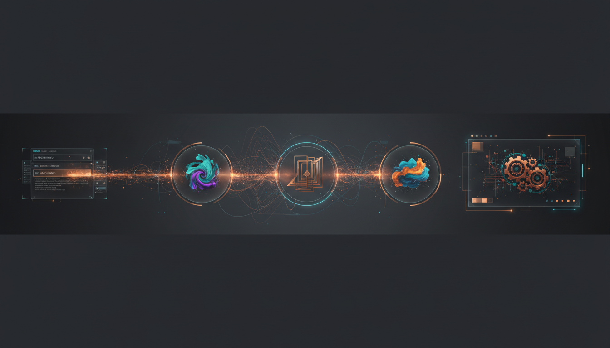

<p align="center">
  
</p>

<h1 align="center">StableSteering</h1>

<p align="center">
  Interactive steering for diffusion image generation, from a user text prompt to preference-guided refinement.
</p>

<p align="center">
  <a href="https://apartsinprojects.github.io/StableSteering/">Docs Site</a> ·
  <a href="./docs/quick_start.md">Quick Start</a> ·
  <a href="./docs/configuration_manual.md">Configuration Manual</a> ·
  <a href="./docs/student_tutorial.md">Student Tutorial</a> ·
  <a href="./docs/user_guide.md">User Guide</a> ·
  <a href="./docs/developer_guide.md">Developer Guide</a>
</p>

## What It Is

StableSteering is a research-oriented system for interactive image generation with diffusion models.

Instead of relying on one-shot prompt rewriting, the system starts from a user text prompt, proposes multiple candidate directions, records user preferences, updates an internal steering state, and generates the next round from that evolving state.

The current repository includes both:

- the original specification and research documents
- a runnable FastAPI-based MVP with a real GPU-backed Diffusers backend
- Gemini-generated visual assets used to make the Markdown and HTML docs easier to learn

## Why It Matters

Text-to-image generation is powerful, but creative control is still awkward in practice.
Users often know which result is better before they know how to rewrite the prompt that would produce it.

StableSteering is built around that gap. It turns generation into a feedback loop:

1. start from a text prompt
2. generate candidate images
3. capture user preference
4. update steering state
5. generate a stronger next round

That makes the project useful both as:

- a research platform for iterative preference-guided steering
- a concrete prototype for interactive generative workflows

## Current MVP

The current system includes:

- a FastAPI backend for experiments, sessions, async jobs, replay, diagnostics, and trace reporting
- a real Diffusers-backed runtime on GPU by default
- a mock generator reserved strictly for tests
- SQLite-backed local persistence
- backend and frontend tracing with per-session HTML reports
- browser and backend test coverage
- a real GPU-backed example-run generator with standalone HTML output

Example artifacts checked into the repo:

- [Sample HTML walkthrough](./output/examples/real_e2e_example_run/real_e2e_example_run.html)
- [Sample trace report](./output/examples/real_e2e_example_run/session_trace_report.html)
- [Sample manifest](./output/examples/real_e2e_example_run/manifest.json)

## User Flow

The main workflow is prompt-first:

1. the user opens `/setup`
2. enters a text prompt
3. optionally edits the per-session YAML configuration
4. creates a session
5. generates a round of candidate images
6. submits explicit feedback for the active mode
7. waits for the async update job to finish
8. inspects replay and the saved trace report

The normal runtime is GPU-only and uses the real Diffusers backend. If CUDA is unavailable, the app refuses to start instead of silently falling back.


## Getting Started

Install the project:

```bash
python -m pip install -e .[dev,inference]
```

Prepare model assets:

```bash
python scripts/setup_huggingface.py
```

Run the app:

```bash
python scripts/run_dev.py
```

Open:

```text
http://127.0.0.1:8000
```

Helpful pages:

- `http://127.0.0.1:8000/setup`
- `http://127.0.0.1:8000/diagnostics/view`
- `http://127.0.0.1:8000/sessions/{session_id}/trace-report`

## Read Next

Recommended reading order:

1. [Motivation](./docs/motivation.md)
2. [Student Tutorial](./docs/student_tutorial.md)
3. [Theoretical Background](./docs/theoretical_background.md)
4. [System Specification](./docs/system_specification.md)
5. [System Test Specification](./docs/system_test_specification.md)
6. [Pre-Implementation Blueprint](./docs/pre_implementation_blueprint.md)
7. [Quick Start](./docs/quick_start.md)
8. [Configuration Manual](./docs/configuration_manual.md)
9. [System Improvement Roadmap](./docs/system_improvement_roadmap.md)
10. [Research Improvement Roadmap](./docs/research_improvement_roadmap.md)

Additional docs:

- [GitHub Pages Docs](https://apartsinprojects.github.io/StableSteering/)
- [Install Guide](./INSTALL.md)
- [Release Guide](./RELEASE.md)
- [Release Notes v0.1.0](./RELEASE_NOTES_v0.1.0.md)
- [Configuration Manual](./docs/configuration_manual.md)
- [FAQ](./docs/faq.md)

## Run Tests

Backend tests:

```bash
python -m pytest
```

Browser tests:

```bash
npm install
npm run test:e2e:chrome
```

Headed browser debug:

```bash
npm run test:e2e:debug
```

Real model smoke:

```bash
python scripts/smoke_real_diffusers.py
```

Real end-to-end example bundle:

```bash
python scripts/create_real_e2e_example.py
```

Checked-in sample bundle:

- [real_e2e_example_run.html](./output/examples/real_e2e_example_run/real_e2e_example_run.html)
- [session_trace_report.html](./output/examples/real_e2e_example_run/session_trace_report.html)

## Repo Guides

Per-folder documentation is available in:

- [docs/README.md](./docs/README.md)
- [app/README.md](./app/README.md)
- [tests/README.md](./tests/README.md)
- [scripts/README.md](./scripts/README.md)
- [data/README.md](./data/README.md)
- [models/README.md](./models/README.md)
- [output/README.md](./output/README.md)

## Banner Asset

The README banner is stored at [docs/assets/readme_banner.png](./docs/assets/readme_banner.png).

It can be regenerated with:

```bash
python scripts/generate_readme_banner.py
```

The generation script expects `GEMINI_API_KEY` in the environment and uses the official Gemini image-generation API.

## Diagrams And Illustrations

The documentation layer can include Gemini-generated illustrations to make the Markdown and published HTML easier to scan.

Current visual assets include:

- [docs/assets/readme_banner.png](./docs/assets/readme_banner.png)
- [docs/assets/illustrations/steering_loop.png](./docs/assets/illustrations/steering_loop.png)
- [docs/assets/illustrations/system_architecture.png](./docs/assets/illustrations/system_architecture.png)
- [docs/assets/illustrations/trace_report.png](./docs/assets/illustrations/trace_report.png)
- [docs/assets/illustrations/runtime_flow.svg](./docs/assets/illustrations/runtime_flow.svg)
- [docs/assets/illustrations/session_lifecycle.svg](./docs/assets/illustrations/session_lifecycle.svg)
- [docs/assets/illustrations/feedback_modes.svg](./docs/assets/illustrations/feedback_modes.svg)
- [docs/assets/illustrations/config_to_generation.svg](./docs/assets/illustrations/config_to_generation.svg)

They can be regenerated with:

```bash
python scripts/generate_readme_banner.py
python scripts/generate_doc_illustrations.py
```

The Pages builder copies these assets into the generated HTML site automatically.

## Legacy Source

The original combined specification is preserved as:

- [Legacy Combined Spec](./docs/system_spec_legacy_combined.md)
