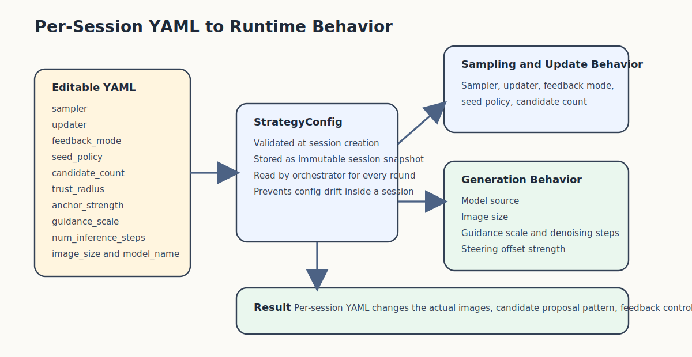

# Configuration Manual

## Purpose

This guide explains how StableSteering configuration works today, with a focus on the prompt-first session setup flow.

It is the reference document for:

- per-session YAML configuration in the HTML setup page
- how YAML maps to backend `StrategyConfig` values
- which parameters affect generation, steering, and feedback behavior
- how to safely edit, reset, and validate session config

For the shortest run path, see [quick_start.md](./quick_start.md).
For the code-level view, see [developer_guide.md](./developer_guide.md).
For the user-facing workflow, see [user_guide.md](./user_guide.md).

## Where Configuration Lives

StableSteering currently uses configuration at two different levels.

### 1. Runtime Environment Configuration

This controls how the app process runs.
Examples include:

- active backend
- GPU/device policy
- model location
- filesystem roots

These values are loaded from application settings in the backend and are not the same as per-session strategy choices.

Relevant code:

- [config.py](../app/core/config.py)

### 2. Per-Session Strategy Configuration

This controls how one user session behaves.
Examples include:

- sampler
- updater
- feedback mode
- candidate count
- image size
- trust radius

These values are edited as YAML in the setup page and are parsed into `StrategyConfig` for each new session.

Relevant code:

- [schema.py](../app/core/schema.py)
- [config_yaml.py](../app/core/config_yaml.py)
- [setup.html](../app/frontend/templates/setup.html)
- [app.js](../app/frontend/static/app.js)
- [main.py](../app/main.py)

## Session Setup Flow

The current setup flow is:

1. open `/setup`
2. enter the user text prompt
3. optionally edit the negative prompt
4. edit the YAML strategy block
5. submit the setup form
6. backend validates the YAML and creates:
   - an experiment
   - a session linked to that experiment
7. browser opens the new session view

The YAML block is reloaded fresh from the backend template when:

- the setup page is rendered
- the user clicks `Reload default YAML`

That makes each session configuration explicit and editable instead of being spread across several independent form controls.

## Setup Endpoints

The setup page now uses these routes:

- `GET /setup`
  Renders the HTML page and injects the default YAML template.

- `GET /setup/config-template`
  Returns the canonical default YAML as JSON.

- `POST /setup/session`
  Accepts prompt fields plus `config_yaml`, validates the YAML, creates the experiment, then creates the session.

This means the YAML document is the source of truth for per-session strategy configuration.



## YAML Template

The setup page starts from a backend-generated YAML document similar to this:

```yaml
sampler: random_local
updater: winner_average
feedback_mode: scalar_rating
seed_policy: fixed-per-round
steering_mode: low_dimensional
candidate_count: 5
image_size: 512x512
trust_radius: 0.35
anchor_strength: 0.35
guidance_scale: 7.5
num_inference_steps: 15
model_name: runwayml/stable-diffusion-v1-5
```

The exact default text is rendered by:

- [config_yaml.py](../app/core/config_yaml.py)

## Parameter Reference

### `sampler`

Controls how candidate steering vectors are proposed for a round.

Supported values:

- `random_local`
- `exploit_orthogonal`
- `uncertainty_guided`
- `axis_sweep`
- `incumbent_mix`

Effect:

- changes how exploration behaves around the current steering state
- changes the balance between exploitation and diversity

Related code:

- [random_local.py](../app/samplers/random_local.py)
- [exploit_orthogonal.py](../app/samplers/exploit_orthogonal.py)
- [uncertainty.py](../app/samplers/uncertainty.py)
- [axis_sweep.py](../app/samplers/axis_sweep.py)
- [incumbent_mix.py](../app/samplers/incumbent_mix.py)

### `updater`

Controls how user feedback updates the incumbent steering state.

Supported values:

- `winner_average`
- `winner_copy`
- `linear_preference`

Effect:

- determines how aggressively the system moves toward the selected winner

Related code:

- [winner_average.py](../app/updaters/winner_average.py)
- [winner_copy.py](../app/updaters/winner_copy.py)
- [linear_pref.py](../app/updaters/linear_pref.py)

### `feedback_mode`

Controls how the UI feedback payload is interpreted.

Supported values:

- `scalar_rating`
- `pairwise`
- `top_k`
- `winner_only`
- `approve_reject`

Effect:

- changes which session controls the frontend renders
- changes how the browser collects explicit user preference signals before normalization

Related code:

- [normalization.py](../app/feedback/normalization.py)


### `seed_policy`

Controls how seeds are assigned across rounds.

Current value used by the MVP:

- `fixed-per-round`
- `fixed-per-candidate`
- `fixed-per-candidate-role`

Effect:

- `fixed-per-round`
  All newly rendered candidates in the round share one seed. This is the cleanest way to reduce within-round seed noise.

- `fixed-per-candidate`
  Each visible candidate position gets its own deterministic seed. This increases variation inside a batch.

- `fixed-per-candidate-role`
  Candidates with the same sampler role share one deterministic seed, while different roles get different seeds. This is useful when the sampler uses meaningful roles such as `explore`, `refine`, `challenger`, or `validation`.

Notes:

- round 1 baseline prompt and later carried-forward incumbents still participate in the policy metadata
- carried-forward incumbents preserve the original winning image and seed rather than being re-rendered under a new seed
- all policies are deterministic for the same session and round inputs

### `steering_mode`

Describes the steering representation family.

Current value used by the MVP:

- `low_dimensional`

Effect:

- selects the steering representation contract used by generation
- the current implementation supports only `low_dimensional`, so this field is validated but not yet a multi-mode switch

### `candidate_count`

Controls how many candidates are shown per round.

Typical values:

- `3`
- `4`
- `5`

Current round policy:

- round 1 includes the unmodified prompt baseline as candidate `0`
- later rounds include the previous round winner as candidate `0`
- remaining candidates come from the sampler

This means `candidate_count` is the total visible batch size, not the number of newly sampled alternatives.

### `image_size`

Controls the rendered image size.

Format:

- `WIDTHxHEIGHT`

Examples:

- `512x512`
- `768x512`

Notes:

- the current real Diffusers path parses this string directly
- poor-quality settings can hurt output quality, especially with SD 1.5

### `trust_radius`

Controls how far the sampler is allowed to move from the current steering state.

Effect:

- larger values increase exploration
- smaller values keep proposals closer to the incumbent direction

### `anchor_strength`

Controls how strongly the latent steering vector perturbs the encoded prompt embedding.

Effect:

- larger values make candidate steering offsets more pronounced
- smaller values keep steered candidates closer to the raw prompt embedding
- this now directly affects Diffusers prompt-embedding steering and is persisted in candidate generation metadata

### `guidance_scale`

Controls classifier-free guidance strength during image generation.

Effect:

- larger values usually push images to follow the prompt more literally
- smaller values allow looser, sometimes more varied interpretation
- this now directly affects both real Diffusers rendering and mock trace artifacts

### `num_inference_steps`

Controls how many denoising steps the diffusion pipeline runs per image.

Effect:

- larger values typically improve quality and prompt faithfulness at the cost of latency
- smaller values are faster but can degrade image quality or stability
- this now directly affects both real Diffusers rendering and mock trace artifacts

### `model_name`

Selects the model checkpoint for the session.

Current default:

- `runwayml/stable-diffusion-v1-5`

Important note:

- if a prepared local model matching this Hugging Face id exists, the real backend loads and caches that model for the session
- if the model is missing, session generation fails clearly instead of silently ignoring the setting
- this field now directly affects the real generation backend and is stored in candidate generation metadata

## Validation Rules

The YAML editor is flexible, but it is not free-form.
The backend validates the YAML against `StrategyConfig`.

Validation happens in:

- [config_yaml.py](../app/core/config_yaml.py)

Current validation behavior:

- invalid YAML syntax is rejected
- non-mapping YAML is rejected
- missing required structure falls back only where `StrategyConfig` defines defaults
- invalid enum-like values are rejected by schema validation
- invalid numeric types are rejected by schema validation

If validation fails, the setup request returns a structured API error.

## Practical Editing Guidance

Good workflow:

1. start from the default YAML
2. change one or two parameters at a time
3. create a session
4. observe the session behavior
5. compare the resulting trace report and replay

Recommended beginner changes:

- switch `sampler`
- switch `updater`
- change `candidate_count` from `4` to `3` or `5`
- increase or decrease `trust_radius`

Changes to make carefully:

- unusual `image_size`
- very large `candidate_count`
- combinations that make comparisons harder rather than easier

## Relationship To Runtime Settings

Per-session YAML does not override every backend runtime rule.

Examples of process-level rules that still apply:

- GPU-only real Diffusers runtime by default
- no silent fallback to the mock backend
- model preparation requirements
- trace and artifact storage locations

So the session YAML controls the strategy of the run, while the app settings control the environment in which the run is executed.

## Example Configurations

### Conservative Comparison Session

```yaml
sampler: random_local
updater: winner_average
feedback_mode: scalar_rating
seed_policy: fixed-per-round
steering_mode: low_dimensional
candidate_count: 5
image_size: 512x512
trust_radius: 0.25
anchor_strength: 0.35
guidance_scale: 7.0
num_inference_steps: 20
model_name: runwayml/stable-diffusion-v1-5
```

Use this when:

- you want stable nearby comparisons
- you want smoother updates between rounds

### More Exploratory Session

```yaml
sampler: uncertainty_guided
updater: linear_preference
feedback_mode: scalar_rating
seed_policy: fixed-per-round
steering_mode: low_dimensional
candidate_count: 5
image_size: 512x512
trust_radius: 0.4
anchor_strength: 0.45
guidance_scale: 7.5
num_inference_steps: 24
model_name: runwayml/stable-diffusion-v1-5
```

Use this when:

- you want broader exploration around the current direction
- you want stronger movement after feedback

### Pairwise Preference Session

```yaml
sampler: exploit_orthogonal
updater: winner_copy
feedback_mode: pairwise
seed_policy: fixed-per-round
steering_mode: low_dimensional
candidate_count: 3
image_size: 512x512
trust_radius: 0.3
anchor_strength: 0.35
guidance_scale: 8.0
num_inference_steps: 20
model_name: runwayml/stable-diffusion-v1-5
```

Use this when:

- you want sharper A/B-style comparisons
- you want the winner to become the new incumbent exactly

### Axis Sweep Ranking Session

```yaml
sampler: axis_sweep
updater: linear_preference
feedback_mode: top_k
seed_policy: fixed-per-round
steering_mode: low_dimensional
candidate_count: 5
image_size: 512x512
trust_radius: 0.34
anchor_strength: 0.4
guidance_scale: 7.5
num_inference_steps: 22
model_name: runwayml/stable-diffusion-v1-5
```

Use this when:

- you want more interpretable positive/negative axis probes
- you want to rank the full batch rather than select only one winner

### Approve / Reject Session

```yaml
sampler: incumbent_mix
updater: winner_average
feedback_mode: approve_reject
seed_policy: fixed-per-round
steering_mode: low_dimensional
candidate_count: 5
image_size: 512x512
trust_radius: 0.3
anchor_strength: 0.35
guidance_scale: 7.2
num_inference_steps: 18
model_name: runwayml/stable-diffusion-v1-5
```

Use this when:

- you want to quickly mark acceptable vs unacceptable options
- you still want one approved candidate to become the update target

## Where To Learn More

- [quick_start.md](./quick_start.md)
- [user_guide.md](./user_guide.md)
- [developer_guide.md](./developer_guide.md)
- [student_tutorial.md](./student_tutorial.md)
- [system_specification.md](./system_specification.md)
