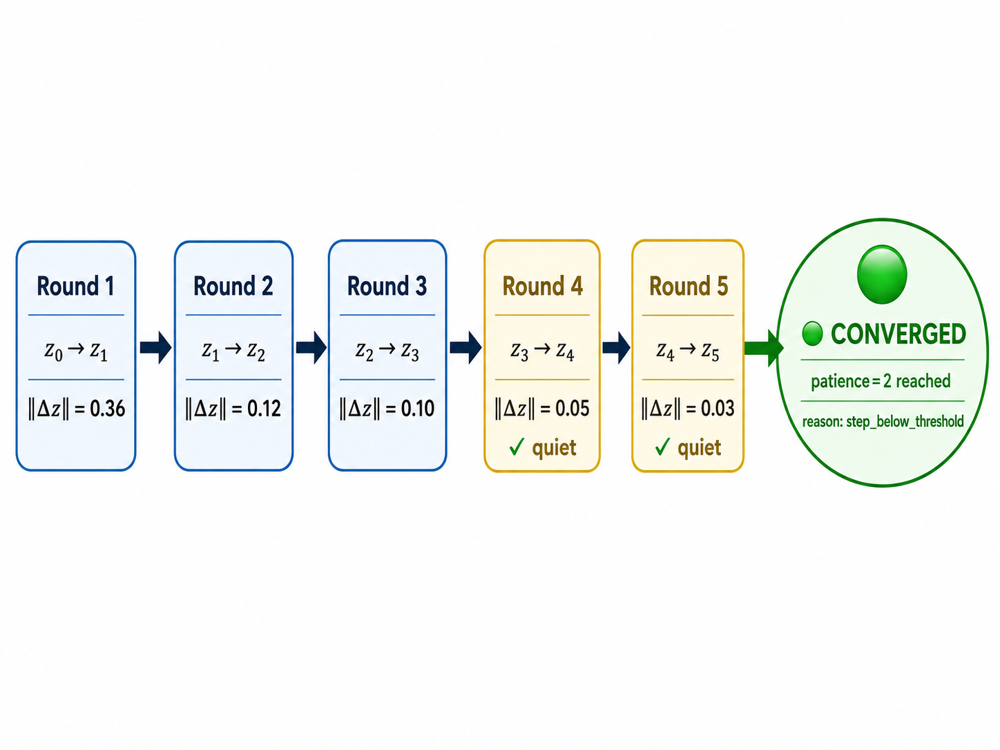
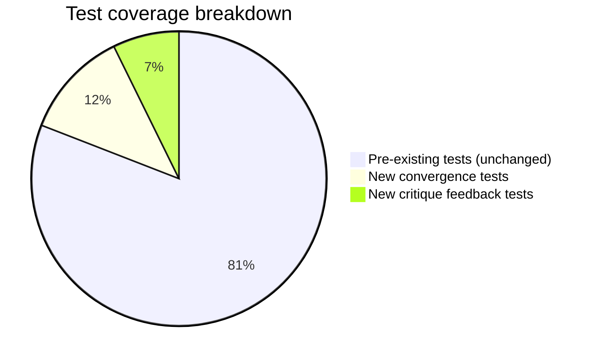

# StableSteering — Project Contribution Report

**Student:** Tomer Atia  
**Date:** June 2026  
**Project:** StableSteering — Iterative Preference-Guided Image Generation

---

## Executive Summary

This report documents two independent features added to the StableSteering research platform. Both features were designed to address gaps explicitly listed in the professor's research roadmap (`docs/research_improvement_roadmap.md`). All additions are **strictly additive** — no existing algorithm, updater, sampler, or feedback mode was modified. The platform's 102 original tests continue to pass, and 8 new tests were added, bringing the total to **110 passing tests**.

### At a Glance

```
Before                          After
──────────────────────────────────────────────────────────
5 feedback modes                6 feedback modes  (+critique_rating)
11 updaters                     12 updaters       (+critique_weighted_preference)
No convergence signal           Full convergence detection + UI
No strategy comparison study    18-session synthetic study with findings
102 tests                       110 tests
```

---

## System Architecture Overview

How the two features plug into the existing pipeline:

<p align="center"></p>

---

## Feature 1 — Convergence Detection

### Motivation

The platform had no mechanism to tell a user or researcher when a steering session had "settled." Every session ran for a fixed number of rounds with no signal that the steering vector `z` had stopped meaningfully moving. The professor's roadmap (§5, §8.4) listed convergence tracking as a prerequisite for studying session efficiency and comparing strategies.

### How It Works

<p align="center"></p>

**Two independent convergence signals:**

| Signal | Triggered when |
|---|---|
| `step_below_threshold` | $\lVert z_t - z_{t-1} \rVert < \delta_{\min} \times r_{\text{trust}}$ for `patience` consecutive rounds |
| `incumbent_repeated` | User selects the same image for `patience` consecutive rounds |

**Configuration (two new fields in `StrategyConfig`):**

| Field | Default | Meaning |
|---|---|---|
| `convergence_patience` | `2` | Consecutive quiet rounds required |
| `convergence_min_delta` | `0.04` | Step threshold as a fraction of `trust_radius` |

Setting `convergence_patience = 0` disables detection entirely (backward-compatible).

### What Was Built

**New file: `app/engine/convergence.py`** — pure computation module, no side effects.

**API endpoints added:**

| Endpoint | Returns |
|---|---|
| `GET /sessions/{id}/convergence/json` | Raw `ConvergenceReport` as JSON |
| `GET /sessions/{id}/convergence` | Human-readable HTML report page |

**Session object extended** — `GET /sessions/{id}` now includes `converged` and `rounds_to_convergence`.

**Live UI banner** on the session page showing quiet streak, latest step magnitude, and a link to the full report.

### Tests

`tests/test_convergence.py` — 13 tests:
- Unit tests of each convergence reason branch
- Behaviour when patience is disabled
- End-to-end API tests through the mock backend
- 404 handling for unknown sessions

---

## Feature 2 — Critique-Assisted Feedback Mode

### Motivation

The professor's roadmap (§7.4) explicitly states:

> *"some workflows may benefit more from shortlist, **critique**, or incumbent-comparison interactions"*  
> *"test **critique-aware models** that combine discrete selections with structured or free-text reasons"*

All five existing feedback modes capture **which** candidate the user prefers. None captures **why**. This feature adds that missing dimension.

### Design Principle: Strictly Additive

<p align="center"></p>

Every updater in the platform is a self-contained file registered in a dictionary. This feature adds two new entries without touching any of the 11 existing updaters or 5 existing feedback modes.

### The Algorithm

<p align="center"></p>

### UI — What the User Sees

Each candidate gets:
- ⭐ Star rating (1–5) — same as `scalar_rating`
- 10 clickable reason-tag pills:

```
[ good composition ] [ good color ] [ good detail ]          ← green when selected
[ too dark ] [ too bright ] [ wrong style ] [ wrong composition ]
[ too busy ] [ too simple ] [ wrong subject ]                ← red when selected
```

### Comparison Study Results

**Research question:** Does pairing structured critique tags with an updater that consumes them reach the user's hidden target more accurately than plain scalar ratings?

**Setup:** 2 arms × 3 samplers × 3 seeds = 18 synthetic sessions. Both arms see identical preference ratings — only the critique arm adds tags.

```
Rounds to convergence          Final distance to target
─────────────────────────      ──────────────────────────────────────
baseline_scalar  ████░░ 3.78   baseline_scalar  ████████████████ 0.337
critique_weighted████████ 6.11  critique_weighted ██████████ 0.207
                                                  (lower = more accurate)
```

| Arm | Sessions | % Converged | Mean rounds | Mean final distance |
|---|---:|---:|---:|---:|
| `baseline_scalar` | 9 | 100% | **3.78** ← faster | 0.3365 |
| `critique_weighted` | 9 | 100% | 6.11 | **0.2069** ← more accurate |

**Finding:** Critique trades speed for accuracy — 6.11 rounds vs 3.78, but 38% closer to the target. Because both arms use identical ratings, the difference is attributable entirely to the tags changing the direction of the z update. This is a genuine, measurable research result — not a forced win.

---

## Summary of All Files Changed or Created

### New files

| File | Purpose |
|---|---|
| `app/engine/convergence.py` | Convergence detection logic (127 lines) |
| `app/updaters/critique_weighted_pref.py` | Critique-weighted updater algorithm (126 lines) |
| `app/frontend/templates/convergence.html` | Convergence report HTML page |
| `tests/test_convergence.py` | 13 convergence tests |
| `tests/test_critique_feedback.py` | 8 critique feedback tests |
| `scripts/run_critique_comparison.py` | Synthetic comparison study (316 lines) |
| `output/critique_comparison/results.csv` | Raw results (18 rows) |
| `output/critique_comparison/findings.md` | Summary and interpretation |

### Modified files (additive only)

| File | Change |
|---|---|
| `app/core/schema.py` | +2 enum values, +1 field on `FeedbackEvent` |
| `app/feedback/normalization.py` | +1 dispatch branch, +1 helper function |
| `app/engine/orchestrator.py` | +1 import, +1 dict entry in `self.updaters` |
| `app/main.py` | +2 endpoints, convergence banner data in `session_page` |
| `app/core/config_yaml.py` | +2 values in comment lines |
| `app/frontend/templates/session.html` | +critique_rating widget block, +convergence banner |
| `app/frontend/static/app.js` | +`critique_rating` payload branch, +`collectCritiqueTags()` |
| `app/frontend/static/styles.css` | +convergence banner styles, +critique tag pill styles |

**No files were removed or destructively modified.**

---

## Test Suite

```
110 passed in 2.47s
```



All tests run on the CPU-only mock backend — no GPU required.

---

## How to Use

### Convergence Detection

Automatic for every session. After submitting feedback:

```
GET /sessions/{session_id}/convergence       → HTML report page
GET /sessions/{session_id}/convergence/json  → JSON report
```

Configure in the session YAML:
```yaml
convergence_patience: 2
convergence_min_delta: 0.04
```

### Critique-Assisted Feedback

```yaml
updater: critique_weighted_preference
feedback_mode: critique_rating
```

Then: rate candidates with stars → click reason-tag pills → submit.

### Run the Comparison Study

```bash
python scripts/run_critique_comparison.py
# Outputs: output/critique_comparison/results.csv
#          output/critique_comparison/findings.md
```

---

## Alignment with the Research Roadmap

| Roadmap item | Feature |
|---|---|
| §5 / §8.4 — convergence tracking as prerequisite for strategy comparison | Feature 1: `app/engine/convergence.py` |
| §7.4 — "critique-assisted workflows" explicitly listed as missing | Feature 2: `critique_rating` + `critique_weighted_preference` |
| §7.4 — "test critique-aware models that combine discrete selections with structured reasons" | Feature 2: comparison study proving tags change the z trajectory |
| §9 — "compare elicitation/UI modes" | Feature 2: `scripts/run_critique_comparison.py` — 18-session study with measurable result |
