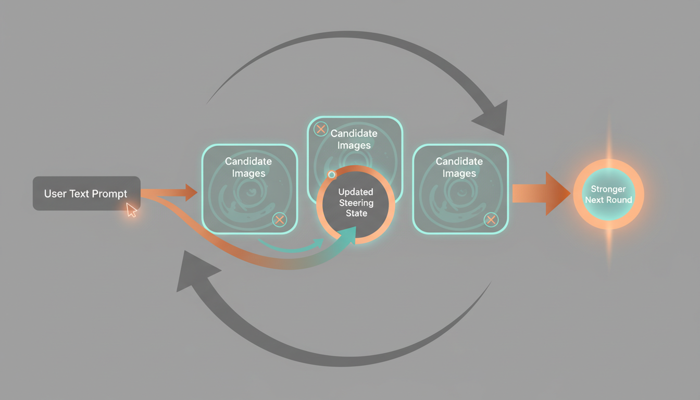
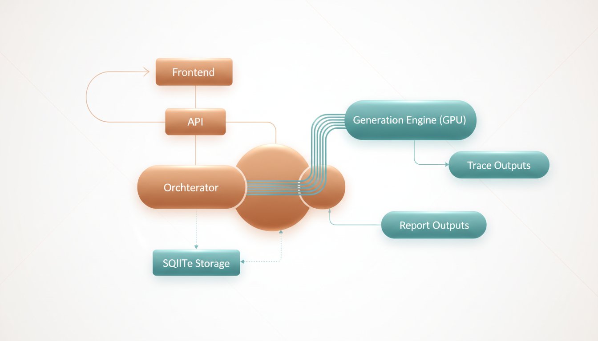
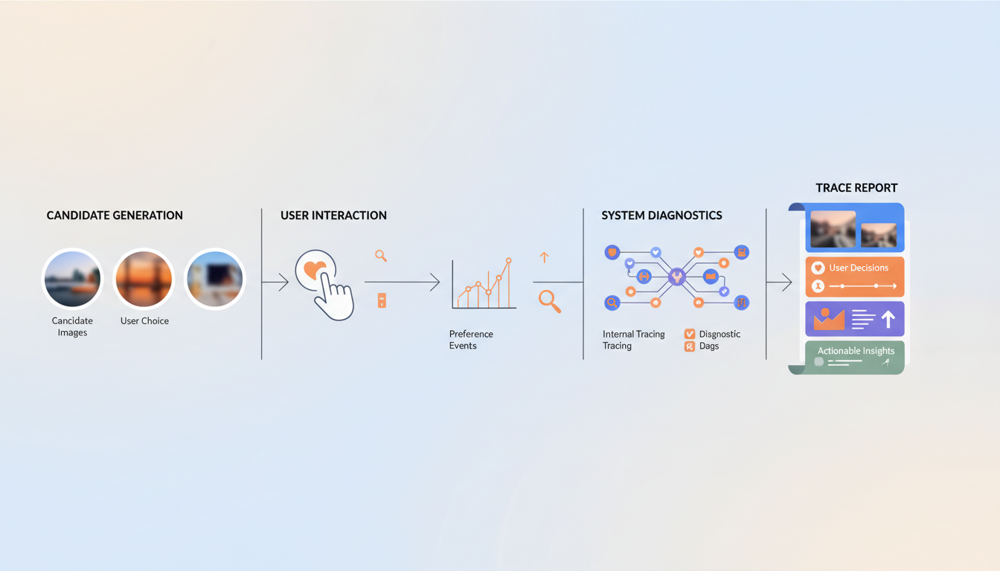

# Student Tutorial

## Who This Is For

This tutorial is for students who want to understand StableSteering as both:

- a research idea
- a working software system

You do not need to know every detail of diffusion models before reading this.
The goal is to build intuition first, then connect that intuition to the actual implementation in this repository.

## Learning Goal

By the end of this tutorial, you should understand:

- why the system exists
- what problem it tries to solve
- how the steering concept works at a high level
- how the application is organized in code
- how a user session moves from prompt to refined image proposals

## 1. Motivation

Text-to-image systems are powerful, but one-shot prompting is often frustrating in practice.
A user may know the direction they want, but not the exact words needed to get there in a single prompt.

Typical problems include:

- the prompt is too broad, so results feel inconsistent
- the prompt is too specific, so results become brittle or overconstrained
- the user can tell which image feels better, but cannot easily explain why in one sentence
- each retry starts over instead of learning from the user's previous preferences

StableSteering addresses this by turning image generation into an interactive process.
Instead of asking the user to solve everything with one perfect prompt, the system:

1. starts from the user's text prompt
2. proposes several nearby candidate directions
3. lets the user express preferences
4. updates the steering state
5. generates a better next round

This makes the system useful for creative exploration, product ideation, concept design, and research on human-in-the-loop generation.

For the fuller research framing, see [motivation.md](./motivation.md).

## 2. Background Intuition

At a high level, a diffusion image model turns text conditioning into image samples.
StableSteering explores the idea that we can gently move the conditioning representation in a direction that better matches user preferences.

You can think of the system like this:

- the original prompt gives us a starting location
- the system samples candidate directions around that starting point
- the user says which outputs are stronger or weaker
- the system shifts its internal steering state toward preferred regions

This does not require the user to manually edit embeddings.
The user only interacts through images, ratings, or preference choices.

The main theoretical ideas behind the project are:

- prompt-conditioned diffusion generation
- local exploration around a current steering point
- preference-driven updates
- iterative refinement instead of one-shot prompting

This Gemini-generated illustration is meant to build intuition for the interaction cycle:
start from a prompt, propose candidates, observe user preference, update the steering state, and repeat.

For the fuller theory discussion, see [theoretical_background.md](./theoretical_background.md).

## 3. System Concept

StableSteering is best understood as a loop:

1. The user enters a text prompt.
2. The system creates a session and initializes a steering state.
3. The backend generates a round of candidate images.
4. The user gives feedback.
5. The backend updates the steering state.
6. The next round is generated from that updated state.

This process continues until the user is satisfied or the experiment ends.

### What Makes It Different

The important shift is that the user does not need to produce the perfect prompt upfront.
Instead, the user can express preference through interaction.

That gives the system two forms of information:

- explicit text intent from the original prompt
- implicit preference information from later selections and ratings

Together, these allow the session to move toward a better result over time.

This illustration gives a high-level picture of the runtime path from prompt entry to generation, feedback, storage, and reporting.
Treat it as a conceptual map rather than a strict engineering diagram.

## 4. Main Parts Of The Implementation

The implementation has a few core layers.

### Frontend

The frontend is the user-facing part of the app.
It lets the user:

- enter the initial prompt
- create a session
- generate the next round
- review candidate images
- submit ratings or preferences
- inspect replay and trace outputs

Relevant files:

- [index.html](/E:/Projects/StableSteering/app/frontend/templates/index.html)
- [setup.html](/E:/Projects/StableSteering/app/frontend/templates/setup.html)
- [session.html](/E:/Projects/StableSteering/app/frontend/templates/session.html)
- [app.js](/E:/Projects/StableSteering/app/frontend/static/app.js)

### API Layer

The FastAPI app exposes the system as HTTP routes.
It handles:

- experiment creation
- session creation
- async round generation
- async feedback application
- replay export
- diagnostics
- trace report serving

Relevant file:

- [main.py](/E:/Projects/StableSteering/app/main.py)

### Orchestration Layer

The orchestrator coordinates the session lifecycle.
It is the heart of the application logic.

It decides how to:

- create a round
- validate session state
- normalize feedback
- update steering state
- export replay information
- emit trace events

Relevant file:

- [orchestrator.py](/E:/Projects/StableSteering/app/engine/orchestrator.py)

### Generation Layer

The generation layer connects the system to the image model.
In the real runtime, this uses a Diffusers-backed Stable Diffusion pipeline on GPU.

The project also contains a mock backend, but that is reserved strictly for testing.

Relevant file:

- [generation.py](/E:/Projects/StableSteering/app/engine/generation.py)

### Storage Layer

The storage layer persists experiments, sessions, rounds, and related state.
The current implementation uses SQLite for structured records, while artifacts and traces are stored on disk.

Relevant file:

- [repository.py](/E:/Projects/StableSteering/app/storage/repository.py)

## 5. A Typical User Session

Here is the normal user flow.

### Step 1: Start From A Prompt

The user begins with a text description such as:

`A premium cinematic product hero photo of an expedition-ready electric explorer motorcycle...`

This is important because the system is prompt-first.
The prompt defines the initial semantic goal.

### Step 2: Generate Candidate Images

The system produces multiple candidates for the current round.
These images are not random in a completely uncontrolled way.
They are sampled around the current steering state.

### Step 3: User Feedback

The user reviews the proposals and gives feedback, for example:

- higher ratings for strong candidates
- lower ratings for weak candidates
- critique text about what should improve

### Step 4: Steering Update

The backend converts that feedback into an updated internal state.
That state influences the next generation round.

### Step 5: New Round

The next round should better reflect the user's preferences.
Over multiple rounds, the session ideally becomes more aligned, more coherent, and more useful.

## 6. Why Async Jobs Matter

Real image generation can take time, especially on a GPU pipeline.
Because of that, StableSteering uses async jobs for round generation and feedback application.

This matters for user experience because:

- the UI stays responsive
- users see a clear progress bar and status text
- the backend can track queued, running, succeeded, or failed states

This makes the system feel like a real interactive tool instead of a blocking demo script.

For more on the actual endpoints and job flow, see [developer_guide.md](./developer_guide.md) and [user_guide.md](./user_guide.md).

## 7. Why Traces And HTML Reports Matter

StableSteering is not only an app.
It is also a research system.

That means we care about:

- what images were proposed
- what the user selected
- what feedback was submitted
- how the system changed between rounds

The backend saves readable per-session traces and generates an HTML report.
This is valuable for:

- teaching
- debugging
- research analysis
- demonstrations

This illustration matches the idea of the saved HTML report:
one place to inspect proposed images, user actions, feedback, and how the session evolved over time.

You can see this in the generated example bundles under `output/examples/`.

## 8. How To Study The Code

If you are learning the system for the first time, this is a good reading order:

1. Read [motivation.md](./motivation.md).
2. Read [theoretical_background.md](./theoretical_background.md).
3. Read [system_specification.md](./system_specification.md).
4. Read [quick_start.md](./quick_start.md).
5. Read [user_guide.md](./user_guide.md).
6. Read [developer_guide.md](./developer_guide.md).
7. Open [main.py](/E:/Projects/StableSteering/app/main.py).
8. Open [orchestrator.py](/E:/Projects/StableSteering/app/engine/orchestrator.py).
9. Open [generation.py](/E:/Projects/StableSteering/app/engine/generation.py).
10. Open [repository.py](/E:/Projects/StableSteering/app/storage/repository.py).

## 9. Suggested Exercises

If you are using this project to learn, try these exercises:

### Concept Exercises

- Explain in your own words why iterative preference feedback can be more useful than repeated prompt rewriting.
- Describe the difference between the user's prompt and the system's steering state.
- Explain why replay and trace logs are useful in research systems.

### Implementation Exercises

- Trace one request from the frontend to the backend and back again.
- Find where a new round is created and identify the validation checks.
- Find where feedback is normalized before being applied.
- Inspect a saved trace report and explain what evidence it preserves.

### Research Exercises

- Propose a better feedback mode than scalar rating.
- Suggest a baseline to compare against StableSteering.
- Design a small user study to test whether iterative steering improves user satisfaction.

## 10. Big Picture

StableSteering sits at the intersection of:

- human-computer interaction
- generative AI systems
- preference learning
- interactive creative tools

That makes it a good teaching project.
It is concrete enough to run, inspect, and modify, but rich enough to support meaningful research questions.

## Next Documents

After this tutorial, the most useful next reads are:

- [quick_start.md](./quick_start.md)
- [user_guide.md](./user_guide.md)
- [developer_guide.md](./developer_guide.md)
- [system_improvement_roadmap.md](./system_improvement_roadmap.md)
- [research_improvement_roadmap.md](./research_improvement_roadmap.md)
