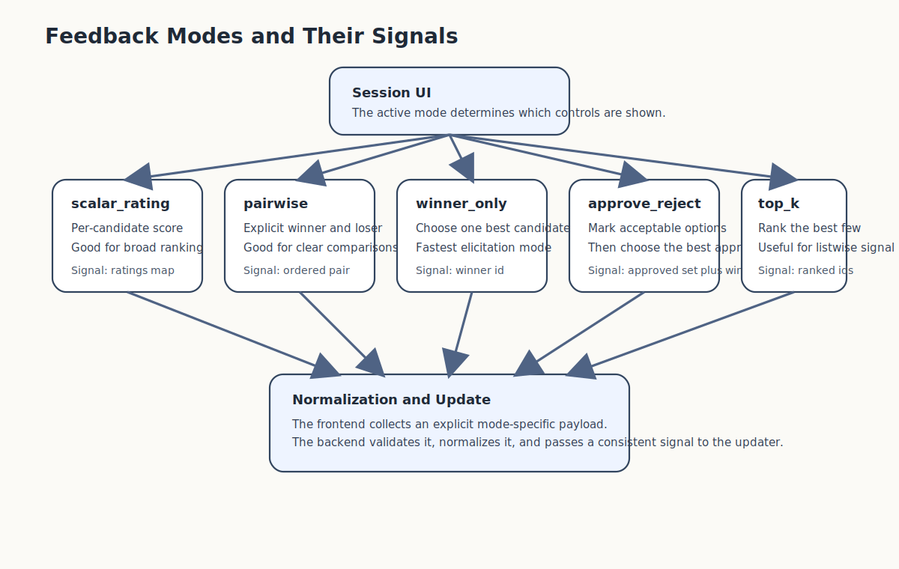

# User Guide

## 1. What This App Does

StableSteering is a research prototype for interactive image-generation steering. Instead of only rewriting prompts, it lets you evaluate candidate image variations across multiple rounds and provide feedback so the system can update its steering state.

The current version runs with a real Diffusers backend by default. The mock
generator exists only inside explicit test harnesses.

The app also records backend and frontend trace events so session behavior is easier to inspect while you work.

If you are learning the system for the first time, start with [student_tutorial.md](student_tutorial.md).

## 2. Main Workflow

The basic flow is:

1. enter a text prompt
2. start a session around that prompt
3. generate a round of candidate images
4. provide feedback with the active mode controls
5. submit feedback
6. generate the next round
7. review the session replay

Generation and feedback run asynchronously. That means the page stays responsive while the backend job is in progress.

## 3. Pages

### Home

The home page shows:

- the project overview
- the current experiment list
- a link to start a new session

### Setup

The setup page lets you set:

- prompt
- negative prompt
- experiment name
- experiment description
- a per-session YAML configuration block

That YAML block controls the sampler, updater, feedback mode, seed policy, candidate count, image settings, and other session-level strategy values.

### Session

The session page lets you:

- generate the next round
- review current steering state
- inspect candidate images
- provide mode-specific feedback to candidates
- submit feedback
- open the replay page
- open the trace report
- inspect the live frontend trace panel

### Replay

The replay page shows:

- all completed rounds
- each round's candidates
- the stored update summary
- the persisted outcome of submitted feedback

## 4. How to Use the Current MVP

Recommended usage:

1. open the setup page
2. start from a prompt you can easily recognize
3. keep the default settings for your first run
4. generate the first round
5. use the currently selected feedback mode to express a clear preference
6. submit feedback
7. generate another round and compare how the state evolves

## 4.1 Progress and Status

When you generate a round or submit feedback, the session page shows:

- a progress bar
- a status label such as queueing, running, completed, or failed
- inline error text if something goes wrong

While work is running:

- the relevant button is disabled
- the current page remains usable
- the page refreshes automatically after success so you see the next state

This is especially helpful with the real Diffusers backend, where image generation can take a noticeable amount of time.

## 5. Understanding the Candidate Cards

Each card shows:

- a generated candidate image
- the candidate identifier
- the sampler role
- the steering vector `z`
- feedback controls for the active mode

The visible controls change with the selected feedback mode:

- `scalar_rating` shows rating inputs
- `pairwise` shows explicit winner and loser choices
- `winner_only` shows a single winner choice
- `approve_reject` shows approval choices plus a preferred approved winner
- `top_k` shows explicit rank inputs



## 6. Understanding Replay

Replay is useful for:

- reviewing how many rounds were run
- seeing which candidates were shown
- checking which candidate won each update
- comparing session progression over time
- confirming what feedback was stored for a round

## 7. Understanding Trace Reports

Each session also produces a backend-saved HTML trace report. It combines:

- proposed images for each round
- backend events for generation and feedback
- frontend actions captured during the run
- normalized user preference outcomes
- runtime backend and device diagnostics

You can open it from the session page, or directly at `/sessions/{session_id}/trace-report`.

For a full worked example, generate the sample bundle with:

```bash
python scripts/create_real_e2e_example.py
```

That writes a complete example run under `output/examples/real_e2e_example_run/`.

## 8. Current Limitations

This prototype currently:

- requires the real Diffusers backend and a CUDA-capable GPU for normal app startup
- supports only a minimal set of interaction flows
- does not yet expose advanced controls from the full specification
- stores data locally
- is meant for one local user workflow

Trace data is persisted locally under `data/traces/`.
Per-session reports are persisted under `data/traces/sessions/<session_id>/report.html`.

## 9. Best Practices

- start with short, concrete prompts
- keep candidate count small while learning the workflow
- use replay after each session to understand what changed
- use the trace report when you want one readable record of images, actions, and preferences
- treat this as a research tool, not a production image editor
- use the diagnostics page when you want to confirm the app is actually running on GPU
