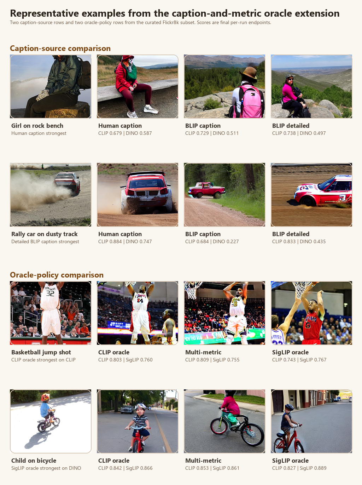

# Appendix: Controlled Slices and Submission Package Notes

## Appendix A. Sampling, Feedback, and Update Modules

The main manuscript develops the refinement framework at the level of concepts, equations, and experimental questions. This appendix complements that presentation by recording the concrete module families used in the reported studies and by collecting protocol tables and supplementary comparisons that are only summarized in the main text.

### A.1 Implemented Sampler Families

| Sampler | Operational behavior | Typical roles |
|---|---|---|
| `random_local` | Produces one near-incumbent exploit proposal and several farther exploratory proposals with deliberate directional separation inside the trust radius. | `exploit`, `explore` |
| `exploit_orthogonal` | Uses a fixed directional pattern that mixes near-incumbent and cross-axis probes. | `exploit`, `refine`, `orthogonal`, `mirror` |
| `axis_sweep` | Sweeps positive and negative moves along steering axes with small jitter. | `axis_positive`, `axis_negative` |
| `uncertainty_guided` | Increases the perturbation span across the batch so later candidates are more exploratory. | `explore`, `validation` |
| `incumbent_mix` | Mixes conservative refinements with one broader challenger proposal. | `refine`, `mix`, `challenger` |
| `diversity_shell` | Places challengers on a wider shell around the incumbent with deliberate pairwise separation. | `shell_probe`, `shell_counterprobe` |
| `line_search` | Probes forward, backtrack, and lateral moves around the current direction. | `forward_probe`, `far_forward`, `backtrack`, `lateral_probe`, `counter_lateral` |
| `annealed_shell` | Starts with a wider shell around the incumbent and gradually narrows that shell as rounds progress, with paired probe and counter-probe directions plus controlled jitter. | `annealed_probe`, `annealed_counterprobe` |
| `spherical_cover` | Greedily selects angularly separated challenger directions on the trust-region sphere to cover the available region more uniformly. | `cover_probe` |
| `two_scale_cover` | Mixes short-radius and long-radius challenger probes over separated directions so one round can contain both local refinements and farther alternatives. | `near_cover_probe`, `far_cover_probe` |
| `plateau_escape` | Proposes one carried-forward incumbent plus forward, lateral, and counter-probe challengers designed to escape visible late-round repetition. | `forward_escape`, `lateral_plus`, `lateral_minus`, `counter_probe` |
| `quality_diversity_mix` | Mixes incumbent-adjacent proposals with angularly separated challenger probes inspired by quality-diversity coverage search so the batch preserves both local refinement and broader behavioral diversity. | `elite_probe`, `diversity_probe`, `counter_probe` |
| `restart_bridge_mix` | Mixes incumbent-adjacent bridge refinements with partial restarts toward new regions so a round can preserve local progress while still challenging the incumbent with less correlated candidates. | `bridge_refine`, `bridge_forward`, `partial_restart`, `lateral_restart`, `counter_reset` |

All samplers are bounded by the configured trust radius. In round one, the system also inserts a pinned `baseline_prompt` candidate with zero steering. In later rounds, the previous winner is inserted as a carried-forward incumbent before the sampler fills the remaining candidate slots.

Two stagnation-control parameters now modify this process. `stagnation_patience` counts repeated selected-image reuse across rounds, and `stagnation_trust_radius_scale` widens the effective trust radius once that plateau detector fires. The widened trust radius is recorded in candidate metadata so later analysis can tell when escape logic was active.

### A.2 Implemented Feedback Modes

| Feedback mode | Raw payload | Normalized winner signal |
|---|---|---|
| `scalar_rating` | mapping from candidate id to numeric rating | highest-rated candidate after deterministic tie-breaking |
| `pairwise` | winner id and loser id | winner id plus loser id |
| `winner_only` | winner id | winner id |
| `approve_reject` | mapping from candidate id to boolean approval, optional preferred winner | preferred approved winner plus approved and rejected sets |
| `top_k` | ranked list of candidate ids | top-ranked candidate plus full ranking |

The current implementation validates that referenced candidates belong to the current round and rejects malformed pairwise, ranking, and approval structures before update.

### A.3 Implemented Updaters

| Updater | Update rule | Interpretation |
|---|---|---|
| `winner_copy` | $z_{t+1} = w_t$ | exact replacement with the winning candidate state |
| `winner_average` | $z_{t+1} = 0.5 z_t + 0.5 w_t$ | smoothed movement toward the winner |
| `linear_preference` | $z_{t+1} = 0.35 z_t + 0.65 w_t$ | stronger heuristic move toward the winner |
| `score_weighted_preference` | $z_{t+1} = (1-\alpha) z_t + \alpha \, \mu_t^{+}$, with score-weighted centroid $\mu_t^{+}$ | uses ratings, rankings, or approvals as positive evidence instead of only the top winner |
| `contrastive_preference` | $z_{t+1} = z_t + \alpha (\mu_t^{+} - \mu_t^{-})$ | moves toward preferred candidates and away from explicitly dispreferred candidates |
| `softmax_preference` | $z_{t+1} = (1-\alpha) z_t + \alpha \sum_j \pi_j z_t^{(j)}$, with $\pi_j \propto \exp(\beta r_j)$ over normalized scores | uses a softmax-weighted preference mixture so highly rated challengers dominate the next state without discarding the rest of the batch |
| `borda_preference` | $z_{t+1} = (1-\alpha) z_t + \alpha \sum_j \omega_j z_t^{(j)}$, with Borda-style ordinal weights $\omega_j$ derived from ranking position | treats the batch as an ordered list and moves toward a centroid that reflects the full ranking rather than only the winner |
| `bradley_terry_preference` | $z_{t+1} = (1-\alpha) z_t + \alpha \sum_j \rho_j z_t^{(j)}$, where $\rho_j$ is induced by lightweight Bradley-Terry latent utilities fit from pairwise comparisons implied by the batch | approximates a probabilistic pairwise preference model and uses the inferred utilities to weight the next steering state |
| `challenger_mixture_preference` | $z_{t+1} = z_t + \alpha \Delta_{\text{winner}} + \beta \Delta_{\text{challengers}}$, where challenger weights depend on margin to the incumbent | allows near-tie challengers to influence the next state even when the incumbent still wins the round |
| `plackett_luce_preference` | $z_{t+1} = (1-\alpha) z_t + \alpha \sum_j \eta_j z_t^{(j)}$, where $\eta_j$ is induced by a lightweight Plackett-Luce-style listwise utility model fit from the ranked batch | uses the full ranked order to produce a probabilistic listwise update rather than a winner-only step |
| `advantage_softmax_preference` | $z_{t+1} = (1-\alpha) z_t + \alpha \sum_j \pi_j z_t^{(j)}$, with $\pi_j \propto \exp(\beta (r_j - r_{\text{inc}}))$ over incumbent-relative advantages | preserves incumbent information while increasing the weight of challengers that genuinely outperform the incumbent rather than merely scoring well in absolute terms |

These update rules are deliberately lightweight. They should be read as session-level control policies, not as full statistical preference estimators or learned reward models.

## Appendix B. Budget-Normalized Seed-Policy Slice

The seed-policy slice fixes the prompt subset, sampler, updater, and two-round steering-loop budget while comparing `fixed-per-round` and `fixed-per-candidate` seeding. Its purpose is methodological control rather than outcome-quality comparison.

| Policy | Runs | Completed runs | Total rounds | Mean rounds / run | Mean feedback events / run | Screening flags |
|---|---:|---:|---:|---:|---:|---:|
| Fixed per candidate | 9 | 9 | 18 | 2.0 | 1.0 | 7 |
| Fixed per round | 9 | 9 | 18 | 2.0 | 1.0 | 13 |

Interpretation boundary: both policies preserve the same workflow structure under matched conditions. The differing screening-flag counts are retained as descriptive diagnostics only and should not be read as evidence of visual superiority.

## Appendix C. Fixed-Sampler Updater Ablation

The updater ablation fixes the sampler, seed policy, prompt subset, and two-round budget while comparing `winner_copy`, `winner_average`, and `linear_preference`.

| Updater | Runs | Completed runs | Total rounds | Mean rounds / run | Mean feedback events / run | Screening flags |
|---|---:|---:|---:|---:|---:|---:|
| Linear preference | 9 | 9 | 18 | 2.0 | 1.0 | 7 |
| Winner average | 9 | 9 | 18 | 2.0 | 1.0 | 8 |
| Winner copy | 9 | 9 | 18 | 2.0 | 1.0 | 8 |

Interpretation boundary: the ablation demonstrates that the same controlled experiment scaffold can compare updater choices cleanly. It does not establish that one updater should be preferred scientifically.

## Appendix D. Oracle Target-Recovery Proxy Study

The oracle target-recovery bundle provides the exact protocol details that underlie Section 6.1 of the main manuscript. Each task begins from a real target image paired with a manually written caption and negative prompt. The generator receives only the text inputs. The hidden target image is used exclusively by an oracle that scores each generated candidate by CLIP image-similarity and selects the highest-scoring candidate as the winner for the next steering update.

This protocol preserves the conceptual framing of StableSteering. It still starts from language, still uses candidate proposals and winner-based updates, and still never exposes the target image directly to the generator. The hidden target is therefore an evaluation device and an oracle-feedback source, not a conditioning signal.

### D.1 Protocol Summary

| Field | Value |
|---|---|
| Targets | 3 held-out real images with manual captions |
| Rounds per target | 10 |
| Candidates per round | 4 |
| Sampler | `exploit_orthogonal` |
| Updater | `linear_preference` |
| Feedback mode | `winner_only` |
| Seed policy | `fixed-per-candidate` |
| Steering dimension | 5 |
| Oracle metric | CLIP image-image cosine similarity |

### D.2 Aggregate Outcome

| Measure | Mean |
|---|---:|
| Baseline prompt-only similarity | 0.825 |
| Round-1 best-candidate similarity | 0.888 |
| Round-10 best-candidate similarity | 0.896 |
| Baseline to round-10 improvement | 0.071 |

All three targets improve relative to the baseline prompt-only render. Two targets achieve their best score in the first round and then plateau, while one target continues improving until round four. This pattern suggests that the current steering loop often finds a strong target-facing direction early, with later rounds serving mostly to preserve rather than substantially extend that gain.

### D.3 Interpretation Boundary

The oracle bundle is intentionally narrow.

1. It is a proxy target-recovery study, not a human-preference study.
2. The same embedding family is used for oracle selection and evaluation.
3. Improvement in CLIP space should therefore be interpreted as movement toward the hidden target under that proxy metric, not as general visual superiority.

Despite these caveats, the bundle matters because it demonstrates that StableSteering can support a round-by-round measurable alignment study in addition to workflow-level protocol slices.

## Appendix E. Repeated-Seed Multi-Metric Oracle Extension

The repeated oracle extension provides the detailed protocol and target-level tables behind the main-text repeated-oracle result. Each of the three held-out targets is run three times under different deterministic seed assignments, yielding 9 runs, 90 rounds, and 360 candidate rows. CLIP image-image cosine similarity still serves as the oracle metric used to choose winners, but final evaluation is reported under both CLIP and DINOv2 image embeddings.

### E.1 Protocol Summary

| Field | Value |
|---|---|
| Targets | 3 held-out real images with manual captions |
| Repeats per target | 3 |
| Total runs | 9 |
| Rounds per run | 10 |
| Candidates per round | 4 |
| Sampler | `exploit_orthogonal` |
| Updater | `linear_preference` |
| Feedback mode | `winner_only` |
| Seed policy | `fixed-per-candidate` |
| Steering dimension | 5 |
| Oracle metric | CLIP image-image cosine similarity |
| Auxiliary evaluation metric | DINOv2 image-image cosine similarity |

### E.2 Aggregate Outcome

| Metric | Baseline mean | Final mean | Mean improvement | Run-level sd |
|---|---:|---:|---:|---:|
| CLIP cosine | 0.828 | 0.881 | 0.053 | 0.035 |
| DINOv2 cosine | 0.452 | 0.595 | 0.142 | 0.179 |

### E.3 Target-Level Summary

| Target | Repeats | CLIP final (mean ± sd) | DINOv2 final (mean ± sd) |
|---|---:|---:|---:|
| Black-and-white cat portrait | 3 | 0.883 ± 0.016 | 0.565 ± 0.047 |
| Mountain lake landscape | 3 | 0.844 ± 0.005 | 0.505 ± 0.067 |
| Red bicycle street photo | 3 | 0.916 ± 0.011 | 0.715 ± 0.035 |

### E.4 Interpretation Boundary

1. CLIP still acts as the oracle that chooses winners.
2. DINOv2 is an independent evaluator, not a second oracle.
3. The extension reduces single-seed and single-metric risk but remains a proxy target-recovery study rather than a human-perception study.

### E.5 Plateau and Stagnation-Control Follow-ons

The repeated oracle extension also exposed a qualitative failure mode: visible later-round freezing. In the original repeated-seed oracle bundle, all `9/9` runs reused a previously selected image at some point and `8/9` runs ended with the same selected image in the last three rounds.

Three follow-on bundles were therefore run. The first replaced the older oracle policy with the new `plateau_escape` sampler and `softmax_preference` updater while keeping the same target family and repeated-seed protocol. The second added two stronger anti-stagnation controls on top of that bundle: temporary trust-radius widening after stagnation and oracle-side incumbent cooldown, which excludes the carried-forward incumbent from winner selection after repeated same-image reuse. The third kept the same compact `plateau_escape + softmax_preference` family but compared three incumbent-handling policies directly under a matched budget: carry-forward baseline, soft incumbent penalty, and hard incumbent cooldown.

#### E.5.1 Plateau-Escape Bundle

| Measure | Value |
|---|---:|
| Runs | 9 |
| Last-three-round identical-image plateaus | 8 |
| Runs still improving after round 4 | 6 |
| Mean final CLIP cosine | 0.886 |
| Mean final DINOv2 cosine | 0.554 |

Interpretation: `plateau_escape` and `softmax_preference` improved late-round movement relative to the earlier repeated oracle bundle, but visible incumbent freezing was still common.

#### E.5.2 Stagnation-Control Bundle

| Measure | Value |
|---|---:|
| Runs | 9 |
| Last-three-round identical-image plateaus | 0 |
| Runs still improving after round 4 | 8 |
| Mean final CLIP cosine | 0.869 |
| Mean final DINOv2 cosine | 0.598 |

Interpretation: the stagnation-control policy solved the visible freezing problem almost completely, but it reduced final CLIP recovery relative to the softer plateau-escape bundle. The most plausible explanation is over-exploration: hard incumbent suppression keeps the session moving, but sometimes away from the current best proxy solution.

#### E.5.3 Budget-Matched Incumbent-Policy Slice

| Policy | Runs | Final CLIP (mean ± sd) | Final DINOv2 (mean ± sd) | Improves after round 4 | Last-three-round plateaus | Mean unique selected-image ratio |
|---|---:|---:|---:|---:|---:|---:|
| Carry-forward baseline | 3 | 0.884 ± 0.037 | 0.583 ± 0.134 | 2/3 | 1/3 | 0.556 |
| Soft incumbent penalty | 3 | 0.891 ± 0.033 | 0.636 ± 0.112 | 1/3 | 2/3 | 0.389 |
| Hard incumbent cooldown | 3 | 0.856 ± 0.034 | 0.568 ± 0.132 | 1/3 | 0/3 | 0.556 |

Interpretation: the compact matched-budget slice sharpens the anti-stagnation story. Soft incumbent penalty achieves the strongest final proxy recovery on this small comparison, suggesting that milder incumbent discouragement can be helpful. Hard cooldown still removes end-of-run sticking most reliably, but again appears too aggressive for final alignment. The problem therefore looks less like a binary “freeze or move” issue and more like a tradeoff between retaining the best incumbent and preserving useful challenger pressure.

<figure>
  
  <figcaption><strong>Appendix Figure E1.</strong> Compact incumbent-policy comparison under a matched oracle budget. This figure is worth retaining because it isolates one of the paper's strongest mechanistic claims: mild incumbent discouragement can improve proxy recovery, whereas hard incumbent suppression removes visible sticking more reliably but weakens final alignment.</figcaption>
</figure>

## Appendix F. Human Pairwise Evaluation Layer

The paper package now includes a small direct-human evaluation layer meant for prompt-faithfulness and coherence judgments. The layer is intentionally modest: it curates six pairwise comparisons and packages them for browser-based inspection plus CSV-based annotation.

### F.1 Package Summary

| Field | Value |
|---|---|
| Prompt families | 3 |
| Pair types | baseline vs StableSteering final; no-update vs StableSteering final |
| Total curated pairs | 6 |
| Annotation responses | `left`, `right`, `tie`, `invalid` |
| Browser preview | `pairwise_review.html` |
| Current annotations | 0 |

### F.2 Collection Question

Judges are asked a single fixed question:

> Which image better satisfies the prompt while remaining visually coherent?

This wording is intentionally narrower than “which image is better overall.” It targets the central interaction claim of the paper: the steering loop should help move from prompt-only initialization toward images that better satisfy the intended prompt while preserving coherence.

### F.3 Interpretation Boundary

1. The current package is protocol-ready but contains no human judgments yet.
2. It therefore supports submission completeness rather than outcome evidence.
3. Once populated, the layer can support direct pairwise preference estimates with confidence intervals and agreement reporting.

## Appendix G. Budget-Matched Direct Baseline Comparison

This appendix provides the exact protocol tables, checkpoint values, and supplementary figure associated with the main-text direct-baseline comparison. It fixes the budget at `5` rounds and `4` candidates per round for every method and compares four approaches on the same hidden-target family:

1. `prompt_best_of_budget`: same caption, new seeds, keep the best image seen so far.
2. `prompt_modifier_search`: heuristic prompt rewriting through a fixed library of textual modifiers.
3. `no_update_resampling`: same sampler family as StableSteering, but the steering state is reset each round and never updated from feedback.
4. `stablesteering_best`: the current best paper policy, `quality_diversity_mix + bradley_terry_preference + top_k + content_masked`.

### G.1 Protocol Summary

| Field | Value |
|---|---|
| Targets | 3 held-out real images with manual captions |
| Repeats per target | 2 |
| Total runs | 24 |
| Rounds per run | 5 |
| Candidates per round | 4 |
| Total visible candidate budget per run | 20 |
| Selection oracle | CLIP cosine to the hidden target |
| Auxiliary evaluation | DINOv2 cosine to the hidden target |

### G.2 Aggregate Outcome

| Method | Mean final CLIP | Mean CLIP gain | Mean final DINOv2 | Mean DINOv2 gain |
|---|---:|---:|---:|---:|
| `no_update_resampling` | 0.881 | +0.051 | 0.556 | +0.089 |
| `prompt_modifier_search` | 0.875 | +0.046 | 0.498 | +0.031 |
| `stablesteering_best` | 0.873 | +0.044 | 0.553 | +0.086 |
| `prompt_best_of_budget` | 0.873 | +0.044 | 0.602 | +0.135 |

### G.3 Exact Checkpoint Values for Figure 5

The main-text Figure 5 is shown as grouped bars at four checkpoints. The exact mean best-so-far values used in that figure are listed below.

#### G.3.1 CLIP cosine to the hidden target

| Method | Baseline | Round 1 | Round 3 | Final |
|---|---:|---:|---:|---:|
| `no_update_resampling` | 0.829 | 0.861 | 0.868 | 0.881 |
| `prompt_best_of_budget` | 0.829 | 0.856 | 0.867 | 0.873 |
| `prompt_modifier_search` | 0.829 | 0.862 | 0.875 | 0.875 |
| `stablesteering_best` | 0.829 | 0.861 | 0.872 | 0.873 |

#### G.3.2 DINOv2 cosine to the hidden target

| Method | Baseline | Round 1 | Round 3 | Final |
|---|---:|---:|---:|---:|
| `no_update_resampling` | 0.467 | 0.523 | 0.477 | 0.556 |
| `prompt_best_of_budget` | 0.467 | 0.529 | 0.521 | 0.602 |
| `prompt_modifier_search` | 0.467 | 0.514 | 0.498 | 0.498 |
| `stablesteering_best` | 0.467 | 0.590 | 0.545 | 0.553 |

### G.4 Interpretation Boundary

This slice changes the scientific interpretation of the paper in an important way.

1. The current framework remains valuable, but the current best steering policy does not dominate the direct baselines under a compact matched budget.
2. Simple seed search and no-update resampling already recover a substantial portion of the hidden-target signal.
3. The heuristic prompt-rewrite arm is informative but still weaker than a stronger language-model prompt optimizer would be.

The right conclusion is therefore not that steering has failed. The right conclusion is that the problem has become more precise: the next generation of update and incumbent policies must beat simple budgeted alternatives, not only produce measurable oracle improvement in isolation.

<figure>
  
  <figcaption><strong>Figure A1.</strong> Representative final images from the direct-baseline slice. The point of the figure is not to declare a universal visual winner, but to show that the compact matched-budget comparison produces qualitatively mixed outcomes consistent with the metric summary: prompt-only search, heuristic prompt rewriting, and StableSteering can each be strong on some targets, while no-update resampling remains surprisingly competitive.</figcaption>
</figure>

## Appendix H. Sampler and Feedback-Model Comparison Slice

The final controlled bundle collects supplementary module comparisons that support Sections 6.4 and 6.5 of the main manuscript. The bundle is split into two slices. The sampler slice fixes the updater at `linear_preference` with `winner_only` feedback and compares `random_local`, `exploit_orthogonal`, `diversity_shell`, and `line_search`. The feedback-model slice fixes the sampler at `exploit_orthogonal` and compares four update-and-feedback pairings: `winner_average` with `winner_only`, `linear_preference` with `winner_only`, `score_weighted_preference` with `scalar_rating`, and `contrastive_preference` with `top_k` ranking.

All runs use the same three real-image targets, the same manual captions, a five-round budget, `fixed-per-candidate` seeds, a five-dimensional steering state, and four candidates per round. The resulting bundle contains 24 runs, 120 rounds, and 480 candidate rows.

### H.1 Sampler Slice Summary

| Sampler | Mean baseline score | Mean final best score | Mean improvement |
|---|---:|---:|---:|
| `diversity_shell` | 0.829 | 0.882 | 0.053 |
| `line_search` | 0.829 | 0.882 | 0.053 |
| `exploit_orthogonal` | 0.828 | 0.867 | 0.038 |
| `random_local` | 0.844 | 0.876 | 0.032 |

The main qualitative pattern is that the newly added broader search policies, `diversity_shell` and `line_search`, finish higher than the older local baselines under this oracle proxy. This suggests that proposal geometry remains a meaningful scientific axis even when the update rule is held fixed.

### H.2 Feedback-Model Slice Summary

| Updater / feedback pairing | Mean baseline score | Mean final best score | Mean improvement |
|---|---:|---:|---:|
| `winner_average` + `winner_only` | 0.829 | 0.882 | 0.053 |
| `linear_preference` + `winner_only` | 0.839 | 0.885 | 0.046 |
| `contrastive_preference` + `top_k` | 0.827 | 0.873 | 0.045 |
| `score_weighted_preference` + `scalar_rating` | 0.845 | 0.883 | 0.038 |

The richer preference models remain competitive, but this small proxy study does not yet show that they dominate winner-centric updates. The more defensible interpretation is methodological: StableSteering can host different preference models and compare them under the same steering scaffold.

### H.3 Interpretation Boundary

This bundle should be read as an exploratory controlled slice rather than a definitive ranking.

1. The same CLIP family is still used for oracle selection and evaluation.
2. The target set is intentionally small.
3. The sampler slice and the feedback slice answer different questions and should not be compared directly.
4. The resulting ordering is therefore evidence of sensitivity to modeling choice, not proof of globally preferred policies.

## Appendix I. Method-Extension Comparison for New Samplers, Preference Models, and Oracle Policies

The earlier sampler and feedback-model slice established that the steering loop is sensitive to modeling choice. The next question is whether the framework can absorb genuinely different method families without changing the surrounding session scaffold. The method-extension bundle answers that question with one larger but still controlled hidden-target recovery study. It introduces two new sampler families, two new ordinal preference updaters, and two alternative oracle-selection policies on top of the earlier CLIP-only oracle.

All three slices share the same outer protocol: three held-out targets with manual captions, one repeat per target-policy cell, five rounds per run, four candidates per round, `fixed-per-candidate` seeds, a five-dimensional steering state, and a 512x512 Stable Diffusion v1.5 generation backend. The bundle contains 33 runs, 165 rounds, and 660 candidate rows in total.

### I.1 Sampler Extension Slice

The sampler slice fixes the updater at `softmax_preference` and compares four broader search geometries: `diversity_shell`, `line_search`, `annealed_shell`, and `spherical_cover`.

| Sampler | Final CLIP | CLIP delta | Final DINOv2 | DINOv2 delta |
|---|---:|---:|---:|---:|
| `annealed_shell` | 0.878 | 0.065 | 0.627 | 0.110 |
| `diversity_shell` | 0.877 | 0.065 | 0.595 | 0.127 |
| `line_search` | 0.878 | 0.052 | 0.660 | 0.095 |
| `spherical_cover` | 0.881 | 0.041 | 0.668 | 0.109 |

Interpretation: the sampler slice is competitive rather than decisive. `spherical_cover` finishes with the strongest final CLIP and DINOv2 scores, while `annealed_shell` remains competitive with both of the earlier diversity-forward baselines. The broader conclusion is that the proposal geometry remains a meaningful modeling choice: angular coverage and round-dependent shell narrowing both change the behavior of the same outer steering loop.

### I.2 Preference-Model Extension Slice

The preference-model slice fixes the sampler at `diversity_shell` and compares four update rules: `softmax_preference`, `score_weighted_preference`, `borda_preference`, and `bradley_terry_preference`.

| Preference model | Final CLIP | CLIP delta | Final DINOv2 | DINOv2 delta |
|---|---:|---:|---:|---:|
| `borda_preference` | 0.877 | 0.047 | 0.535 | -0.007 |
| `bradley_terry_preference` | 0.886 | 0.088 | 0.687 | 0.150 |
| `score_weighted_preference` | 0.869 | 0.047 | 0.643 | 0.180 |
| `softmax_preference` | 0.879 | 0.033 | 0.581 | 0.026 |

Interpretation: the richer ordinal models do not all behave the same way. `bradley_terry_preference` is the strongest new updater in this small study, suggesting that a lightweight latent-utility fit can extract additional information from the ranked batch. `borda_preference` broadens the method family conceptually, but its weak DINOv2 result is an important warning that richer ordinal structure does not automatically imply stronger target recovery.

### I.3 Oracle-Policy Extension Slice

The oracle slice fixes the steering loop at `annealed_shell + softmax_preference` and compares three hidden-target selection policies: CLIP-only, CLIP+DINO ensemble, and CLIP-plus-novelty bonus.

| Oracle policy | Final CLIP | CLIP delta | Final DINOv2 | DINOv2 delta |
|---|---:|---:|---:|---:|
| CLIP + DINO ensemble | 0.874 | 0.063 | 0.697 | 0.267 |
| CLIP + novelty bonus | 0.883 | 0.047 | 0.670 | 0.113 |
| CLIP oracle | 0.877 | 0.068 | 0.659 | 0.188 |

Interpretation: the oracle itself is a modeling choice, not only evaluation plumbing. CLIP-only retains the strongest direct CLIP improvement, but the CLIP+DINO ensemble produces the strongest DINOv2 recovery by a wide margin. The novelty-bonus oracle keeps exploration pressure alive but does not dominate either metric here. The most defensible conclusion is therefore that hidden-target steering can be steered by different notions of similarity, and those choices materially change the convergence behavior observed by the same outer loop.

### I.4 Interpretation Boundary

This bundle is intentionally exploratory.

1. The target set is still very small.
2. Each cell uses only one repeat per target.
3. The oracle slice changes the hidden-target selection rule, not only the evaluation metric.
4. The resulting comparisons should therefore be read as evidence that the framework can host richer method families and that those families matter, not as a final ranking of globally best policies.

## Appendix J. Oracle Progress Diagnosis and Focused Follow-up

The repeated oracle studies showed a concrete behavioral failure mode: later rounds often appeared frozen because the carried-forward incumbent kept winning and the same image was selected repeatedly. A focused compact diagnosis therefore asked a narrower question than the earlier bundles: what exactly is causing the visible lack of incremental progress, and can targeted changes improve either late-round movement or final target recovery?

The diagnosis compared four policies under one shared protocol: the older baseline `exploit_orthogonal + linear_preference + CLIP-only oracle`, a new `two_scale_cover` sampler that mixes short- and long-radius challengers, a new `challenger_mixture_preference` updater that lets near-miss challengers influence the next state, and a fully progress-aware policy that combines both changes with a softer `clip_margin_mix` oracle. A small follow-up then swapped in the stronger ordinal `bradley_terry_preference` model to test whether a better ranking-based user model could recover a more favorable balance.

### J.1 Diagnosis Bundle Summary

| Policy | Final CLIP | CLIP delta | Final DINOv2 | Late improvements | Incumbent selection share | Plateau share |
|---|---:|---:|---:|---:|---:|---:|
| Baseline CLIP oracle | 0.884 | 0.054 | 0.557 | 0.00 | 0.80 | 1.00 |
| Two-scale cover sampler | 0.889 | 0.080 | 0.606 | 0.33 | 0.93 | 1.00 |
| Challenger-mixture updater | 0.873 | 0.055 | 0.535 | 0.33 | 0.73 | 1.00 |
| Full progress-aware policy | 0.882 | 0.058 | 0.496 | 0.67 | 0.47 | 0.33 |

Interpretation: the first compact diagnosis localizes the stagnation problem. A stronger sampler improves final proxy recovery but still leaves plateauing intact. A progress-aware oracle plus challenger-aware updater reduces incumbent lock-in and plateauing substantially, but the first version pays too much in DINOv2 recovery.

### J.2 Follow-up with Bradley-Terry Preference Modeling

| Policy | Final CLIP | CLIP delta | Final DINOv2 | Late improvements | Incumbent selection share | Plateau share |
|---|---:|---:|---:|---:|---:|---:|
| Two-scale cover sampler | 0.884 | 0.054 | 0.549 | 1.00 | 0.67 | 0.67 |
| Full progress-aware policy | 0.876 | 0.045 | 0.522 | 1.00 | 0.73 | 0.33 |
| Bradley-Terry cover | 0.878 | 0.018 | 0.631 | 0.67 | 0.80 | 0.67 |
| Bradley-Terry progress-aware | 0.883 | 0.063 | 0.630 | 1.33 | 0.60 | 0.33 |

Interpretation: the follow-up improves the compromise substantially. `Bradley-Terry progress-aware` preserves much of the late-round movement benefit while recovering strong final CLIP and DINOv2 scores. On this small study it is the clearest current candidate for a balanced anti-stagnation policy.

### J.3 Interpretation Boundary

1. Both compact bundles are still small three-target proxy studies.
2. They are designed to diagnose behavior, not to establish a final best policy.
3. The progress-aware oracle is still a handcrafted selection rule rather than a learned model of human preference.

## Appendix K. Restart-Style Oracle Reformulation Slice

The next compact follow-on asked whether plateauing could be reduced by changing the oracle-steering task formulation itself rather than only widening the existing challenger shell. The resulting bundle compared five policies under one shared six-round, three-target hidden-target recovery scaffold:

1. the older CLIP-only baseline,
2. the earlier Bradley-Terry progress-aware policy,
3. the quality-diversity plus listwise Pareto policy,
4. a new restart-style directional policy, and
5. a new restart-style incumbent-advantage policy.

The restart-style policies use the new `restart_bridge_mix` sampler. This sampler does not treat every challenger as a local perturbation of the incumbent. Instead, it allocates some candidate slots to bridge refinements that remain near the incumbent, and other slots to partial restarts that deliberately leave the current local basin while retaining only a fraction of the incumbent direction. The two restart-style policies differ in what supervision they emphasize.

- `restart_directional` uses a directional oracle that rewards movement toward the hidden target from the current incumbent in CLIP space.
- `restart_advantage` uses an incumbent-aware scalar oracle plus `advantage_softmax_preference`, which increases the influence of challengers in proportion to their advantage over the incumbent.

### K.1 Compact Slice Summary

| Policy | Final CLIP | CLIP delta | Final DINOv2 | Late improvements | Incumbent selection share | Plateau share |
|---|---:|---:|---:|---:|---:|---:|
| Baseline CLIP oracle | 0.891 | 0.054 | 0.500 | 1.00 | 0.73 | 0.33 |
| Bradley-Terry progress-aware | 0.876 | 0.020 | 0.522 | 0.33 | 0.67 | 0.67 |
| Pareto listwise | 0.867 | 0.029 | 0.555 | 0.33 | 0.27 | 0.00 |
| Restart directional mix | 0.862 | 0.030 | 0.582 | 1.00 | 0.00 | 0.00 |
| Restart advantage mix | 0.894 | 0.069 | 0.439 | 1.00 | 0.67 | 0.33 |

### K.2 Interpretation

The new slice sharpens the plateau story rather than resolving it completely.

1. `restart_directional` is the cleanest anti-plateau policy in this compact study. It eliminates incumbent reselection entirely and removes end-of-run plateaus, while also giving the strongest DINOv2 recovery among the compared policies.
2. `restart_advantage` gives the strongest final CLIP recovery and the largest CLIP gain, but does not remove plateauing to the same extent.
3. The older CLIP-only baseline remains competitive on final CLIP, but does so with much heavier incumbent reuse.

The scientific value of the slice is therefore conceptual. It shows that plateau avoidance and final proxy alignment are genuinely different objectives. Restart-style reformulations make that tradeoff more visible than earlier local-shell interventions.

### K.3 Interpretation Boundary

1. This is still a very small three-target proxy study.
2. The directional oracle uses CLIP geometry to define “movement toward the target,” so it remains metric-dependent.
3. The incumbent-advantage policy mixes absolute score, incumbent-relative gain, and novelty, so it should be read as a handcrafted control policy rather than a learned user model.

## Appendix L. Steering-Direction Computation Comparison

The steering-mode comparison isolates one lower-level modeling choice inside the same outer steering loop: how the low-dimensional state is injected into prompt embeddings. Unlike the sampler and updater slices, this bundle changes neither the proposal geometry nor the preference model. It therefore answers a different question: should the steering direction act as one global perturbation shared by all prompt tokens, or should token content influence where that perturbation is applied?

The compact bundle fixes the outer loop at `diversity_shell + bradley_terry_preference + top_k + CLIP+DINO ensemble oracle`, uses the same three real-image targets, runs five rounds per target-policy cell, and compares four prompt-embedding steering modes:

1. `low_dimensional`, which applies one shared hidden-space offset to every prompt token;
2. `content_masked`, which applies that offset selectively to content-bearing tokens; and
3. `token_factorized`, which applies a low-rank token-dependent offset; and
4. `token_vector_field`, which applies a full token-by-hidden steering field so each content token can receive its own hidden-space direction.

### L.1 Aggregate Summary

| Steering mode | Final CLIP | CLIP delta | Final DINOv2 | DINOv2 delta |
|---|---:|---:|---:|---:|
| `content_masked` | 0.884 | 0.062 | 0.573 | 0.217 |
| `low_dimensional` | 0.879 | 0.063 | 0.643 | 0.297 |
| `token_factorized` | 0.879 | 0.063 | 0.639 | 0.312 |
| `token_vector_field` | 0.882 | 0.044 | 0.622 | 0.192 |

### L.2 Interpretation

This slice is interesting because it rejects a simplistic “more expressive is always better” story while also showing that several prompt-embedding control models remain viable.

1. The older shared-token baseline remains competitive on CLIP and is strongest on final DINOv2 recovery, which means a single global prompt-embedding direction is not obviously too weak for iterative steering.
2. The `content_masked` mode achieves the strongest final CLIP score, suggesting that selective token awareness can sharpen semantic recovery without requiring a fully free token-wise field.
3. The `token_factorized` mode matches the shared-token model on CLIP and DINOv2 while giving the largest DINOv2 gain over baseline, which suggests that a structured token-dependent operator can remain stable when its capacity is constrained.
4. The new `token_vector_field` mode remains competitive, but its additional freedom does not automatically translate into stronger recovery than the lighter structured alternatives.

The main methodological conclusion is therefore not “token-wise steering wins.” It is that the steering-direction computation itself is a meaningful modeling axis inside the overall framework, and that moderate structural bias remains competitive with more expressive token-wise control.

### L.3 Interpretation Boundary

1. This is still a small three-target proxy study.
2. The same outer loop is held fixed, so the slice isolates only the prompt-embedding steering operator.
3. The comparison therefore supports a representational claim about steering-direction computation, not a claim about a universally best end-to-end policy.

## Appendix M. Reproducibility and Artifact Notes

The submission package rests on repository-contained artifacts:

1. A journal-style main manuscript.
2. A preserved five-round qualitative case-study bundle with trace report and HTML walkthrough.
3. A repeated minimal baseline matrix.
4. A budget-normalized seed-policy slice.
5. A fixed-sampler updater ablation.
6. An oracle target-recovery bundle with preserved targets, runs, analysis, and derived figures.
7. A repeated-seed multi-metric oracle bundle with preserved runs, tables, and derived figures.
8. A human pairwise evaluation package with curated pairs and annotation materials.
9. A sampler and feedback-model comparison slice with preserved runs, tables, and derived figures.
10. Plateau-escape and stagnation-control oracle follow-ons with preserved runs and analysis summaries.
11. A budget-matched incumbent-policy oracle slice with preserved summaries and a derived figure.
12. Focused oracle-progress diagnosis and follow-up bundles with preserved summaries and a derived figure.
13. A restart-style oracle reformulation bundle with preserved summaries and a derived figure.
14. A steering-direction computation comparison bundle with preserved summaries, a curve figure, and representative example images.
15. A caption-source and multi-metric oracle extension with BLIP-generated captions, SigLIP, LPIPS, and preserved summary tables.
16. Generated paper figures copied or built from repository-contained assets.

The core reproducibility claim is traceability of the reported studies. Each experiment preserves run-level summaries, round-level tables, candidate rows, and derived analysis outputs under fixed protocols. The appendix therefore supports the main text by documenting controlled evidence in detail rather than by introducing additional scientific claims.

## Appendix N. Caption-Source and Multi-Metric Oracle Extension

This extension broadens the hidden-target recovery protocol in two directions. First, it replaces the manual caption with an automatically generated detailed caption to test whether the refinement loop still produces meaningful recovery from a richer machine-generated prompt. Second, it evaluates several image-similarity metrics rather than relying only on CLIP.

The protocol starts from a curated Flickr8k subset. A BLIP captioning model is applied once to 8 images to produce a caption artifact containing both a standard caption and a selected richer caption variant. The experiment itself uses 6 selected targets, yielding 36 runs, 144 rounds, and 576 scored candidate rows. All runs share one common generation budget (`4` rounds, `4` candidates per round) and compare three caption-source conditions and three oracle-policy conditions.

### N.1 Protocol Summary

- Caption artifact source: curated Flickr8k test subset
- Caption model: `Salesforce/blip-image-captioning-large`
- Caption artifact size: `8` images
- Experiment subset size: `6` targets
- Total runs: `36`
- Total rounds: `144`
- Total scored candidate rows: `576`
- Evaluation metrics:
  - CLIP cosine
  - SigLIP cosine
  - DINOv2 cosine
  - LPIPS distance

### N.2 Caption-Source Comparison

| Condition | Final CLIP | Final SigLIP | Final DINOv2 | Final LPIPS |
|---|---:|---:|---:|---:|
| BLIP selected detailed caption | 0.810 [0.773, 0.845] | 0.786 [0.728, 0.841] | 0.478 [0.256, 0.693] | 0.676 [0.619, 0.737] |
| BLIP caption | 0.786 [0.735, 0.832] | 0.750 [0.698, 0.801] | 0.391 [0.168, 0.621] | 0.692 [0.642, 0.733] |
| Human caption | 0.798 [0.735, 0.854] | 0.785 [0.729, 0.842] | 0.476 [0.255, 0.686] | 0.686 [0.647, 0.725] |

### N.3 Oracle-Policy Comparison

| Condition | Final CLIP | Final SigLIP | Final DINOv2 | Final LPIPS |
|---|---:|---:|---:|---:|
| CLIP oracle | 0.834 [0.808, 0.860] | 0.778 [0.727, 0.827] | 0.473 [0.273, 0.653] | 0.686 [0.645, 0.730] |
| Multi-metric oracle | 0.825 [0.792, 0.862] | 0.772 [0.717, 0.824] | 0.458 [0.255, 0.662] | 0.708 [0.670, 0.740] |
| SigLIP oracle | 0.796 [0.761, 0.831] | 0.789 [0.725, 0.853] | 0.476 [0.258, 0.631] | 0.718 [0.681, 0.757] |

### N.4 Representative Visual Examples

The extension also benefits from a compact qualitative panel because the caption-source and oracle-policy slices make slightly different claims. The caption-source rows show that richer automated initialization can recover structure that is hard to reach from a shorter caption alone, while the oracle-policy rows show that different similarity metrics can favor visibly different endpoints on the same hidden target.

<figure>
  
  <figcaption><strong>Appendix Figure N1.</strong> Representative outcomes from the caption-and-metric oracle extension. The top two rows compare caption-source conditions on two Flickr8k targets; the bottom two rows compare oracle policies on two targets from the same curated subset. The figure is illustrative rather than aggregate: its role is to make the caption-source and metric-choice effects visually concrete while the tables above remain the primary evidence.</figcaption>
</figure>

### N.5 Interpretation

Three aspects of the result are relevant to the main paper.

1. The hidden-target protocol remains meaningful when initialization comes from an automatically generated rich caption rather than a manual caption. The selected BLIP detailed caption slightly improves CLIP, SigLIP, and LPIPS endpoints relative to the human-caption condition while remaining essentially tied on DINOv2.
2. Caption richness matters more than simply replacing the human prompt with any machine-generated caption. The richer selected BLIP caption is clearly stronger than the shorter standard BLIP caption across all four reported metrics.
3. Oracle choice changes what the loop optimizes. CLIP-only selection gives the strongest final CLIP score, SigLIP-only selection gives the strongest final SigLIP and DINOv2 endpoints, and the multi-metric oracle remains an intermediate compromise rather than dominating both single-metric policies.

### N.6 Interpretation Boundary

1. The extension uses a compact six-target subset and should therefore be read as a controlled probe rather than a full benchmark.
2. The caption model is used only to generate initialization text. It is not adapted or fine-tuned for this task.
3. LPIPS is reported as a supplementary perceptual distance and should not be interpreted as a complete visual quality metric.
