# StableSteering: Preference-Guided Local Search for Iterative Text-to-Image Refinement

## Abstract

Iterative refinement is central to practical text-to-image use, yet current interfaces still rely heavily on prompt rewriting even when users can more easily judge relative visual progress than verbalize the next correction. This paper studies refinement as a preference-guided local-search problem performed at inference time around a fixed generator. StableSteering represents a session by a persistent prompt together with a low-dimensional steering state that is updated through repeated candidate proposal, comparative feedback, preference aggregation, and state revision. This decomposition isolates four methodological axes within one common loop: steering-direction computation, proposal geometry, preference modeling, and incumbent management. Evaluation combines representative archived trajectories with controlled hidden-target studies built from real images and caption-based initialization. In a repeated multi-metric oracle study comprising `9` runs, `90` rounds, and `360` candidate rows, mean best-candidate similarity increases from `0.828` to `0.881` under CLIP and from `0.452` to `0.595` under DINOv2. Controlled slices further show that steering-direction computation is itself a meaningful design axis, broader proposal coverage and richer preference aggregation alter recovery behavior, and incumbent policy largely determines late-round stagnation. A budget-matched comparison against prompt-only and no-update baselines further clarifies the framework's role: it distinguishes framework-level claims from policy-level performance and identifies update efficiency, proposal diversity, and incumbent management as the principal levers for future improvement.

<figure>
  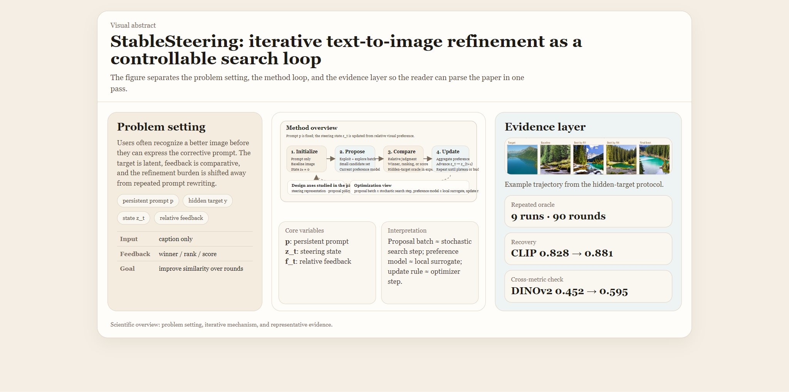
  <figcaption><strong>Visual Abstract.</strong> The figure is organized into three parts. Left: the problem setting, in which the prompt remains fixed while the target is latent and feedback is comparative. Center: the StableSteering loop, which alternates proposal, comparison, preference aggregation, and steering-state update. Right: a representative hidden-target trajectory together with the main repeated-oracle quantitative highlight. The figure is composed from exact vector layout and experiment-derived imagery to summarize the paper’s setting, mechanism, and evidence at a glance.</figcaption>
</figure>

## 1. Introduction

Text-to-image generation has become a powerful interface for visual creation, but it remains a weak interface for visual refinement. In practice, users often recognize that one image is closer to their intent than another while still lacking the vocabulary needed to write the prompt that would produce the desired correction. This problem matters because real use is rarely one-shot. Product iteration, design exploration, scientific illustration, and creative authoring all involve repeated refinement under partially specified intent. Yet current workflows still place most of the refinement burden on prompt editing, manual trial-and-error, or expensive model-level adaptation.

That burden is not only inconvenient; it reflects a deeper mismatch between the supervision users can provide and the supervision the system expects. Prompt engineering is a real skill rather than a trivial interface operation, and prompt revision can be especially difficult for novice users or for subtle visual changes (Oppenlaender et al., 2023; Wang et al., 2024a). Prompt-optimization methods can improve prompts offline, but they still operate in language space and therefore inherit the difficulty of expressing the right correction verbally (Wang et al., 2024b). Interactive systems can help with prompting and editing, but they often combine several intervention mechanisms at once, which makes the refinement process harder to study as a scientific object in its own right (Wang et al., 2024a).

This paper takes a different perspective. Instead of treating iterative refinement as repeated prompt rewriting, it treats it as an inference-time control problem over a fixed generator. The prompt remains persistent. A session-level steering state captures the current local direction of search. Each round then performs four operations: it constructs prompt-conditioned control from the current state, proposes a small exploit-explore candidate batch, elicits preference information over that batch, and updates the state for the next round. The user is therefore asked to provide comparative visual information rather than a fully specified textual correction.

An especially useful way to view this loop is as an optimization process without direct gradients. The steering state is the current iterate. The proposal policy plays the role of a stochastic sampler. Human or oracle feedback supplies noisy supervision. The preference model converts that supervision into a local surrogate direction, and the update rule advances the next state. Incumbent preservation, smoothing, and stagnation control act like optimizer-side memory and trust-region mechanisms. The analogy is not exact because the system lacks access to a differentiable ground-truth objective, but it is scientifically productive because it focuses attention on proposal geometry, surrogate quality, and update memory rather than on prompt rewriting alone.

This framing makes the problem both difficult and important. It is difficult because the objective is latent, the feedback is comparative and noisy, the search space is only indirectly defined through a text-conditioned diffusion model, and later rounds can plateau even when visually plausible challengers remain. It is important because the same refinement bottleneck appears across many practical text-to-image workflows, and because it occupies a middle ground between prompt engineering and model fine-tuning that is not yet well characterized.

The central claim of the paper is therefore methodological rather than architectural. StableSteering contributes a framework in which iterative refinement can be decomposed into four inference-time design axes: steering-direction computation, candidate-sampling policy, preference-aggregation model, and incumbent-management policy. This decomposition makes it possible to compare concrete strategies within one shared loop rather than across incomparable end-to-end systems.

The paper makes four contributions.

1. It formulates iterative text-to-image refinement as a preference-guided inference-time search process around a persistent prompt and an explicit steering state.
2. It isolates steering-direction computation, proposal geometry, preference modeling, and incumbent handling as separable methodological axes inside one common refinement loop.
3. It introduces a hidden-target oracle protocol, built from real images and caption-based initialization, that turns iterative refinement into a measurable round-by-round target-recovery problem.
4. It shows empirically that recovery and plateauing are governed by the interaction among steering representation, proposal diversity, preference aggregation, and incumbent policy rather than by any single heuristic in isolation.

The paper's central claim is focused and direct: iterative text-to-image refinement can be treated as a well-defined inference-time process, and that process can be analyzed systematically through controlled comparisons of the modeling choices that shape it. Exact module inventories and full supplementary protocol tables are provided in Appendix A and Appendices D-N.

## 2. Related Work and Conceptual Positioning

### 2.1 Prompting, prompt refinement, and the interaction bottleneck

One immediate context for this work is the prompt-engineering literature. DiffusionDB documented both the scale and the variability of real-world prompting behavior, helping make clear that prompt construction is itself a nontrivial human task rather than a frictionless interface primitive (Wang et al., 2023). Oppenlaender et al. (2023) further showed that prompt engineering behaves like an acquired creative skill: users can often judge prompt quality but struggle to produce or refine prompts that consistently yield the intended result. PromptCharm makes the same point from a systems perspective, showing that mixed-initiative tooling and richer feedback channels are needed because iterative prompt editing is difficult in practice (Wang et al., 2024a). DPO-Diff approaches the problem from another direction by optimizing prompts directly in language space (Wang et al., 2024b). These papers are important because they establish the user-side bottleneck that motivates StableSteering. They differ, however, in locus of control: they still treat the prompt itself as the primary adaptive object.

### 2.2 Diffusion control and inference-time editing

StableSteering also sits next to a broad literature on inference-time control of diffusion models. Latent diffusion and classifier-free guidance established the dominant modern text-to-image backbone and inference-time conditioning paradigm (Rombach et al., 2022; Ho and Salimans, 2022). Prompt-to-Prompt manipulates cross-attention to preserve spatial layout while changing text semantics (Hertz et al., 2022). DiffusionCLIP, Imagic, and SEGA show that useful semantic directions can be built and applied at inference time (Kim et al., 2022; Kawar et al., 2023; Brack et al., 2023). SDEdit, ControlNet, and InstructPix2Pix broaden the control surface further through image-conditioned editing, structural conditioning, and instruction-based editing (Meng et al., 2022; Zhang et al., 2023; Brooks et al., 2023). This line of work demonstrates that powerful control does not require training an entirely new generator. StableSteering differs in what it studies: it focuses on the iterative decision process that chooses and updates steering directions across rounds, not on a new conditioning architecture.

### 2.3 Multi-turn and mixed-initiative generation

A third line of work studies multi-turn or mixed-initiative generation more directly. TheaterGen and AutoStudio investigate multi-turn consistency and structured generation over longer interactions (Cheng et al., 2024; Xian et al., 2024). T2I-Copilot uses multi-agent prompt engineering and self-improvement to improve text-to-image generation without retraining (Lian et al., 2024). These systems are valuable because they confirm that iterative generation is an important application regime. Relative to them, StableSteering makes a stronger abstraction: the next prompt is not the primary state variable. Instead, the framework treats refinement as local search over a persistent prompt-conditioned intent, with the steering state and candidate batch as the main adaptive objects.

### 2.4 Preference alignment for diffusion models

Preference signals are also increasingly used to improve diffusion generators. ImageReward provides a learned reward model for text-to-image preference evaluation (Xu et al., 2023). Using Human Feedback to Fine-Tune Diffusion Models without Any Reward Model, DPOK, curriculum-style direct preference optimization, and diffusion RL variants all show that preference information can be used to fine-tune model parameters or learned policies (Yang et al., 2023; Fan et al., 2024; Black et al., 2024; Croitoru et al., 2025; Miao et al., 2024). These papers are adjacent in supervision type but different in intervention locus. StableSteering keeps the generator fixed and performs adaptation entirely at inference time through a session-level state. The scientific question is therefore not how to align the generator globally, but what can be achieved by preference-guided local search before one pays the cost of model-level adaptation.

### 2.5 Relevance feedback, preference learning, and diversity-aware search

The paper is also connected to older literatures that are rarely foregrounded in text-to-image work but are conceptually central here. Classical relevance feedback updates a query from judgments over retrieved items rather than from a completely new query; Rocchio-style feedback is the canonical example (Rocchio, 1971; Salton and Buckley, 1990). Recent interactive retrieval work revisiting relevance feedback in CLIP-based systems shows that preference accumulation remains useful even with strong pretrained encoders (Nara et al., 2024). Preference-based online learning and dueling-bandit formulations study how relative comparisons can guide sequential decision making without direct scalar supervision (Bengs et al., 2021). Quality-diversity search, especially MAP-Elites, emphasizes the value of maintaining diverse high-performing candidates rather than collapsing immediately onto one exploitative path (Mouret and Clune, 2015). StableSteering inherits ideas from all three traditions: comparative supervision, iterative preference accumulation, and explicit diversity maintenance.

### 2.6 Novelty and scope

The novelty claim of this paper is methodological rather than architectural. StableSteering centers iterative refinement itself as the object of study: a fixed-generator, inference-time process with separable steering-direction, proposal, preference, and incumbent policies, together with an oracle protocol that makes that process measurable. This positioning gives the paper a distinct role within the broader literature on prompt refinement, diffusion control, and preference-guided generation: it provides a common analytic loop in which different refinement strategies can be instantiated and compared.

In summary, StableSteering is best read as an inference-time framework at the intersection of diffusion control, mixed-initiative generation, preference-guided search, relevance feedback, and diversity-aware local optimization. Its central question is not how to build the best single controller, but how to analyze the design space of iterative refinement itself.

## 3. Problem Formulation and Conceptual Pipeline

Let \(p\) denote the persistent text prompt and let \(z_t \in \mathbb{R}^d\) denote the steering state at round \(t\). The state is not assumed to be semantically interpretable coordinate by coordinate. It is simply the current point in a low-dimensional control space used to generate the next candidate batch. Let \(m_t\) denote an optional preference-memory state, which stores the current local belief about promising directions. In the simplest winner-centric loop, \(m_t\) is trivial. In richer update rules, \(m_t\) can be viewed as an optimizer-like memory term that smooths, reweights, or accumulates preference information across rounds.

At round \(t\), the sampler proposes \(k\) steering perturbations \(s_t^{(1)}, \dots, s_t^{(k)}\) around the current state. Equivalently, one may write

$$
s_t^{(j)} \sim q_t(\cdot \mid z_t, m_t),
\qquad j=1,\dots,k,
$$

where \(q_t\) is a proposal distribution that mixes exploitative and exploratory directions according to the current state and, when present, the current preference memory. The diffusion renderer then produces a candidate set

$$
C_t = \left\{x_t^{(j)} = G\!\left(p, z_t, s_t^{(j)}; \theta \right)\right\}_{j=1}^{k},
$$

where \(G\) is a fixed generator with parameters \(\theta\). The user, or an oracle in proxy experiments, provides feedback \(f_t\) over the batch \(C_t\). A normalization map converts that feedback into a comparable internal signal:

$$
\tilde f_t = N(f_t, C_t).
$$

The preference model then updates the local memory state,

$$
m_{t+1} = M(m_t, C_t, \tilde f_t),
$$

where \(M\) may be as simple as “keep only the winner” or as rich as a score-weighted, pairwise, or listwise latent-utility estimator. An update operator \(U\) then produces the next steering state:

$$
z_{t+1} = U(z_t, m_{t+1}, C_t, \tilde f_t; \phi),
$$

where \(\phi\) denotes the parameters of the chosen update rule rather than learned model parameters. A useful SGD-style view is

$$
z_{t+1} = z_t + \eta_t \Delta_t,
\qquad
\Delta_t = \Delta(z_t, m_{t+1}, C_t, \tilde f_t),
$$

where \(\Delta_t\) is a surrogate descent direction induced by candidate comparisons rather than analytical gradients. The loop repeats until a stopping condition is met.

This formulation separates four modeling choices that are often conflated in iterative generation systems:

1. **Steering-direction model**: how the low-dimensional state is converted into a prompt-conditioned embedding perturbation.
2. **Sampling model**: how the candidate batch explores the local neighborhood around the current state.
3. **Preference model**: how ratings, pairwise choices, or rankings are transformed into a local preference state or surrogate direction.
4. **Steering policy**: how the next state balances incumbent preservation, challenger influence, and optimizer-like memory.

This decomposition is itself part of the paper's novelty claim. Much adjacent work changes the generator, rewrites prompts, or introduces a critic over one-shot samples. Here, the methodological object is the refinement loop itself. By separating proposal, aggregation, and incumbent policies, the paper makes it possible to ask not only whether iterative refinement helps, but which approaches within the shared framework produce which behaviors.

The corresponding conceptual pipeline is shown in Figure 1.

<figure>
  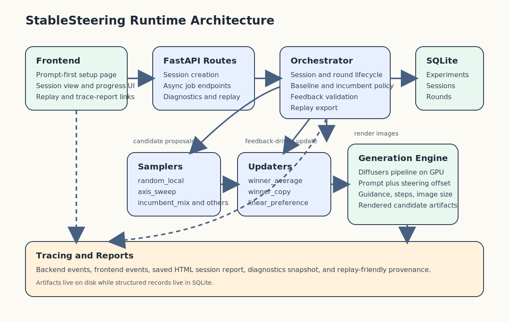
  <figcaption><strong>Figure 1.</strong> Conceptual overview of StableSteering. A persistent prompt defines the task, the steering-direction operator maps the latent state into prompt-conditioned control, the sampler proposes a local candidate set, preferences are elicited over the candidates, and an update operator produces the next state. The scientific question is not only whether the loop can improve alignment, but how steering-direction computation, sampling, preference modeling, and incumbent policy shape that behavior.</figcaption>
</figure>

## 4. Methodology

### 4.1 Rendering model and steering state

The generator remains fixed within a session. The prompt \(p\) is constant, and all iterative behavior is expressed through the steering state \(z_t\), the optional preference-memory state \(m_t\), the proposal set \(s_t^{(j)}\), and the update rule. In the current implementation the steering state modulates prompt embeddings and generation settings at inference time, but the methodological point is more general: StableSteering treats iterative refinement as stateful search over a prompt-conditioned local control manifold.

The initial state is \(z_0 = 0\), which corresponds to a baseline prompt-only render. Round 1 always includes this unmodified baseline candidate. In later rounds, the previously selected winner is carried forward as an incumbent. This choice stabilizes the search but also creates the possibility of late-round stagnation, a phenomenon that becomes important in the experiments. In the SGD analogy, the incumbent is best thought of as a retained checkpoint of the best current iterate rather than as a direct analog of momentum.

### 4.2 Steering-direction computation models

The steering state does not act directly in pixel space. Instead, it is mapped into a prompt-embedding perturbation. Let \(E(p) \in \mathbb{R}^{L \times H}\) denote the prompt embeddings for a prompt with \(L\) tokens and hidden width \(H\). StableSteering applies a steering operator

$$
\tilde E_t = E(p) + \Delta(E(p), p, z_t),
$$

and the diffusion model then renders from \(\tilde E_t\) rather than from the raw prompt embeddings alone. The paper compares three concrete instantiations of \(\Delta\).

The experiments compare three conceptually distinct forms of steering-direction computation.

1. **Global steering.** The steering vector produces one hidden-space offset that is broadcast across all tokens:

$$
\Delta_{u,h} = a \sum_{i=1}^{d} z_{t,i} b_{i,h},
$$

where \(u\) indexes tokens, \(h\) indexes hidden dimensions, \(a\) is the anchor strength, and \(b_i \in \mathbb{R}^{H}\) is the \(i\)-th hidden-space basis vector. This is the simplest representation: the prompt is perturbed coherently in one shared hidden-space direction.

2. **Content-weighted steering.** The same hidden-space displacement is modulated by a token-content mask \(m_u\):

$$
\Delta_{u,h} = m_u \, a \sum_{i=1}^{d} z_{t,i} b_{i,h},
\qquad
0 \le m_u \le 1.
$$

This produces a modestly structured token-aware representation: content-bearing tokens receive more of the steering signal, while special tokens and padding are suppressed.

3. **Factorized token-aware steering.** A low-rank token-aware model assigns different token profiles to each steering coordinate:

$$
\Delta_{u,h} = a \sum_{i=1}^{d} z_{t,i} c_{i,u} b_{i,h},
$$

where \(c_i \in \mathbb{R}^{L}\) is a learned-free token-profile basis. This is the most expressive of the three reported representations because it allows different prompt tokens to receive different steering perturbations.

The three variants therefore share the same outer optimization loop and the same low-dimensional state \(z_t\). They differ only in how that state is converted into prompt-conditioned directional evidence. This separation is methodologically useful because it allows representational questions to be studied without changing the surrounding refinement loop. Appendix A records the concrete implementation mapping used in the archived codebase.

### 4.3 Candidate-sampling model families

The candidate sampler determines which local alternatives are visible at each round. In optimization language, it defines the stochastic proposal distribution from which local directional evidence is elicited. The implemented samplers fall into four broad classes.

1. **Local exploit-explore proposals**, which remain near the incumbent while maintaining modest directional variation.
2. **Structured directional probes**, which test interpretable forward, backward, or axis-aligned moves around the current state.
3. **Coverage-oriented proposals**, which prioritize angular separation and broader local coverage.
4. **Adaptive anti-stagnation proposals**, which widen the search, blend local refinement with partial restart behavior, or respond explicitly to repeated incumbent reuse.

The proposal set at round \(t\) can be written abstractly as

$$
S_t = \mathcal{S}(z_t, \rho_t, k),
$$

where \(\rho_t\) is an effective search radius. In adaptive variants, \(\rho_t\) may expand when repeated incumbent reuse suggests that the search has become locally stagnant. Exact sampler inventories and protocol-specific sampler assignments are provided in Appendix A and Appendices E-L.

### 4.4 Preference elicitation and normalization

The framework supports several forms of user feedback: scalar ratings, winner-only selection, pairwise winner/loser choice, approve/reject markings, and ranked top-\(k\) lists. These raw forms are heterogeneous, so they are normalized into internal batch-level preference weights or contrasts. In optimization language, this stage constructs a noisy local supervision signal from human comparisons over a finite candidate batch.

For example, a scalar-rating round may yield normalized nonnegative weights \(w_t^{(j)}\) satisfying \(\sum_j w_t^{(j)} = 1\). A pairwise round may produce a winner-loser contrast. A top-\(k\) ranking may induce ordinal or probabilistic utilities over the entire batch. This normalization step is essential because it determines whether the update uses only the winner, the full ranking, or explicit positive-versus-negative evidence.

### 4.5 Update models

The update model determines how batch-level preference information is transformed into the next steering state. The simplest update rules are winner-centric:

$$
z_{t+1} = z_t + \alpha \left(z_t^{\star} - z_t\right),
$$

where \(z_t^{\star}\) is the selected winner state and \(\alpha \in (0,1]\) controls step size. In the optimization analogy, these are zeroth-order update rules: they estimate a local preferred direction from the current batch and step along it.

Richer models use more of the batch. A score-weighted or softmax-weighted update forms a centroid of all candidate states:

$$
z_{t+1} = (1-\alpha)z_t + \alpha \sum_{j=1}^{k} \pi_t^{(j)} z_t^{(j)},
\qquad
\pi_t^{(j)} \propto \exp(\beta r_t^{(j)}),
$$

where \(r_t^{(j)}\) is a normalized score and \(\beta\) controls concentration. A contrastive update moves toward preferred candidates and away from dispreferred ones:

$$
z_{t+1} = z_t + \alpha \left(\mu_t^{+} - \mu_t^{-}\right).
$$

Probabilistic pairwise and listwise models go one step further by estimating latent utilities from relative comparisons across the batch. Incumbent-aware variants additionally weight challenger influence relative to the currently retained image. These models matter because they transform feedback from “choose the best image” into “estimate a local preference structure over the candidate set.” In the optimization analogy, they are alternative surrogate models of the latent objective. Appendix A.3 gives the exact implemented update families and closed-form rules used in the archived experiments.

### 4.6 Oracle models for target-recovery evaluation

The main quantitative validation in this paper uses oracle-driven target recovery. Each task starts from a real image \(y\) and a manually written caption \(p\). The generator sees only \(p\), not \(y\). The oracle chooses winners by comparing candidate images to the hidden target \(y\) in a pretrained embedding space.

The simplest oracle is CLIP cosine similarity:

$$
o_t^{(j)} = \cos\!\left(e_{\text{CLIP}}(x_t^{(j)}), e_{\text{CLIP}}(y)\right).
$$

Later experiments also use DINOv2 for independent evaluation and explore ensemble or novelty-aware policies, for example

$$
o_t^{(j)} = \lambda\, o_{\text{CLIP}}^{(j)} + (1-\lambda)\, o_{\text{DINO}}^{(j)} + \gamma\, \nu_t^{(j)},
$$

where \(\nu_t^{(j)}\) is a novelty or challenger bonus. The purpose of these oracle variants is not to claim that CLIP or DINO is the ground truth. Their purpose is to create controlled hidden-target tasks in which progress can be measured round by round.

### 4.7 Incumbent management and anti-stagnation controls

Carrying the current winner forward into the next round is intuitively attractive because it preserves the best-known image. However, it also creates a structural bias toward repeated re-selection. StableSteering therefore studies incumbent handling explicitly.

The framework includes three increasingly strong anti-stagnation ideas:

1. **Radius expansion** after repeated same-image reuse.
2. **Soft incumbent penalties**, which reduce incumbent dominance without forbidding it.
3. **Hard incumbent cooldown**, which temporarily excludes the incumbent from winner selection.

These choices are important because visible plateauing in iterative refinement often has less to do with “poor generation quality” than with the interaction between incumbent carry-forward, narrow proposal geometry, and winner-only updates.

From a methodological perspective, this is one of the clearest ways the paper differs from adjacent literature. In many refinement systems the incumbent policy is implicit, folded into prompt editing, self-critique, or a hidden search routine. StableSteering makes incumbent handling explicit and experimentally variable, which allows the paper to identify plateauing as a structural refinement phenomenon rather than an anecdotal artifact.

## 5. Experimental Methodology

The experimental program is designed to answer methodological questions rather than to maximize a leaderboard score. For that reason, the paper uses a layered evaluation strategy. The main text reports the highest-value evidence needed to establish the paper's central claims: that iterative inference-time refinement is measurable, that steering representation and proposal geometry matter, that preference modeling matters, and that plateauing is a structural phenomenon rather than a visual anecdote. Secondary module slices, broader artifact bundles, and additional protocol details are moved to the appendix so that the main paper remains focused on the most informative comparisons.

### 5.1 Research questions

The experiments are organized around four questions.

1. **RQ1:** Can iterative steering produce measurable progress toward a hidden visual target when the generator receives only a caption?
2. **RQ2:** Do different steering-direction, sampling, and preference models materially change the behavior of the loop?
3. **RQ3:** Why do many iterative runs appear to stop changing visually even when more rounds remain?
4. **RQ4:** Which anti-stagnation strategies preserve challenger pressure without destroying final alignment?

### 5.2 Primary evidence layers

Table 1 summarizes the main empirical layers used in the paper. The table is important because the manuscript intentionally combines qualitative evidence, hidden-target oracle evidence, and focused mechanism studies. These layers answer different questions and should not be read as interchangeable.

| Evidence layer | Purpose | Main reported quantity | Role in argument |
|---|---|---|---|
| Representative archived trajectories | Show what best-so-far refinement looks like inside the experimental protocol | target, baseline, and intermediate best-so-far images | illustrative only |
| Base oracle target-recovery study | Establish that iterative refinement is measurable | baseline-to-round-10 improvement under CLIP | foundational evidence |
| Repeated multi-metric oracle study | reduce single-seed and single-metric risk | CLIP and DINOv2 improvement across 9 runs | strongest primary quantitative evidence |
| Steering, sampler, and preference slices | compare modeling choices within one shared loop | matched-budget final recovery and deltas | mechanism evidence |
| Plateau diagnosis and restart slices | explain and mitigate late-round freezing | incumbent share, plateau share, late improvement, final recovery | failure-mode analysis |

### 5.3 Common experimental setting

All reported experiments use one fixed diffusion backbone so that the empirical comparisons isolate inference-time refinement choices rather than differences in model training. Unless otherwise noted, images are generated at `512×512`, each run uses a small candidate budget, and the reported bundles are archived with per-run summaries, round-level tables, and derived figures. The main hidden-target studies use three held-out real-image targets assembled for this study together with manual captions, while the caption-source extension uses a curated Flickr8k test subset (Hodosh et al., 2013). The exact protocol settings for each bundle are reported in the appendix.

### 5.4 Representative archived trajectories

The paper includes a small qualitative layer drawn directly from archived experimental runs. Its purpose is illustrative rather than statistical: it shows what best-so-far refinement looks like within the same hidden-target protocol used for the quantitative studies. Figure 2 presents two representative trajectories, one landscape and one portrait, each shown as target, baseline, early best-so-far improvement, mid-run refinement, and final best image.

<figure>
  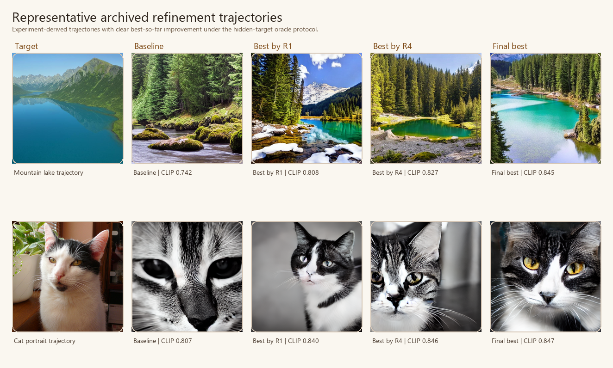
  <figcaption><strong>Figure 2.</strong> Representative archived refinement trajectories drawn from two experimental runs. Each row shows the hidden target, the prompt-only baseline, and best-so-far checkpoints over the course of one run. The figure is included to make the progression pattern visually concrete; aggregate quantitative claims remain grounded in the main result tables and Figures 3-12.</figcaption>
</figure>

To complement those trajectories, Figure 2A makes the within-round decision process explicit by showing two consecutive candidate batches from a single archived oracle run. This panel is useful because it reveals how incumbent carry-forward interacts with newly proposed challengers: the previous winner is preserved for the next round, but a newly sampled challenger can still overtake it.

<figure>
  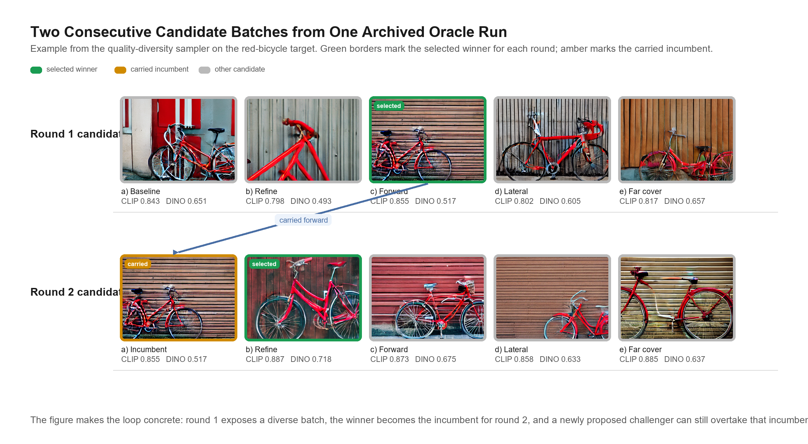
  <figcaption><strong>Figure 2A.</strong> Two consecutive candidate batches from one archived oracle run. Round 1 exposes a diverse batch, the selected winner is carried into round 2 as the incumbent, and a newly proposed challenger still overtakes that incumbent. This figure is included to make the batch-selection mechanism concrete; the aggregate quantitative evidence remains in Figures 3-12 and the appendix tables.</figcaption>
</figure>

### 5.5 Oracle target-recovery protocol

The main quantitative protocol uses real images paired with manually written captions. For each target image \(y\), generation begins from the caption alone. The hidden target is used only by the oracle that scores candidates. The base oracle study uses 3 targets, 10 rounds per target, 4 candidates per round, and a fixed steering configuration, yielding 120 candidate images in total. The exact base-protocol table is given in Appendix D.

The repeated-seed extension repeats each target 3 times under different deterministic seeds, yielding 9 runs, 90 rounds, and 360 candidate rows. Final evaluation is reported under both CLIP and DINOv2. Exact target-level tables are given in Appendix E.

An additional caption-and-metric extension uses a curated Flickr8k subset to ask two related questions: whether the hidden-target protocol remains informative when initialization comes from an automatically generated rich caption rather than a manual caption, and whether the reported behavior depends strongly on the chosen image-similarity metric. The extension uses 6 selected targets, 36 runs, 144 rounds, and 576 scored candidate rows, compares human captions with BLIP-generated caption variants (Li et al., 2022), and compares CLIP, SigLIP (Zhai et al., 2023), and multi-metric oracle policies together with LPIPS as a supplementary perceptual distance (Zhang et al., 2018). Exact protocol details and confidence-interval tables are given in Appendix N.

This protocol is also part of the paper's novelty claim. Prior work often evaluates prompt fidelity, editing quality, or downstream reward scores, but much less often asks whether an iterative refinement loop can recover a hidden real-image target from caption-only initialization under repeated feedback. The protocol is intentionally narrow, but it turns a vague refinement narrative into a measurable round-by-round problem.

### 5.6 Controlled module slices

To isolate design choices inside the steering loop, the paper includes several matched-budget slices.

1. **Representation slices**, which compare alternative steering representations while holding the outer loop fixed.
2. **Proposal slices**, which compare local-search geometries.
3. **Preference slices**, which compare batch-aggregation models.
4. **Direct-baseline slices**, which compare the steering loop against prompt-only and non-updating alternatives under the same visible candidate budget.
5. **Stagnation-analysis slices**, which study plateauing through late-round movement, incumbent reuse, and challenger pressure.

The goal of these slices is to identify which modeling choices most strongly alter the search dynamics. Exact slice definitions, protocol tables, and supplementary summaries are collected in Appendices G-L.

### 5.7 Budget-matched direct-baseline slice

The direct-baseline slice compares the steering loop with simpler alternatives under a common visible candidate budget of `5` rounds and `4` candidates per round. The compared methods are prompt-only best-of-budget seed search, heuristic prompt-modifier search, no-update resampling, and the current best steering policy. The comparison therefore asks how a fixed image budget is used under different refinement strategies.

The slice provides a direct comparative reference for the main oracle results. The exact checkpoint values used in the main-text figure are reported in Appendix G.3.

### 5.8 Human pairwise layer

The paper package also includes a small human pairwise evaluation protocol with curated pairs and annotation tooling. At present, it is protocol-ready but contains no collected human judgments. It is therefore part of the methodological infrastructure, not of the reported evidence.

## 6. Results

The results are organized from broadest claim to most specific mechanism. Section 6.1 establishes that the framework supports measurable hidden-target recovery at all. Section 6.2 asks the newly added direct-baseline question: what happens under the same visible candidate budget if one simply keeps resampling or rewrites the prompt heuristically? Sections 6.3-6.5 then ask which internal modeling choices most strongly affect recovery once the loop itself is treated as the object of study. Sections 6.6-6.8 focus on the main failure mode revealed by the earlier experiments, namely late-round plateauing, and study how anti-stagnation strategies change that behavior.

### 6.1 Hidden-target recovery is measurable and nontrivial

The most important outcome is that the loop supports measurable target recovery rather than only anecdotal improvement. In the base oracle target-recovery study, mean best-candidate CLIP similarity improves from `0.825` for the prompt-only baseline to `0.896` by round 10. In the repeated-seed multi-metric extension, mean CLIP similarity improves from `0.828` to `0.881`, while mean DINOv2 similarity improves from `0.452` to `0.595`.

<figure>
  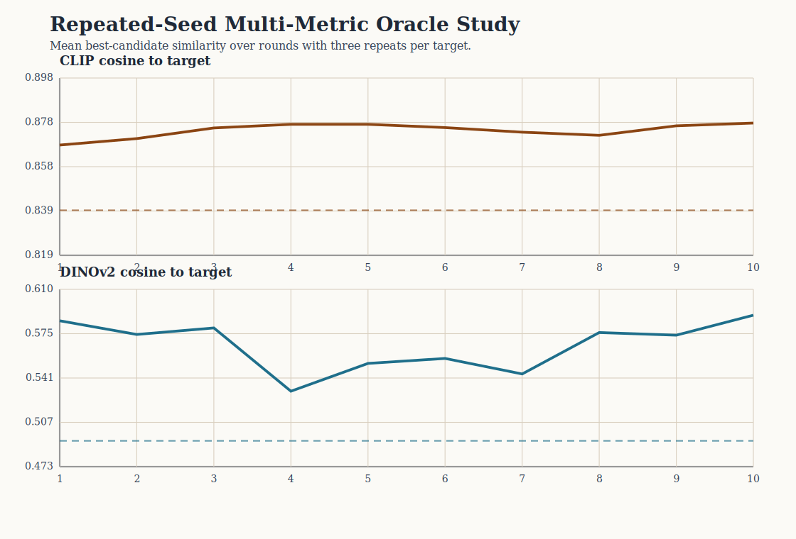
  <figcaption><strong>Figure 3.</strong> Repeated-seed multi-metric oracle target recovery. Improvement is visible under both the oracle metric (CLIP) and an independent evaluation metric (DINOv2), supporting the view that the loop captures consistent signal across rounds. The gains are moderate and align with a local-search interpretation.</figcaption>
</figure>

<figure>
  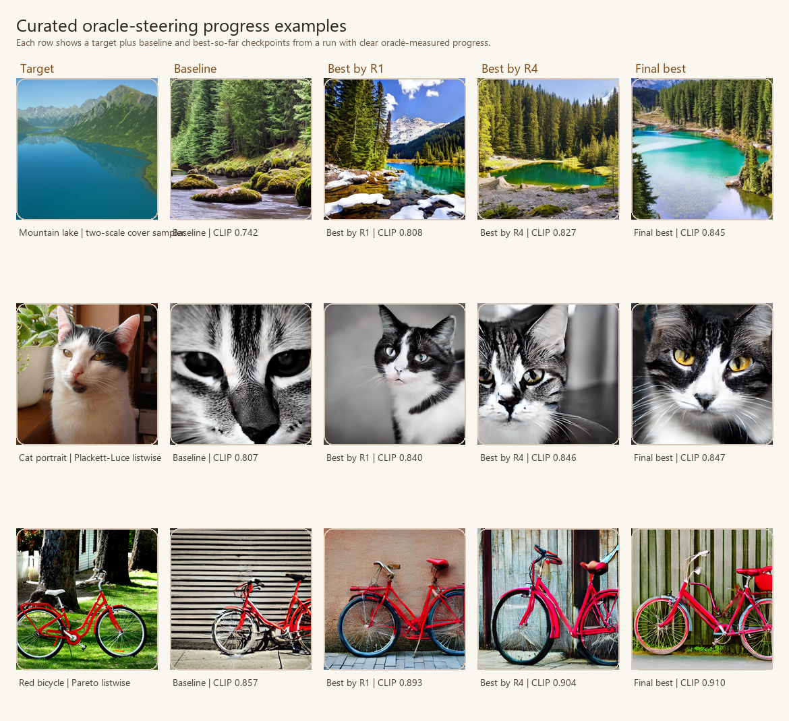
  <figcaption><strong>Figure 4.</strong> Curated oracle-steering progress examples from later oracle bundles. Each row shows a hidden target, the prompt-only baseline, and best-so-far checkpoints from a run with clear oracle-measured improvement over rounds. The figure is intentionally illustrative rather than aggregate: it highlights successful progressive recovery, while the manuscript’s quantitative claims remain grounded in Figure 3 and the accompanying tables.</figcaption>
</figure>

These gains are scientifically meaningful for two reasons. First, they show that iterative preference-guided inference can do more than produce a large first-round batch. Second, they show that the loop is not solely improving under the metric that chooses winners: DINOv2 also improves on average even though it is not the selection oracle in the base repeated protocol.

The repeated bundle also reveals meaningful target heterogeneity that is worth stating explicitly in the main text. Recovery is strongest for the red-bicycle target (`0.916` final CLIP, `0.715` final DINOv2), weaker for the mountain-lake target (`0.844`, `0.505`), and intermediate for the cat portrait (`0.883`, `0.565`). This pattern suggests that the framework is not merely producing one uniform effect size; target structure and prompt-image ambiguity materially influence how much iterative steering can recover under a fixed loop.

A complementary caption-source and oracle-metric extension on a curated Flickr8k subset indicates that the protocol does not depend on manual prompts alone. The BLIP-selected detailed caption condition reaches final CLIP `0.810` (95% bootstrap CI `[0.773, 0.845]`), final SigLIP `0.786` (`[0.728, 0.841]`), final DINOv2 `0.478` (`[0.256, 0.693]`), and final LPIPS `0.676` (`[0.619, 0.737]`), slightly improving on the human-caption condition on CLIP, SigLIP, and LPIPS while essentially matching it on DINOv2. Across oracle policies, CLIP selection gives the strongest final CLIP score (`0.834`, `[0.808, 0.860]`), SigLIP selection gives the strongest final SigLIP (`0.789`, `[0.725, 0.853]`) and DINOv2 (`0.476`, `[0.258, 0.631]`) endpoints, and the multi-metric oracle remains an intermediate compromise. The combined result suggests that richer automated captions broaden the feasible initialization space while the oracle metric still determines which notion of similarity is emphasized; Appendix N provides the exact numeric tables.

Table 2 collects the most decision-relevant quantitative comparisons from the main text. The purpose is not to collapse the paper into one scalar ranking, but to make the evidence hierarchy explicit: the repeated oracle study establishes the core effect, while later rows identify which modeling choices most strongly shape that effect.

| Main-text comparison | Key result | Interpretation |
|---|---|---|
| Repeated oracle target recovery | CLIP `0.828 -> 0.881`, DINOv2 `0.452 -> 0.595` | iterative refinement is measurable and nontrivial |
| Budget-matched direct baselines | different simple baselines are strongest on different metrics under the same visible budget | framework-level analysis should be distinguished from any single current policy |
| Steering-direction slice | lightweight and fully token-aware steering variants are all competitive, but added expressivity does not guarantee stronger recovery | steering-direction structure matters, but the best form remains a controlled design choice |
| Preference-model extension | `bradley_terry_preference` gives strongest combined CLIP/DINOv2 outcome in its slice | richer preference modeling can matter materially |
| Inspired-method / progress-aware follow-up | stronger late movement with reduced plateauing | challenger preservation changes the search regime |
| Restart-style reformulation | `restart_directional` best for plateau avoidance, `restart_advantage` best for final CLIP | anti-plateau control is a multi-objective tradeoff |

They also clarify the novelty boundary of the result. The contribution is to evaluate a fixed-generator refinement loop as a dynamical process with observable convergence behavior. The paper's empirical novelty lies in making that process measurable and then using it to study which design choices matter.

### 6.2 Budget-matched direct baselines provide an informative reference

The direct-baseline slice places the steering loop alongside simpler alternatives under the same visible image budget. The comparison is valuable because it distinguishes a claim about the refinement framework from a claim about one particular policy.

The compact matched-budget protocol yields a competitive set of methods with distinct strengths. No-update resampling reaches the strongest final CLIP score, `0.881`, with mean gain `+0.051`. Prompt-only best-of-budget reaches the strongest final DINOv2 score, `0.602`, with mean gain `+0.135`. The current best StableSteering policy reaches `0.873` final CLIP and `0.553` final DINOv2, while the heuristic prompt-rewrite baseline reaches `0.875` CLIP and `0.498` DINOv2. Figure 5 summarizes the comparison at four checkpoints, and Appendix G provides the exact numerical tables.

<figure>
  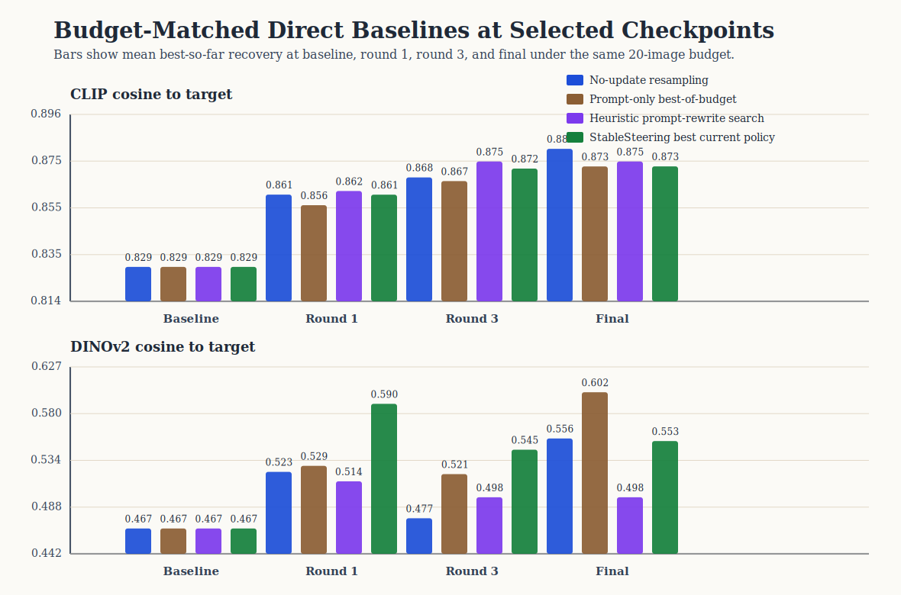
  <figcaption><strong>Figure 5.</strong> Budget-matched direct baseline comparison at selected checkpoints on the hidden-target task. Bars show mean best-so-far recovery at baseline, round 1, round 3, and final under the same `5 × 4` visible-candidate budget. The checkpoint view makes the comparison easy to read at meaningful points in the search: no-update resampling is strongest on final CLIP, prompt-only best-of-budget is strongest on final DINOv2, and StableSteering remains competitive while exposing a richer refinement process to analysis.</figcaption>
</figure>

This comparison refines the paper’s interpretation in three ways. First, it separates a claim about the framework from a claim about the present policy. Second, it shows that a substantial portion of hidden-target recovery is achievable through budgeted candidate exposure alone. Third, it identifies update efficiency and incumbent management as the central methodological questions for future refinement policies.

The prompt-rewrite arm is also informative. The heuristic modifier-search baseline remains competitive on CLIP, especially for the red-bicycle target, while producing lower aggregate DINOv2 recovery. This suggests that direct prompt editing remains a meaningful comparator and that latent steering and prompt editing emphasize different parts of the refinement problem.

### 6.3 Steering representation affects recovery

The steering-mode slice asks whether it matters how the steering state is translated into prompt-conditioned control. In the updated four-way comparison, the content-weighted representation achieves the strongest final CLIP score (`0.884`), the shared-token and token-factorized representations achieve the largest CLIP deltas (`0.063` and `0.063`) and the strongest final DINOv2 scores (`0.643` and `0.639`), and the new token-vector-field representation remains competitive without becoming the clear winner (`0.882` final CLIP, `0.622` final DINOv2). The resulting picture is more nuanced than a simple “more token awareness is better” story.

<figure>
  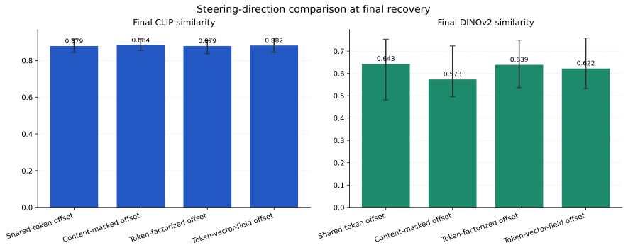
  <figcaption><strong>Figure 6.</strong> Steering-direction computation comparison summarized at final recovery. The four-way slice shows that several steering-direction models are viable, but greater representational freedom does not automatically produce stronger recovery. Content-masked steering gives the strongest final CLIP score in this compact comparison, while the shared-token and token-factorized variants remain competitive on DINOv2.</figcaption>
</figure>

<figure>
  
  <figcaption><strong>Figure 7.</strong> Example final images from the steering-mode comparison. The four modes produce visibly different tradeoffs in target matching and scene structure, which is consistent with the quantitative slice: token-aware steering is useful, but the more expressive variants do not simply dominate the lighter formulations.</figcaption>
</figure>

The methodological lesson is that representational structure matters, but in a graded way. The updated slice supports two conclusions at once: token-aware steering is a meaningful modeling axis, and additional token-wise flexibility does not automatically translate into stronger recovery. Appendix L provides the supporting slice tables and additional qualitative examples.

### 6.4 Proposal geometry affects the search regime

The sampler comparison slice already suggested that broader or more structured proposals matter: `diversity_shell` and `line_search` both reached mean final CLIP similarity of approximately `0.882`, compared with `0.867` for `exploit_orthogonal` in the same controlled slice. The later method-extension study reinforces this conclusion. `spherical_cover` achieved the strongest final DINOv2 score among new sampler families (`0.668`), while `annealed_shell` and `diversity_shell` both produced larger CLIP deltas (`0.065`) than several earlier local baselines.

<figure>
  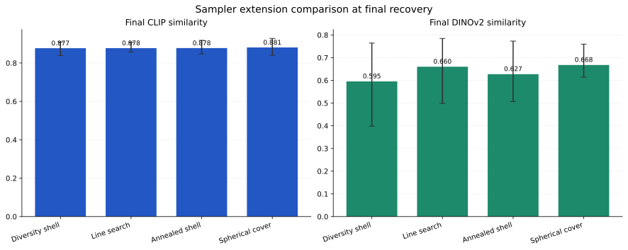
  <figcaption><strong>Figure 8.</strong> Sampler extension comparison summarized at final recovery. Proposal geometry changes the reachable search behavior. Broader coverage-oriented samplers generally preserve more useful challenger diversity than narrowly exploitative local proposals.</figcaption>
</figure>

This result is consistent with the local-search view of refinement. The proposal policy determines which alternatives are visible to the preference model at each round, and therefore shapes both the attainable corrections and the likelihood of later-round stagnation. Supplementary proposal slices are reported in Appendices H-I.

### 6.5 Preference aggregation changes recovery behavior

Richer feedback modeling does not guarantee uniformly better final scores, but it clearly changes behavior. In the earlier feedback slice, winner-centric updates remained competitive in a small study. In the method-extension comparison, however, `bradley_terry_preference` emerged as the strongest new updater, reaching final CLIP `0.886` and final DINOv2 `0.687`, outperforming `borda_preference`, `score_weighted_preference`, and `softmax_preference` on the combined proxy view.

<figure>
  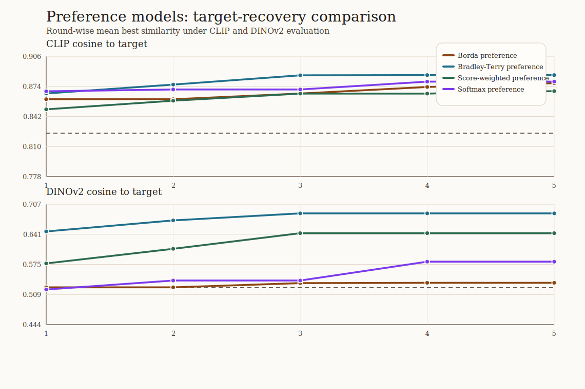
  <figcaption><strong>Figure 9.</strong> Preference-model extension comparison summarized at final recovery. Models that use more of the batch than a single winner can materially change the resulting search behavior. In this study, Bradley-Terry-style weighting produced the strongest overall combination of CLIP and DINOv2 recovery.</figcaption>
</figure>

The main scientific implication is that once candidate diversity is available, the way feedback is aggregated becomes consequential. Winner-only updates use only a narrow fraction of the available comparative signal, whereas richer pairwise or listwise models can alter both recovery and stagnation behavior. Appendix A.3 and Appendices H-I give the full updater inventory and supplementary comparison tables.

### 6.6 Plateauing is a structural property of the loop

A recurrent phenomenon in oracle steering is that later rounds stop changing visually. Focused diagnosis experiments show that this impression corresponds to a measurable pattern. In the compact diagnosis bundles, the baseline oracle policy exhibited high incumbent selection share and high plateau share. For example, the baseline CLIP-oracle policy in the later compact inspired-method study had incumbent selection share `0.73` and plateau share `0.67`.

The diagnosis experiments indicate that plateauing is created by a three-way interaction:

1. the incumbent is always present,
2. proposals remain too local, and
3. winner-centric preference updates reinforce incumbent dominance.

<figure>
  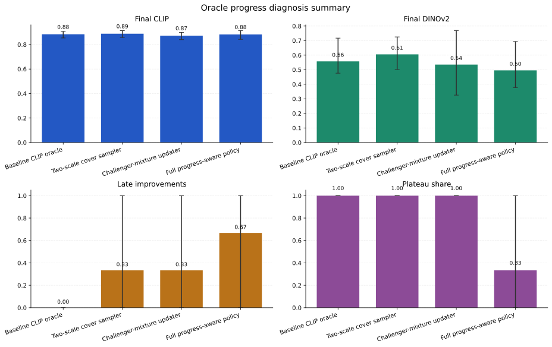
  <figcaption><strong>Figure 10.</strong> Focused diagnosis of oracle stagnation, shown as a compact metric summary. The most useful policies are not simply the ones with the highest final score, but the ones that preserve late-round movement while avoiding destructive over-exploration.</figcaption>
</figure>

The resulting picture is mechanistic rather than anecdotal. Later-round stagnation is not simply a visual impression; it is a reproducible property of the interaction among proposal locality, incumbent carry-forward, and preference aggregation.

### 6.7 The most effective policies balance challenger diversity and incumbent retention

The most informative later results come from three mutually reinforcing bundles: the compact incumbent-policy slice, a literature-inspired method comparison, and a progress-aware follow-up. The compact incumbent-policy slice is especially useful because it isolates incumbent handling under one shared budget and one shared proposal family. In that controlled comparison, a soft incumbent penalty achieved the strongest aggregate proxy recovery (`0.891` final CLIP, `0.636` final DINOv2), while hard incumbent exclusion removed end-of-run sticking most reliably but reduced final alignment (`0.856` CLIP, `0.568` DINOv2). This establishes a clear mechanistic point: moderate incumbent discouragement is more effective than hard suppression.

The later exploratory bundles sharpen the same point from a wider design perspective. A diversity-oriented listwise policy produced final DINOv2 `0.655`, CLIP delta `0.049`, incumbent selection share `0.20`, and plateau share `0.00`. A progress-aware pairwise policy produced final CLIP `0.883`, final DINOv2 `0.630`, late improvements `1.33`, incumbent selection share `0.60`, and plateau share `0.33`. Exact configuration names are given in Appendices I-J.

<figure>
  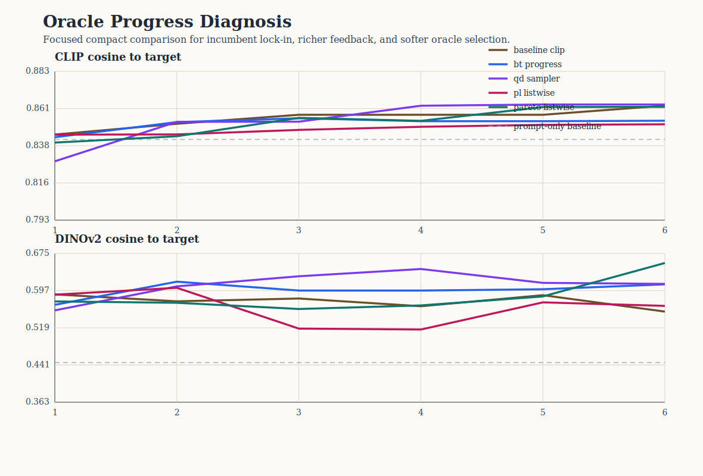
  <figcaption><strong>Figure 11.</strong> Literature-inspired method variants, summarized across final alignment and progress metrics. The strongest overall behavior does not come from maximal anti-incumbent pressure, but from balancing broader search coverage, richer preference aggregation, and moderate incumbent discouragement.</figcaption>
</figure>

Together, these results support a precise methodological conclusion: proposal geometry, preference aggregation, and incumbent handling must be designed jointly so that the search neither settles too early nor loses the best recovered direction. The compact incumbent-policy slice is especially useful because it turns that claim into a direct controlled comparison. Supplementary details are provided in Appendix E.

### 6.8 Restart-style formulations make the plateau tradeoff more explicit

The newest compact reformulation bundle asks a slightly different question: can plateauing be reduced by changing the task formulation itself rather than only widening the local challenger set? Two restart-style variants were therefore introduced. `restart_directional` combines a restart-bridge sampler with a directional oracle that rewards movement toward the hidden target from the current incumbent. `restart_advantage` uses the same restart-style sampler with an incumbent-aware softmax updater and an oracle that mixes absolute CLIP score, challenger advantage over the incumbent, and novelty.

<figure>
  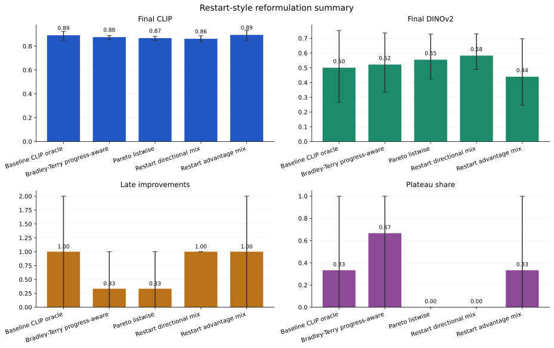
  <figcaption><strong>Figure 12.</strong> Restart-style oracle reformulations, summarized across final alignment and progress metrics. The most informative outcome is not a universal winner but a clarified tradeoff: directional restart removes plateauing and maximizes late-round movement, whereas advantage-aware restart gives the strongest final CLIP recovery in the same compact slice.</figcaption>
</figure>

The restart-style comparison is informative because it clarifies the tradeoff rather than collapsing to one universally dominant policy. In the compact slice, a directional-restart formulation reduces incumbent selection share to `0.00`, plateau share to `0.00`, and yields the strongest DINOv2 recovery among the compared policies (`0.582`). An advantage-aware restart formulation yields the strongest final CLIP score (`0.894`) and the largest CLIP improvement (`0.069`), while retaining some incumbent reuse. The baseline CLIP policy remains competitive on final CLIP (`0.891`), but does so with heavier incumbent lock-in (`0.73`) and residual plateau share (`0.33`).

This comparison sharpens the main design question. Plateau avoidance and final proxy alignment are not identical objectives. Restart-style formulations show that one can reduce visible stagnation substantially, but different formulations place that gain at different points on the alignment–movement tradeoff.

### 6.9 Evidence summary

The evidence supports the following claims.

1. Iterative inference-time steering can produce measurable hidden-target recovery beyond prompt-only initialization.
2. Sampling, preference modeling, and oracle policy materially change the behavior of the loop.
3. Plateauing is a structural phenomenon with interpretable causes.
4. Moderate incumbent discouragement, restart-style proposals, and broader proposal coverage can improve late-round behavior.

The present studies also locate the main open frontiers for the framework.

1. Budget-matched external comparisons remain an active area for policy improvement.
2. The search over best-performing policies remains open and experimentally interesting.
3. Human-subject evaluation is the natural next layer for connecting oracle recovery to user-facing preference.
4. Broader benchmark coverage would further extend the current compact mechanism-focused studies.

## 7. Discussion

The main conceptual lesson is that iterative text-to-image refinement is best studied as an interaction process with its own optimization geometry. Even with a fixed diffusion backbone, steering representation, proposal geometry, preference aggregation, and incumbent handling define distinct search regimes and distinct failure modes.

This perspective explains several otherwise puzzling empirical patterns. Large first-round gains are unsurprising because the initial batch already exposes useful alternatives to the prompt-only baseline. Later-round stagnation does not necessarily imply that the task is solved; it can arise because the incumbent is repeatedly reselected under proposals that are too local or under updates that discard most of the batch. Hard anti-incumbent interventions restore motion but can overshoot. Richer proposal and preference models can restore motion more selectively, but they also make the search more sensitive to how the steering state itself is represented. These are not accidental implementation quirks. They are the defining tradeoffs of preference-guided local search under a latent generative model.

The broader implication is that inference-time steering occupies a middle ground between prompt rewriting and model adaptation. In that regime, refinement proceeds through repeated judgments over candidate images, and the search policy absorbs part of the burden that would otherwise fall on manual prompt revision or parameter updating.

The direct-baseline slice sharpens this interpretation by making the budget-efficiency question explicit: how should a fixed image budget be allocated across persistence, challenger diversity, and update strength? The matched-budget results show that simple resampling and prompt-only best-of-budget remain strong reference points, which in turn focuses attention on update efficiency and incumbent management.

## 8. Limitations

The present study is bounded in several clear ways.

1. **Proxy-based quantitative evaluation.** The main quantitative studies rely on oracle similarity in pretrained embedding spaces.
2. **Compact controlled studies.** The prompt and target sets are intentionally small because the goal is mechanism identification rather than large-scale benchmarking.
3. **A limited direct prompt baseline.** The budget-matched slice includes a direct prompt-editing comparator, but not a stronger language-model prompt optimizer.
4. **One generator family.** All reported experiments use one diffusion backbone under a fixed runtime regime.
5. **A prepared but unpopulated human-evaluation layer.** The human pairwise protocol is included, but no human judgments are reported in the present manuscript.

These boundaries suggest a natural continuation of the present work: broader prompt and target suites, stronger prompt-optimization baselines, cross-backbone evaluation, populated human pairwise studies, and adaptive stopping rules informed by stagnation rather than fixed round budgets. The appendix records the supporting protocols already prepared for these extensions and separates exact protocol inventories from the conceptual argument developed in the main text.

## 9. Conclusion

This paper introduced StableSteering as an inference-time framework for preference-guided iterative refinement in text-to-image generation. The central methodological move is to separate persistent prompt intent from a session-level steering state and to study refinement as a loop with explicit steering representation, proposal, preference, and incumbent policies. The experiments show that this framing is scientifically useful. Hidden-target recovery is measurable, proposal geometry and preference aggregation materially affect behavior, steering-direction computation remains a meaningful but nontrivial design axis, and plateauing is a structural property of the loop shaped by the balance between challenger diversity and incumbent retention.

The strongest claim of the paper is methodological. StableSteering provides a framework in which iterative refinement becomes analyzable: a fixed-generator inference-time process with separable modeling axes, a hidden-target protocol that makes round-by-round progress observable, and controlled comparisons that clarify the roles of budget use, challenger diversity, preference aggregation, and incumbent policy. Taken together, these contributions establish iterative text-to-image refinement as a well-defined empirical object for further study and provide a concrete basis for future work on stronger preference models, richer proposal policies, and human-facing evaluation.

## Data and Artifact Availability

All figures, preserved reports, experiment summaries, and result tables referenced in this manuscript are archived under the repository paper package. The appendix extends the main text by providing implementation inventories, exact protocol tables, confidence-interval summaries, and supplementary comparison results that are only summarized in the body of the paper.

## References

Bengs, V., Saha, A., and Hüllermeier, E. (2021). Preference-based online learning with dueling bandits: A survey. *Journal of Machine Learning Research*, 22(7), 1-108.

Black, K., Janner, M., Du, Y., Kostrikov, I., and Levine, S. (2024). Training diffusion models with reinforcement learning. *International Conference on Learning Representations*.

Brack, M., Friedrich, F., Hintersdorf, D., Struppek, L., Schramowski, P., and Kersting, K. (2023). SEGA: Instructing text-to-image models using semantic guidance. *Advances in Neural Information Processing Systems*.

Brooks, T., Holynski, A., and Efros, A. A. (2023). InstructPix2Pix: Learning to follow image editing instructions. *Proceedings of the IEEE/CVF Conference on Computer Vision and Pattern Recognition*, 18392-18402.

Cheng, J., Yin, B., Cai, K., Huang, M., Li, H., He, Y., Lu, X., Li, Y., Cheng, Y., Yan, Y., and Liang, X. (2024). TheaterGen: Character management with LLM for consistent multi-turn image generation. *arXiv preprint arXiv:2404.18919*.

Croitoru, F.-A., Hondru, V., Ionescu, R. T., Sebe, N., and Shah, M. (2025). Curriculum direct preference optimization for diffusion and consistency models. *Proceedings of the IEEE/CVF Conference on Computer Vision and Pattern Recognition*.

Fan, L., Liu, Y., Huang, Y., Li, Y., Zhang, Y., White, M., Aziz, W., and Yao, H. (2024). DPOK: Reinforcement learning for fine-tuning text-to-image diffusion models. *arXiv preprint arXiv:2305.16381*.

Hertz, A., Mokady, R., Tenenbaum, J., Aberman, K., Pritch, Y., and Cohen-Or, D. (2022). Prompt-to-Prompt image editing with cross-attention control. *arXiv preprint arXiv:2208.01626*.

Ho, J., and Salimans, T. (2022). Classifier-free diffusion guidance. *arXiv preprint arXiv:2207.12598*.

Hodosh, M., Young, P., and Hockenmaier, J. (2013). Framing image description as a ranking task: Data, models and evaluation metrics. *Journal of Artificial Intelligence Research*, 47, 853-899.

Kawar, B., Tov, O., Mokady, R., Elnekave, E., Aberman, K., and Pritch, Y. (2023). Imagic: Text-based real image editing with diffusion models. *Proceedings of the IEEE/CVF Conference on Computer Vision and Pattern Recognition*, 6007-6017.

Kim, G., Kwon, T., and Ye, J. C. (2022). DiffusionCLIP: Text-guided diffusion models for robust image manipulation. *Proceedings of the IEEE/CVF Conference on Computer Vision and Pattern Recognition*, 2426-2435.

Li, J., Li, D., Xiong, C., and Hoi, S. (2022). BLIP: Bootstrapping language-image pre-training for unified vision-language understanding and generation. *Proceedings of the 39th International Conference on Machine Learning*, 12888-12900.

Lian, S., Lin, H., Yue, S., Huang, H., Zhang, H., Zhou, B., and Zhang, W. (2024). T2I-Copilot: Training-free multi-agent text-to-image generation with prompt engineering, model selection, and self-improvement. *arXiv preprint arXiv:2410.03031*.

Meng, C., He, Y., Song, Y., Song, J., Wu, J., Zhu, J.-Y., and Ermon, S. (2022). SDEdit: Guided image synthesis and editing with stochastic differential equations. *International Conference on Learning Representations*.

Miao, Z., Wang, J., Wang, Z., Yang, Z., Wang, L., Qiu, Q., and Liu, Z. (2024). Training diffusion models towards diverse image generation with reinforcement learning. *Proceedings of the IEEE/CVF Conference on Computer Vision and Pattern Recognition*, 10844-10853.

Mouret, J.-B., and Clune, J. (2015). Illuminating search spaces by mapping elites. *arXiv preprint arXiv:1504.04909*.

Nara, R., Lin, Y.-C., Nozawa, Y., Ng, Y., Itoh, G., Torii, O., and Matsui, Y. (2024). Revisiting relevance feedback for CLIP-based interactive image retrieval. *arXiv preprint arXiv:2404.16398*.

Oppenlaender, J., Linder, R., and Silvennoinen, J. (2023). Prompting AI art: An investigation into the creative skill of prompt engineering. *arXiv preprint arXiv:2303.13534*.

Rocchio, J. J. (1971). Relevance feedback in information retrieval. In G. Salton (Ed.), *The SMART Retrieval System: Experiments in Automatic Document Processing*. Prentice Hall.

Rombach, R., Blattmann, A., Lorenz, D., Esser, P., and Ommer, B. (2022). High-resolution image synthesis with latent diffusion models. *Proceedings of the IEEE/CVF Conference on Computer Vision and Pattern Recognition*, 10684-10695.

Salton, G., and Buckley, C. (1990). Improving retrieval performance by relevance feedback. *Journal of the American Society for Information Science*, 41(4), 288-297.

Wang, Z. J., Montoya, E., Munechika, D., Yang, H., Hoover, B., and Chau, D. H. (2023). DiffusionDB: A large-scale prompt gallery dataset for text-to-image generative models. *Proceedings of the 61st Annual Meeting of the Association for Computational Linguistics*, 729-758.

Wang, Z., Huang, Y., Song, D., Ma, L., and Zhang, T. (2024a). PromptCharm: Text-to-image generation through multi-modal prompting and refinement. *Proceedings of the CHI Conference on Human Factors in Computing Systems*.

Wang, R., Liu, T., Hsieh, C.-J., and Gong, B. (2024b). On discrete prompt optimization for diffusion models. *Proceedings of the 41st International Conference on Machine Learning*, 50992-51011.

Xian, Y., Xie, P., Zhu, P., Xia, F., Tu, X., Sun, B., Chua, T.-S., and Dong, Q. (2024). AutoStudio: Crafting consistent subjects in multi-turn interactive image generation. *arXiv preprint arXiv:2406.04363*.

Xu, J., Liu, X., Wu, Y., Tong, Y., Li, Q., Ding, M., Tang, J., and Dong, Y. (2023). ImageReward: Learning and evaluating human preferences for text-to-image generation. *arXiv preprint arXiv:2304.05977*.

Yang, Y., Yu, T., Zhao, Z., Wang, D., Su, H., and Zhu, J. (2023). Using human feedback to fine-tune diffusion models without any reward model. *arXiv preprint arXiv:2311.13231*.

Zhai, X., Mustafa, B., Kolesnikov, A., and Beyer, L. (2023). Sigmoid loss for language image pre-training. *Proceedings of the IEEE/CVF International Conference on Computer Vision*, 11975-11986.

Zhang, R., Isola, P., Efros, A. A., Shechtman, E., and Wang, O. (2018). The unreasonable effectiveness of deep features as a perceptual metric. *Proceedings of the IEEE/CVF Conference on Computer Vision and Pattern Recognition*, 586-595.

Zhang, L., Rao, A., and Agrawala, M. (2023). Adding conditional control to text-to-image diffusion models. *Proceedings of the IEEE/CVF International Conference on Computer Vision*, 3836-3847.
