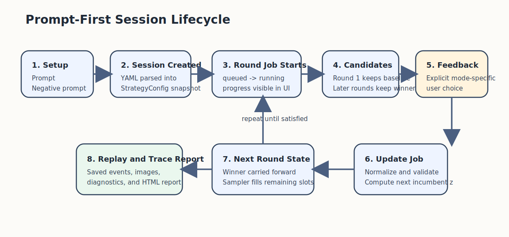
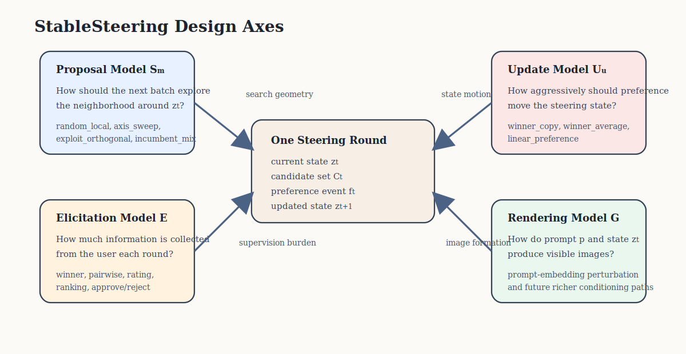
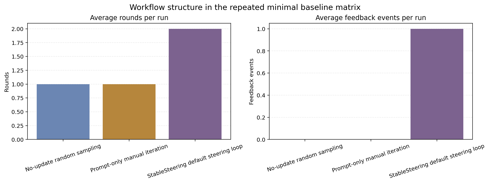
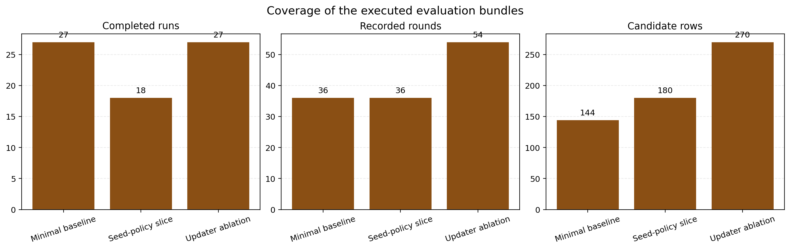
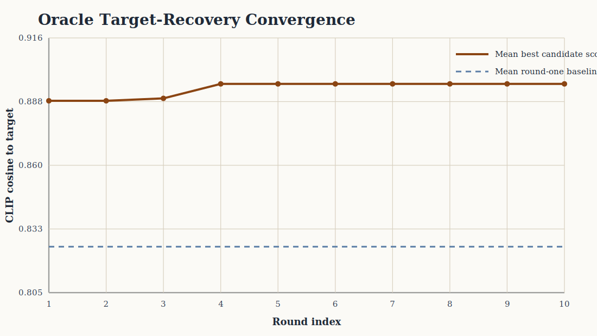
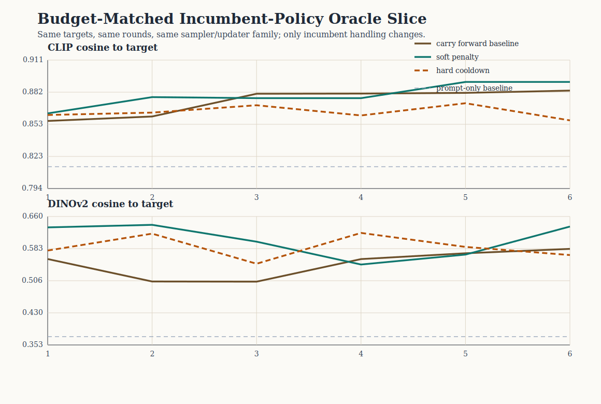
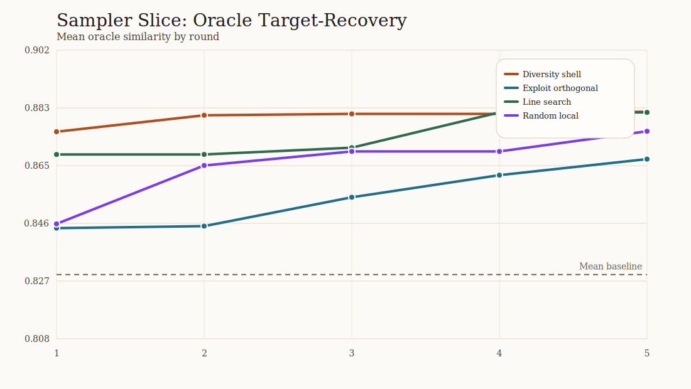

# StableSteering: Interactive Preference-Guided Steering for Diffusion Image Generation

**Journal-style manuscript draft prepared from repository-contained artifacts**

## Abstract

Text-to-image diffusion models are powerful but difficult to refine when users can recognize better candidates more easily than they can author better prompts. StableSteering studies this mismatch as a control problem: starting from a text prompt, the method proposes a small batch of candidate images, elicits a structured preference signal, updates a low-dimensional steering state, and repeats. The central modeling idea is to separate prompt semantics from iterative control, so that language specifies coarse intent while a compact latent state absorbs directional corrections that may be hard to verbalize. This paper formalizes that loop, describes families of proposal, oracle, and preference-update models that instantiate it, and evaluates the resulting framework through a preserved five-round qualitative case study, bounded protocol slices over seeds and update rules, an oracle-based target-recovery study, a repeated-seed multi-metric oracle extension, follow-on anti-stagnation oracle comparisons, a budget-matched incumbent-policy slice, a controlled comparison of candidate-sampling and feedback-model variants, and a later method-extension comparison that adds new samplers, new preference models, and new oracle steering policies. The contribution is therefore conceptual and methodological rather than benchmark-superiority oriented: the paper introduces iterative preference-guided steering as an explicit research object and shows that it can be studied through reproducible multi-round protocols. The current evidence supports the viability of this framing and its usefulness for controlled proxy evaluation, while the new collection-ready human pairwise layer makes the next validation step explicit rather than merely aspirational.

## 1. Introduction

Text-to-image diffusion systems have made high-quality image synthesis broadly accessible, yet fine-grained control remains difficult. The problem is not simply that prompts are imperfect. Rather, prompts are often a poor interface for iterative refinement. In many realistic settings, users can reliably say that one candidate is closer to what they want than another, or that a candidate improves lighting, composition, or product shape, without being able to translate that judgment into a precise prompt rewrite. Existing interaction patterns therefore ask users to communicate through language when the more natural supervision signal may be comparative preference.

StableSteering is designed around that mismatch. Instead of treating generation as a one-shot prompt-to-image mapping, it formulates steering as a bounded iterative process. A prompt initializes the task, but subsequent progress is driven by structured preference over proposed candidates. Each round proposes several local alternatives, the user or oracle selects among them, and the system updates an internal steering state that parameterizes the next search step. The key conceptual move is to let prompt text express initial intent while a separate latent control state absorbs iterative directional corrections.

This paper makes three contributions. First, it introduces a concrete formulation of interactive preference-guided diffusion steering in which candidate sampling, preference elicitation, oracle scoring, and state updating are explicit model components. Second, it instantiates that formulation in a modular framework that supports multi-round sessions and controlled comparisons among steering policies, including explicit anti-stagnation controls for later-round oracle studies. Third, it presents a compact but varied evidence package: a preserved five-round case study, controlled protocol slices that isolate key design choices, an oracle-based target-recovery proxy task, a repeated-seed multi-metric oracle extension, anti-stagnation follow-on comparisons, a budget-matched incumbent-policy slice, a new method-extension comparison over samplers, preference models, and oracle steering policies, and a ready-to-run human pairwise evaluation layer. The paper is intentionally modest in scope: it does not claim a universally optimal steering algorithm. Its scientific claim is narrower and, we argue, useful: iterative preference-guided steering can be treated as a reproducible sequential decision problem rather than as an informal prompt-editing workflow.

The manuscript is intentionally conservative about claim scope. The present evidence supports the conceptual viability of iterative preference-guided steering and shows that the framework can preserve coherent multi-round trajectories under controlled protocols. It does not yet support broad claims of image-quality superiority, population-level user benefit, or statistically grounded superiority over competing control paradigms. That boundary is central to the paper’s framing, experiments, and limitations.

## 2. Related Work and Positioning

StableSteering sits at the intersection of diffusion-based image generation, interactive control, and preference-guided adaptation. The most relevant literature can be organized into five comparison clusters: diffusion-generation foundations, prompt- and edit-based control, multi-turn interactive generation, preference-based diffusion alignment, and iterative test-time refinement. This organization is preferable to a flat paper list because the present work is not claiming a new base generator, a new editing backbone, or a new preference-training objective. Its claim is narrower: iterative preference-guided steering at inference time.

The first cluster establishes the generative substrate on which StableSteering operates. Latent Diffusion Models made high-resolution diffusion synthesis practical at scale, while classifier-free guidance became a standard inference-time mechanism for shaping prompt faithfulness and image quality [1, 2]. StableSteering inherits this diffusion backbone. It does not modify the denoiser architecture or propose a new guidance objective; instead, it studies how a user can iteratively control an existing generator after prompt initialization.

The second cluster concerns prompt-based, instruction-based, and edit-based control. Prompt-to-Prompt showed that cross-attention manipulation can change prompt semantics while preserving much of the original image structure [3]. InstructPix2Pix learned to transform natural-language editing instructions into image edits [4]. DiffusionCLIP and Imagic showed that meaningful control can be obtained by intervening in internal text-conditioned or latent representations rather than only rewriting the visible prompt [5, 6]. SDEdit demonstrated guided editing from an intermediate image state through a diffusion prior [8], while ControlNet added explicit spatial conditioning pathways to pretrained text-to-image models [9]. These methods collectively expanded the control surface beyond raw prompting. However, they still primarily assume that the user specifies desired changes through language, structure, or explicit conditioning inputs. StableSteering differs in supervision: the main interaction primitive is repeated preference over candidate images.

The third cluster is multi-turn interactive image generation, which is the closest adjacent line of work in terms of user experience. TheaterGen studies consistent multi-turn image generation with an LLM-guided prompt-book abstraction for maintaining subject and context consistency across successive turns [12]. AutoStudio explores the same broad setting with a multi-agent formulation aimed at maintaining subject consistency over iterative editing sessions [13]. T2I-Copilot also treats text-to-image generation as an iterative process, using a training-free multi-agent framework to interpret prompts, select models, and refine outputs over multiple steps [14]. These works show that multi-turn generation is an active and important problem. StableSteering differs in both scope and formulation. It does not attempt to solve full conversational generation or general prompt rewriting. Instead, it proposes a narrower iterative-search model in which each round performs local candidate generation around a persistent steering state and preference provides the update signal.

The fourth cluster uses preference information to alter the generator itself. DPOK and Curriculum DPO are representative of methods that use preference or reward information to fine-tune text-to-image diffusion behavior [7, 10]. Using Human Feedback to Fine-tune Diffusion Models without Any Reward Model further develops this line by adapting direct preference optimization ideas to diffusion training without an explicit reward model [15]. These works are important because they establish that preference is a useful supervisory signal for image generation. Yet the intervention point is fundamentally different from that of StableSteering. In those methods, preference updates model parameters or the training objective. In StableSteering, preference updates only the session-level steering state and therefore affects subsequent proposals within one interaction, not the underlying model weights.

The fifth and most recent cluster concerns iterative inference-time refinement. Iterative Refinement Improves Compositional Image Generation uses a vision-language critic to progressively revise generations over multiple steps and reports gains over compute-matched parallel sampling in compositional settings [16]. This result is relevant because it supports the broader idea that iterative correction can improve difficult generations even without retraining the image generator. At the same time, the feedback loop in that work is automated and critic-driven, whereas StableSteering is explicitly framed around user or oracle preference over candidate images. The conceptual similarity is therefore at the level of iterative correction, while the methodological difference lies in the role of explicit preference and persistent session state.

DiffusionDB provides an additional methodological backdrop [11]. By exposing millions of real prompts and generations, it showed that practical text-to-image use is diverse, fragile, and often highly sensitive to prompt wording. StableSteering addresses a complementary question: if prompts are an incomplete interface for iterative refinement, how should the refinement process itself be represented and studied? The answer proposed here is intentionally narrow. StableSteering should not be understood as the first interactive diffusion system or as a replacement for preference-based model alignment. Rather, it occupies a specific niche among prior work: a controlled framework for studying interactive preference-guided steering at inference time using a persistent low-dimensional state, explicit candidate proposals, and structured preference normalization.

## 3. Conceptual Framework

StableSteering is best understood as a model of iterative image steering rather than as an application stack. The framework decomposes the problem into five conceptual objects: a prompt, a steering state, a candidate generator, a preference signal, and an update rule. These pieces matter because together they define one repeated loop: initialize from language, propose local alternatives, elicit relative judgment, update the latent steering state, and repeat.

<figure>
  
  <figcaption><strong>Figure 1.</strong> StableSteering conceptual loop. A text prompt initializes the task, candidate images are proposed around the current steering state, preference is elicited over the candidates, and the steering state is updated before the next round.</figcaption>
</figure>

At initialization time, the user provides a text prompt `p`, an optional negative prompt `n`, and a configuration `c` that specifies the steering policy. The prompt defines the coarse semantic objective. The configuration determines how local search is performed: how many candidates are proposed, how far proposals may move from the current state, how randomness is handled, how user preference is elicited, and how the next state is updated.

The central modeling choice is the session-level steering state `z_t` of dimension `d` at round `t`. The state is initialized at the origin, `z_0 = 0`, and then updated after every round of feedback. Intuitively, `z_t` is not a prompt embedding itself and not a full image latent. It is a compact control variable that parameterizes how the current round should deviate from the original prompt. This separation is useful because it lets language provide the starting point while leaving room for iterative nonverbal refinement.

The core operators can be written compactly as:

\[
\mathcal{C}_t = S_m(z_t, c, \xi_t), \qquad
I_t^{(j)} = G\!\left(p, n, z_t^{(j)}, c, s_t^{(j)}\right), \qquad
\tilde{f}_t = N(f_t), \qquad
z_{t+1} = U_u\!\left(z_t, \mathcal{C}_t, \tilde{f}_t\right).
\]

Here, `S_m` is the configured sampler, `G` is the renderer, `N` is the feedback normalizer, `U_u` is the configured updater, `ξ_t` is sampler randomness, and `s_t^j` is the deterministic seed assigned to candidate `j` in round `t`. Operationally, the loop is:

\[
\text{prompt} \;\rightarrow\; \text{candidate generation} \;\rightarrow\; \text{preference elicitation} \;\rightarrow\; \text{state update} \;\rightarrow\; \text{next round}.
\]

In practice, the first round contains an unmodified-prompt baseline plus exploratory variants. Later rounds preserve the previous winner as an incumbent while proposing local alternatives. This makes the steering process interpretable as a sequence of local preference-guided corrections rather than a sequence of unrelated generations.

A useful conceptual view is to treat StableSteering as local search over an implicit user-utility landscape. Let `u_t(j)` denote the latent utility assigned by the user to candidate `j` at round `t`. The interaction never observes this utility directly. Instead, it observes a coarse preference event, such as a winner, a ranking, or a set of approvals, and then projects that event into a state update. In that sense, the framework sits between classical relevance-feedback methods and modern diffusion control: it uses relative judgments to navigate a generator's local control space without requiring the user to specify the target direction explicitly.

## 4. Sampling and Preference Modeling

The scientific core of StableSteering lies in how it samples candidate directions and how it converts preference into state updates. This section therefore focuses on the steering model itself rather than on implementation-level lifecycle details.

<figure>
  
  <figcaption><strong>Figure 2.</strong> StableSteering session lifecycle. The first round includes an unmodified-prompt baseline candidate. Later rounds preserve the previous winner as the incumbent while still exploring neighboring alternatives.</figcaption>
</figure>

The framework supports several feedback forms, including scalar ratings, winner-only selection, pairwise comparison, approve-or-reject, and top-k ranking. These interaction modes are normalized into a unified updater-facing representation `f̃_t` before the configured updater computes the next state. This design allows the elicitation burden to vary while keeping the underlying steering loop fixed.

Sampling is likewise modular. The framework spans local exploration, structured axis probing, and diversity-forward search policies. The update layer spans winner-centric, score-aware, and contrastive preference models. The present manuscript does not claim that any one module family is best. The defensible claim is narrower: one common interaction loop can host and compare these modeling choices under controlled conditions.

### 4.1 Candidate Sampling Mechanism

At round `t`, the sampler receives the current steering state `z_t`, the session configuration, and a deterministic sampler seed. It returns a batch of candidate steering vectors `z_t^j` together with role labels that describe why each proposal was included. Sampling takes place inside a bounded trust region centered on the current state. Formally, each proposal is restricted to a session-level radius `r`, so `||z_t^j - z_t||_2 <= r` under the trust-region approximation used in the present study.

The first round is special because there is no incumbent image yet. StableSteering therefore pins one visible `baseline_prompt` candidate with steering vector equal to the zero vector. This candidate is rendered from the raw prompt without any steering offset and serves as the reference point for the rest of the session. The remaining first-round proposals are widened deliberately so that the user sees a broader exploratory spread instead of near-duplicates. One candidate is kept close to the origin as an `exploit`-style local perturbation, while the remaining exploratory candidates are blended toward separated directions in steering space and forced to satisfy a minimum radius from the baseline.

From round two onward, the previous round's winning candidate is carried forward explicitly as the incumbent. That image is not re-rendered; instead, its prior steering vector, seed, and render artifact are preserved and inserted as candidate `0` in the next round. The sampler then fills the remaining candidate slots with new challenger proposals around the updated state. This policy makes the compare-select-update loop visible to the user and prevents the currently preferred direction from disappearing between rounds.

In conceptual terms, the sampler family spans four behaviors: conservative local refinement, structured directional probing, diversity-forward search, and schedule-aware exploration. Conservative samplers stay close to the incumbent and ask whether a small correction is preferred. Structured samplers probe interpretable directions such as forward, backward, orthogonal, or axis-aligned moves. Diversity-forward samplers deliberately spread candidates across the available trust region so that early rounds are less likely to collapse into near-duplicates. The newer schedule-aware samplers add temporal structure to that geometry. `annealed_shell`, for example, starts with a wider shell and narrows as rounds progress, while `spherical_cover` greedily chooses angularly separated challenger directions to cover the available trust region more uniformly. The main text focuses on the modeling role of these families; the precise sampler inventory is deferred to the appendix.

Seed assignment is also part of the sampling contract because visual diversity depends strongly on noise reuse. The framework studies three deterministic seed policies. `fixed-per-round` assigns the same seed to all newly rendered candidates in a round, making geometry more comparable but often reducing visible diversity. `fixed-per-candidate` assigns each candidate slot its own deterministic seed, increasing within-round variation. `fixed-per-candidate-role` shares seeds across roles, such as all `explore` candidates or all `axis_positive` probes. Carried-forward incumbents preserve their original seed and image artifact instead of being regenerated.

### 4.2 Preference Elicitation and Normalization

The user-facing interface supports multiple preference modes because different studies may require different elicitation burdens. However, the framework deliberately separates the elicitation interface from the updater contract. Whatever the UI mode, the raw event is converted into a normalized feedback object before any state update is applied.

For scalar ratings, the payload is a mapping from candidate identifier to numeric score. The ratings are sorted in descending order and the highest-rated candidate becomes the winner, using candidate identifier as a deterministic tie-breaker. For pairwise feedback, the event contains both a winner and a loser candidate and rejects degenerate self-comparisons. For winner-only feedback, the payload contains only the selected winner. For approve-or-reject feedback, the event stores the full approval map, the set of approved candidates, the set of rejected candidates, and a preferred winner chosen from the approved set. For top-k feedback, the event stores a ranked list and uses the first ranked candidate as the winner.

This normalization strategy yields a common structured preference representation:

\[
\tilde{f}_t
=
\left\{
\texttt{winner\_candidate\_id},
\;
\texttt{optional\ loser},
\;
\texttt{optional\ ranking},
\;
\texttt{optional\ approval\ sets}
\right\}.
\]

The essential point is that elicitation and update are decoupled. The same outer loop can accept sparse winner signals, graded scores, or partial rankings, then translate them into a normalized object that drives the next state update. This remains a deliberately lightweight preference-modeling regime: the framework supports winner-centric, score-aware, and contrastive heuristics, but it is not yet a full probabilistic preference-estimation framework.

At the conceptual level, however, one can still view the framework through a latent-utility model. If `u_t(j)` is the user's unobserved utility for candidate `j`, then winner-only and pairwise events can be interpreted as sparse observations of the order relation induced by `u_t`, while scalar ratings and top-k rankings provide denser but noisier partial measurements. StableSteering therefore treats normalization as the interface between human-friendly supervision and update-friendly control.

### 4.3 State Update Mechanism

After normalization, the configured updater computes the next steering state `z_(t+1)`. The update family used in this paper has three conceptual forms: direct winner following, smoothed winner following, and preference aggregation. Let `w_t` denote the steering vector of the winning candidate selected at round `t`. Then the core winner-centric update rules are:

\[
\texttt{winner\_copy}: \quad z_{t+1} = w_t,
\]
\[
\texttt{winner\_average}: \quad z_{t+1} = \tfrac{1}{2} z_t + \tfrac{1}{2} w_t,
\]
\[
\texttt{linear\_preference}: \quad z_{t+1} = 0.35\, z_t + 0.65\, w_t.
\]

`winner_copy` is the most aggressive update because it replaces the incumbent state exactly with the winner. `winner_average` smooths the transition and reduces abrupt jumps between rounds. `linear_preference` takes a stronger weighted step toward the winner and should be understood as a simple heuristic approximation to a preference-driven move rather than as a learned gradient estimator.

Two richer update rules extend this family. `score_weighted_preference` forms a weighted centroid of positively scored candidates, using rating magnitude, ranking position, or approval membership to define the weights, and then blends the current state toward that centroid. `contrastive_preference` forms a positive centroid and a negative centroid and moves the state along their difference vector. More recent extensions make the preference model more explicitly ordinal. `borda_preference` treats the ranked batch as an ordered list and updates toward a Borda-weighted centroid, while `bradley_terry_preference` interprets the same ranking as a set of pairwise wins and fits a lightweight latent-utility model before moving toward the resulting weighted center. In compact form:

\[
\texttt{score\_weighted\_preference}: \quad z_{t+1} = (1-\alpha) z_t + \alpha \mu_t^{+},
\]
\[
\texttt{contrastive\_preference}: \quad z_{t+1} = z_t + \alpha (\mu_t^{+} - \mu_t^{-}),
\]

where `\mu_t^{+}` and `\mu_t^{-}` are centroids formed from the preferred and dispreferred candidate subsets induced by the normalized event. These rules remain heuristic control policies rather than learned reward models, but they make the framework rich enough to compare winner-only, score-aware, and contrastive interpretations of user feedback under a shared steering lifecycle.

Together, the sampler, feedback normalizer, and updater form a modular but intentionally lightweight steering model. The present paper treats them as explicit hypothesis-bearing components: different samplers correspond to different local search strategies, different elicitation modes correspond to different supervision burdens, and different updaters correspond to different assumptions about how aggressively preference should move the steering state.

In the oracle studies, one further modeling choice becomes visible: the oracle itself. The simplest oracle chooses candidates by CLIP similarity to a hidden target image, but this is only one possible target-recovery proxy. The current framework also studies a CLIP+DINO ensemble oracle and a CLIP-plus-novelty oracle that rewards movement away from the current incumbent image. Conceptually, these oracle choices matter because they determine what kind of hidden objective the steering loop is being asked to optimize: pure target alignment, alignment under multi-metric agreement, or alignment under an explicit exploration pressure.

## 5. Model Families and Design Axes

StableSteering is better interpreted as a family of models than as one fixed algorithm. Four design axes determine the behavior of a session: the proposal model, the elicitation model, the update model, and the rendering model. Figure 3 summarizes this view.

<figure>
  
  <figcaption><strong>Figure 3.</strong> Design axes of StableSteering. A steering session is determined by a proposal model that explores candidate directions, an elicitation model that captures user preference, an update model that converts preference into state motion, and a rendering model that turns the current prompt-state pair into candidate images.</figcaption>
</figure>

The proposal model determines the local search geometry around the current state. It encodes assumptions about whether the next round should emphasize exploitation near the incumbent, broader exploration away from it, or structured probing along interpretable axes. The elicitation model determines what kind of supervision the user provides and therefore how much information the system receives per round. The update model determines how aggressively the steering state moves after a preference event. Finally, the rendering model determines how the pair `(p, z_t)` is turned into images. In the current instantiation, this last step is implemented by perturbing prompt embeddings with a deterministic basis expansion of `z_t`, but the framework itself is compatible with richer rendering mechanisms.

This decomposition matters conceptually because it distinguishes StableSteering from several adjacent method families. It is not merely prompt editing, because a latent steering state persists across rounds. It is not preference-based model fine-tuning, because preference changes only the interaction state. It is not fully automated iterative refinement, because the correction signal is meant to come from a user or an explicit oracle rather than from an internal critic alone. The framework is thus best viewed as a user-centered sequential control model for diffusion generation.

## 6. Qualitative End-to-End Case Study

The paper’s central qualitative artifact is a preserved five-round session generated from a cinematic product-hero prompt for an expedition-ready electric motorcycle, together with a negative prompt that suppresses blur, geometry distortions, unwanted text, and clutter. The run uses five candidates per round, the `random_local` sampler, the `winner_average` updater, scalar-rating feedback, `512 x 512` output resolution, and 30 inference steps.

The purpose of this artifact is not benchmark comparison. Its role is to make the platform behavior visible: a baseline prompt render, a diverse first round, explicit selection of a preferred candidate, carry-forward of the incumbent, additional local exploration, and preservation of all intermediate states.

<figure>
  
  <figcaption><strong>Figure 4.</strong> Main qualitative montage from the preserved five-round case study. The panels show the baseline prompt render, the first selected direction, a mid-run refinement, and the final incumbent. The figure illustrates a coherent compare-select-update trajectory across multiple rounds.</figcaption>
</figure>

The qualitative trajectory is consistent with the intended use of the system. The first round juxtaposes the unmodified prompt baseline with more exploratory alternatives. Subsequent rounds preserve the incumbent while refining lighting, silhouette, and product geometry. By round five, the session reaches a visually stronger product-hero direction than the initial baseline. This interpretation remains qualitative by design; the case study is a systems demonstration, not a claim of generalized visual improvement.

Table 1 summarizes the case-study runtime settings.

| Setting | Value |
|---|---|
| Prompt family | Cinematic product hero shot of an expedition-ready electric explorer motorcycle |
| Backend / model | Diffusers / `runwayml/stable-diffusion-v1-5` |
| Resolution | `512 x 512` |
| Inference steps | `30` |
| Candidates per round | `5` |
| Sampler | `random_local` |
| Updater | `winner_average` |
| Feedback mode | `scalar_rating` |
| Session length | `5` rounds |
| Visual sanity failures | `0` |

## 7. Evaluation Design

To move beyond a single qualitative case study, the manuscript addresses nine empirical questions. The first asks whether the steering loop can be preserved as a coherent multi-round artifact rather than only as an anecdotal prompt-editing story. The second asks whether the framework can support small repeated protocol studies with fixed bookkeeping and reproducible traces. The third asks whether a hidden-target oracle can reveal measurable round-by-round progress from caption-only initialization. The fourth asks whether that oracle signal remains visible under repeated seeds and an independent image-embedding metric. The fifth asks whether visible later-round stagnation can be mitigated without sacrificing proxy recovery. The sixth asks whether seed choice and winner-centric update rules can be isolated cleanly under matched budgets. The seventh asks whether broader proposal policies and richer preference models matter under the same oracle proxy. The eighth asks whether newly added sampler, updater, and oracle families materially broaden the method space under a shared protocol. The ninth asks whether the paper package now includes a concrete direct-human comparison layer rather than only future-work language about human studies.

These questions are answered by seven intentionally small but controlled studies, three follow-on oracle analyses, and one collection-ready evaluation layer. The repeated minimal baseline matrix establishes that the loop can be executed repeatedly under fixed bookkeeping. The seed-policy slice and updater ablation then test whether local design choices can be isolated without changing the outer protocol. The oracle target-recovery study asks whether caption-only initialization can be improved against a hidden target under automated preference, and the repeated multi-metric oracle extension asks whether that signal persists across seeds and an independent evaluator. Three follow-on oracle comparisons then ask a more behavioral question: how should the framework respond when the incumbent keeps winning and visible progress appears to stall, and what happens when incumbent handling itself is changed under a matched budget? The sampler-and-feedback comparison broadens the modeling axes by comparing alternative proposal policies and richer preference-update rules under the same proxy framing. A later method-extension comparison then adds new samplers, more explicitly ordinal preference models, and alternative oracle steering policies under one shared hidden-target scaffold. Finally, a small human pairwise pilot package curates six comparison pairs and annotation materials for direct judgment collection, although no human annotations are yet reported in this paper.

Table 2 summarizes how each study maps onto the paper's central empirical questions.

| Study | Prompts | Policies | Repeats per cell | Runs | Rounds | Candidate rows | Supported question |
|---|---:|---:|---:|---:|---:|---:|---|
| Minimal baseline matrix | 3 | 3 | 3 | 27 | 36 | 144 | Can the loop support repeated protocol-level comparison across distinct workflow structures? |
| Seed-policy slice | 3 | 2 | 3 | 18 | 36 | 180 | Does the framework isolate seed-policy choice under matched budgets? |
| Updater ablation | 3 | 3 | 3 | 27 | 54 | 270 | Does the framework isolate winner-centric update rules under matched budgets? |
| Oracle target recovery | 3 | 1 | 1 | 3 | 30 | 120 | Can iterative steering improve a hidden-target proxy metric over rounds? |
| Repeated multi-metric oracle | 3 | 1 | 3 | 9 | 90 | 360 | Does oracle progress persist across seeds and an independent evaluation metric? |
| Incumbent-policy oracle slice | 3 | 3 | 1 | 9 | 54 | 270 | Can incumbent handling reduce visible stagnation without degrading proxy target recovery? |
| Sampler and feedback comparison | 3 | 8 | 1 | 24 | 120 | 480 | Do proposal and preference-model choices measurably affect proxy target recovery? |
| Method extension comparison | 3 | 11 | 1 | 33 | 165 | 660 | Do newer sampler, updater, and oracle families broaden the steering design space in a meaningful way? |
| Human pairwise pilot package | 3 | 2 | 1 | 6 pairs | n/a | n/a | Is a direct human judgment layer concretely packaged for the next validation step? |

## 8. Experimental Results

### 8.1 Minimal Baseline Matrix

The minimal baseline matrix answers a narrow but important question: can the steering loop be studied repeatedly as a protocol rather than only demonstrated once? The answer is yes. Across all prompt-policy cells, the loop preserves the intended interaction structure. As designed, the prompt-only and no-update conditions remain one-round, zero-feedback runs, while the default StableSteering condition remains a two-round, one-feedback run in every repeated cell.

<figure>
  
  <figcaption><strong>Figure 5.</strong> Protocol structure in the repeated minimal baseline matrix. The prompt-only and no-update policies remain one-round runs, while the StableSteering default policy performs one preference update and a second round. This figure should be read as protocol evidence, not as an image-quality comparison.</figcaption>
</figure>

This result is useful but intentionally narrow. It shows that the framework supports repeated protocol execution, not that any policy produces better images. Because the three policies use unequal interaction budgets, the study should not be interpreted as an apples-to-apples benchmark.

Table 3 summarizes the repeatability pattern across the three prompt families. The main signal is not image quality but protocol stability: the recorded number of rounds and feedback events is invariant across repeats in every prompt-policy cell. The only nonzero screening flags appear in the portrait prompt family, where lightweight visual checks flagged some candidates in the no-update and StableSteering conditions. These flags are retained only as diagnostic signals rather than as paper-facing performance metrics.

| Prompt family | Prompt-only rounds (mean ± sd) | No-update rounds (mean ± sd) | StableSteering rounds (mean ± sd) | Portrait-only screening flags |
|---|---|---|---|---:|
| Landscape / environment | 1.0 ± 0.0 | 1.0 ± 0.0 | 2.0 ± 0.0 | 0 |
| Portrait / character | 1.0 ± 0.0 | 1.0 ± 0.0 | 2.0 ± 0.0 | 14 |
| Product hero shot | 1.0 ± 0.0 | 1.0 ± 0.0 | 2.0 ± 0.0 | 0 |

### 8.2 Controlled Follow-on Slices

The seed-policy and updater studies extend the empirical scaffold while keeping interpretation conservative. In both cases, the matched two-round steering-loop budget is preserved exactly: every run completes two rounds and one feedback event. This matters because it shows that local changes to seed handling or update rules can be compared without changing the outer experimental protocol.

<figure>
  
  <figcaption><strong>Figure 6.</strong> Coverage of the executed evaluation studies. The controlled slices substantially increase the amount of preserved paper-facing evidence without changing the narrow interpretation boundary: these are controlled steering studies rather than benchmark claims about output quality.</figcaption>
</figure>

The seed-policy study contributes 18 runs, 36 rounds, and 180 candidate rows. The updater study contributes 27 runs, 54 rounds, and 270 candidate rows. Together with the repeated baseline matrix, these results show that StableSteering can support controlled steering experiments rather than only one-off demonstrations.

### 8.3 Oracle-Based Target-Recovery Proxy

The fourth study asks a more outcome-facing question while remaining fully automated and reproducible: if a real target image is hidden from the generator but paired with a manually written caption, can iterative steering recover images that move closer to that target over time? This setting preserves the prompt-first interface while replacing the human judge with an oracle that scores candidates by CLIP image-similarity to the hidden target. The generator therefore receives no target embedding directly; the target is used only to simulate preference selection and to evaluate progress.

The study contains three targets, ten steering rounds per target, and four candidates per round. Averaged over the three targets, the mean baseline similarity is `0.825`, the mean round-one best-candidate similarity is `0.888`, and the mean round-ten best-candidate similarity is `0.896`, corresponding to a mean improvement of `0.071` from the baseline prompt render to the best candidate found by round ten. All three targets improve relative to their caption-only baselines, although the gains are front-loaded: two targets reach their best score in the first round, while one target improves further over subsequent rounds.

<figure>
  
  <figcaption><strong>Figure 7.</strong> Mean best-candidate similarity to the hidden target image under the oracle target-recovery protocol. The curve shows rapid improvement over the caption-only baseline in the early rounds and then a plateau, suggesting that the current steering loop often finds its best direction quickly under this proxy metric.</figcaption>
</figure>

<figure>
  
  <figcaption><strong>Figure 8.</strong> Representative oracle target-recovery examples. For each target, the bundle preserves the hidden real image, the baseline prompt-only render, the first-round best candidate, and the final best candidate found over ten steering rounds.</figcaption>
</figure>

This study should still be interpreted conservatively. It is a target-recovery proxy task in CLIP space, not a human-quality judgment. Nonetheless, it is important because it shows that the StableSteering formulation can support a measurable iterative-alignment experiment in which progress is quantified round by round rather than only narrated qualitatively.

### 8.4 Repeated-Seed Multi-Metric Oracle Extension

The next natural question is whether the oracle signal survives two stronger validity checks: repeated seeds and evaluation under an embedding family that is not used to choose winners. The repeated multi-metric extension keeps the hidden-target protocol fixed but runs three seeds per target and reports both CLIP cosine similarity, which still drives oracle selection, and DINOv2 cosine similarity, which serves as an independent image-only evaluation metric. The resulting bundle contains 9 runs, 90 rounds, and 360 candidate rows.

Aggregated over all targets and repeats, the mean baseline CLIP similarity is `0.828` and the mean final best CLIP similarity is `0.881`, for a mean gain of `0.053` with standard deviation `0.035` across runs. Under DINOv2, the mean baseline similarity is `0.452` and the mean final best similarity is `0.595`, for a mean gain of `0.142` with standard deviation `0.179`. All three targets improve under both metrics on average, though the magnitude differs substantially by target family.

<figure>
  
  <figcaption><strong>Figure 11.</strong> Repeated-seed oracle target-recovery curves evaluated under CLIP and DINOv2. CLIP still drives oracle selection, while DINOv2 provides an independent image-embedding view of progress. Both metrics improve on average over repeated seeds, reducing the risk that the original oracle result was a single-run artifact.</figcaption>
</figure>

This extension does not remove the proxy nature of the experiment, but it improves its credibility. The repeated seeds reduce sensitivity to one favorable run, and the added DINOv2 readout weakens the concern that progress is visible only in the same embedding family used to choose winners. The correct interpretation remains narrow: the study shows repeatable proxy target recovery under two pretrained image-embedding metrics, not human-evaluated visual superiority.

The repeated-seed extension also surfaced a concrete failure mode: visible stagnation. In many runs, the carried-forward incumbent kept winning and the selected image stopped changing even though the session continued. Three follow-on oracle comparisons were therefore run to study anti-stagnation behavior directly. The first replaced the older oracle policy with the new `plateau_escape` sampler and `softmax_preference` updater. This improved late-round movement, with six of nine runs still improving after round four, but it did not materially reduce visible freezing in the final three rounds. The second added a harder stagnation-control policy that widened the effective trust radius after repeated incumbent reuse and temporarily excluded the carried-forward incumbent from oracle winner selection. That policy removed last-three-round image plateaus entirely and increased late-round movement further, but it reduced final mean CLIP recovery from `0.886` in the first plateau-escape bundle to `0.869`. The third and most controlled follow-on kept the proposal and update family fixed while comparing three incumbent-handling policies under a compact matched budget: carry-forward baseline, soft incumbent penalty, and hard incumbent cooldown.

<figure>
  
  <figcaption><strong>Figure 12.</strong> Budget-matched incumbent-policy oracle slice under the same proposal and update family. Soft incumbent penalty yields the strongest final proxy recovery in this compact study, while hard cooldown removes late-round sticking at the cost of lower final alignment.</figcaption>
</figure>

In that compact slice, the carry-forward baseline reaches mean final CLIP and DINOv2 similarities of `0.884` and `0.583`, respectively. Soft incumbent penalty reaches the strongest final scores, `0.891` and `0.636`, but still shows last-three-round plateaus in `2/3` runs and the lowest unique selected-image ratio (`0.389`). Hard incumbent cooldown removes final three-round plateaus entirely, but drops to `0.856` CLIP and `0.568` DINOv2. The combined evidence therefore sharpens the anti-stagnation story rather than resolving it completely: incumbent-aware exploration can improve late-round motion, and a mild penalty can help under a matched budget, but hard incumbent suppression still over-explores and visible movement is not equivalent to better final recovery.

### 8.5 Sampler and Feedback-Model Comparison

The fifth study asks the most explicitly comparative question in the paper: under a fixed small-budget oracle proxy, do proposal policies and preference models materially affect iterative progress? The study is split into two slices. The sampler slice fixes the updater at `linear_preference` with `winner_only` feedback and compares four proposal policies. The feedback-model slice fixes the sampler at `exploit_orthogonal` and compares winner-centric updates against the newly added `score_weighted_preference` and `contrastive_preference` models.

<figure>
  
  <figcaption><strong>Figure 9.</strong> Oracle target-recovery curves for the sampler slice. The broader exploratory policies, <code>diversity_shell</code> and <code>line_search</code>, reach higher final proxy alignment than the older local baselines under the same five-round budget.</figcaption>
</figure>

<figure>
  
  <figcaption><strong>Figure 10.</strong> Oracle target-recovery curves for the feedback-model slice. Richer feedback models remain competitive, but the present small proxy study does not yet show that they dominate winner-centric updates.</figcaption>
</figure>

Across three targets, `diversity_shell` and `line_search` each reach a mean final best similarity of approximately `0.882`, corresponding to mean improvements of about `0.053` over their prompt-only baselines. Under the same conditions, `exploit_orthogonal` reaches `0.867` and `random_local` reaches `0.876`. The scientific takeaway is that proposal geometry matters: broader, more intentionally separated candidate sets can improve proxy target recovery even when the update rule is held fixed.

The feedback-model slice is more mixed. `winner_average` with `winner_only` feedback reaches a mean final best similarity of `0.882`, `linear_preference` with `winner_only` reaches `0.885`, `contrastive_preference` with `top_k` reaches `0.873`, and `score_weighted_preference` with `scalar_rating` reaches `0.883`. The main conclusion is therefore not that richer preference models already win. Rather, the result shows that the same steering scaffold can host ranking-aware and score-aware update rules without changing the outer session loop, and that these variants are already competitive enough to justify larger studies.

These comparisons should still be read narrowly. The slice uses a small target set, the same CLIP family for oracle choice and evaluation, and one five-round budget. The resulting ordering is therefore evidence that sampling and feedback modeling matter, not evidence that one sampler or one preference model should already be treated as universally preferred.

### 8.6 Method Extension Comparison

The next question is whether the method space can be expanded in a way that produces genuinely different behavior rather than only relabeling existing heuristics. A new method-extension study therefore adds two samplers, two preference models, and three oracle steering policies under one shared hidden-target recovery scaffold. The sampler slice compares `annealed_shell` and `spherical_cover` against the stronger earlier baselines `diversity_shell` and `line_search`, all paired with `softmax_preference`. The preference slice compares `borda_preference` and `bradley_terry_preference` against `score_weighted_preference` and `softmax_preference` under a fixed `diversity_shell` sampler. The oracle slice compares three hidden-target selectors under a fixed `annealed_shell + softmax_preference` steering loop: CLIP-only, CLIP+DINO ensemble, and CLIP-plus-novelty bonus.

<figure>
  
  <figcaption><strong>Figure 13.</strong> Extended sampler comparison under the shared hidden-target protocol. The newly added <code>annealed_shell</code> and <code>spherical_cover</code> samplers are competitive with the earlier diversity-forward baselines and expand the geometric search space studied by the paper.</figcaption>
</figure>

<figure>
  
  <figcaption><strong>Figure 14.</strong> Extended preference-model comparison. The new ordinal models broaden the update family from centroid heuristics toward explicitly ranking-based interpretations of feedback.</figcaption>
</figure>

<figure>
  
  <figcaption><strong>Figure 15.</strong> Oracle steering-policy comparison. The CLIP+DINO ensemble oracle improves independent DINOv2 recovery most strongly, while CLIP-only and CLIP-plus-novelty retain different tradeoffs between direct target alignment and continued exploration.</figcaption>
</figure>

The sampler slice is competitive rather than decisive. `spherical_cover` reaches the strongest final CLIP and DINOv2 scores, `0.881` and `0.668`, while `annealed_shell` reaches `0.878` and `0.627`. The older diversity-forward baselines remain close: `diversity_shell` reaches `0.877` and `0.595`, and `line_search` reaches `0.878` and `0.660`. The main scientific takeaway is therefore not that one sampler clearly dominates, but that the geometry of proposal construction remains a real degree of freedom. Angularly separated coverage and schedule-aware shell narrowing both appear to be viable search biases under the same outer loop.

The preference slice is more striking. `bradley_terry_preference` achieves the strongest final results of the four compared update rules, with mean final CLIP `0.886` and DINOv2 `0.687`, while `score_weighted_preference` reaches `0.869` and `0.643`, `softmax_preference` reaches `0.879` and `0.581`, and `borda_preference` reaches `0.877` and `0.535`. The new ordinal models therefore do more than merely add notation: at least one of them, the Bradley-Terry-style updater, appears to extract useful signal from the ranked batch that the simpler winner- or score-centric rules leave unused. At the same time, `borda_preference` underperforms on DINOv2, which is a useful warning that not every richer ordinal model is automatically better.

The oracle-policy slice isolates a different scientific axis: what hidden objective is the steering loop effectively optimizing? The CLIP-only oracle remains strongest on direct CLIP delta (`+0.068`), but the CLIP+DINO ensemble oracle achieves the strongest DINOv2 improvement by a wide margin, reaching mean final DINOv2 `0.697` and mean DINOv2 delta `0.267`. The novelty-augmented oracle reaches the highest final CLIP score (`0.883`) but with a smaller CLIP delta because its baselines start from slightly higher-scoring runs. The important result is conceptual: oracle choice is itself part of the steering model. If a hidden-target study is used to validate interactive steering, the paper must state clearly whether it is validating one embedding family, a multi-metric agreement objective, or an explicit exploration-biased proxy.

These new comparisons should again be read with restraint. The target suite is still small, the runs are still single-repeat slices, and the oracle-policy comparison remains a proxy rather than a human study. Even so, the method-extension bundle substantially improves the paper's methodological contribution: the steering loop now supports more interesting sampler geometry, more explicit ranking-based preference models, and multiple oracle definitions that can be compared under one reproducible protocol.

### 8.7 Human Pairwise Evaluation Layer

The manuscript now also includes a small human pairwise evaluation layer intended to support direct judgment collection in a follow-on study. The current package contains six curated pairs drawn from three prompt families and two comparison types: baseline prompt-only versus final StableSteering output, and no-update comparison versus final StableSteering output. Each pair is accompanied by a browser preview, a manifest, and a blank annotation sheet with the allowed responses `left`, `right`, `tie`, and `invalid`.

No human annotations are reported yet, so this layer contributes protocol completeness rather than outcome evidence. Its importance is practical and scientific. Practically, it closes a common submission gap by turning “future human evaluation” into a concrete artifact bundle. Scientifically, it fixes the exact judgment question to be asked next: which image better satisfies the prompt while remaining visually coherent?

### 8.8 What the Results Do and Do Not Show

The executed studies support eight defensible claims. First, the framework can preserve real end-to-end qualitative sessions with replayable artifacts. Second, it can run repeated, multi-cell experiments under fixed protocols. Third, it can support a bounded oracle target-recovery protocol in which iterative steering improves a measurable proxy objective over multiple rounds. Fourth, that proxy trend remains visible under repeated seeds and an independent image-embedding metric. Fifth, anti-stagnation behavior can be studied directly and reveals a real exploration-versus-recovery tradeoff rather than a purely cosmetic UI issue. Sixth, it can support controlled comparisons among proposal policies and richer preference-update models under the same outer loop. Seventh, it can support a second generation of sampler, updater, and oracle methods without changing the underlying session scaffold. Eighth, it can serialize enough information to support post-hoc analysis, figure generation, and a concrete human-evaluation collection layer.

The current results do not show that the steering loop is better than prompt-only iteration in human-perceived quality. They do not show statistical superiority, preference alignment across large prompt suites, or cross-user benefit. They also do not yet show that one sampler, updater, seed policy, oracle policy, or incumbent policy should be preferred on scientific grounds outside the present narrow proxy tasks. Even with the DINOv2 extension, the oracle studies do not substitute for human judgment, and the new anti-stagnation follow-ons show that better late-round motion does not automatically imply better final proxy recovery. That restraint is necessary for journal-quality honesty.

## 9. Reproducibility and Experimental Discipline

The experiments in this paper are intentionally bounded and protocol-driven. Session configuration, sampling rule, update rule, candidate count, steering dimensionality, and seed policy are fixed per run and preserved with the resulting artifacts. This matters because an iterative steering method is otherwise easy to describe loosely and hard to compare fairly.

The strongest reproducibility claim in the current paper is therefore methodological rather than statistical. StableSteering makes it possible to preserve one steering trajectory or one small experiment family as a fully specified sequence of proposals, preferences, updates, and outputs. This does not replace large-scale evaluation, but it does make small controlled studies and qualitative analysis much easier to inspect and reproduce.

## 10. Discussion

StableSteering occupies a useful middle ground between a one-off demonstration and a mature benchmark suite. It already provides a clear conceptual scaffold for future studies: prompt-first initialization, an explicit steering state, modular proposal policies, multiple elicitation modes, and controlled update rules. These ingredients are often implicit in early-stage interactive generation projects, where qualitative examples and quantitative claims are hard to reconcile.

The most important current strength is explicitness. The framework makes it possible to say what was proposed, what was preferred, how that preference was normalized, and how the next state was computed. That explicitness is scientifically useful because iterative prompting is otherwise difficult to formalize or analyze.

The strongest remaining gap is empirical depth. The current studies are still small, prompt coverage is narrow, interaction budgets are only partially normalized, and the human pairwise layer is packaged but not yet populated with judgments. The oracle studies add a stronger proxy outcome than protocol bookkeeping alone and now show that both candidate-sampling and feedback-model choices can matter, while the repeated multi-metric extension reduces the risk that this pattern is a single-seed or single-metric artifact. The new anti-stagnation comparisons sharpen the picture further: later-round freezing is real, can be mitigated, and creates a genuine tradeoff between continued exploration and final proxy recovery. The compact incumbent-policy slice narrows that claim even more usefully: softer incumbent penalties may recover a better tradeoff than hard cooldown, but the problem is not solved. The newest method-extension bundle pushes the scientific story another step forward by showing that more structured samplers, more explicitly ordinal preference models, and alternative oracle definitions all change behavior in measurable ways. Even so, the evidence still falls short of human-perceived quality evaluation or large-scale comparative benchmarking. In its present state, the work is best understood as a conceptually clear and experimentally disciplined early study of interactive preference-guided diffusion steering rather than as a definitive comparative benchmark.

## 11. Limitations

Several limitations remain visible to a critical reviewer.

First, the qualitative case study is a single curated trajectory. It is useful for demonstrating the idea, but it cannot establish general benefit. Second, the minimal baseline matrix compares unequal workflow structures, so it should be interpreted only as a workflow-comparison pilot. Third, the controlled follow-on slices isolate design choices under fixed budgets, but they still report descriptive workflow evidence rather than outcome-quality evidence. Fourth, the oracle bundles remain proxy studies even after the repeated multi-metric extension; CLIP still chooses winners, and DINOv2 is only an auxiliary evaluator. Fifth, the anti-stagnation follow-ons show that reducing visible plateaus is not the same as improving final target-recovery quality, and the new compact incumbent-policy slice suggests that softer incumbent penalties may help without settling the broader tradeoff. Sixth, the sampler, updater, and oracle extension bundle is still a single-repeat comparison on a small target set, so it cannot justify broad model-selection claims. Seventh, the human pairwise layer is protocol-ready but not yet populated with judgments, confidence intervals, or significance tests. Eighth, the results are tied to a small set of prompt families.

These limitations are not hidden because they are central to preserving trust. The goal of the present paper is to report a strong platform contribution with honest evidence boundaries, not to imply that the evidence already supports a larger algorithmic claim.

## 12. Conclusion

StableSteering formulates image steering as an iterative preference-guided process in which a text prompt initializes generation and a compact latent control state carries subsequent refinement. Its main contribution is to make this formulation explicit through concrete sampling rules, preference-normalization schemes, oracle definitions, and update models that can be studied under controlled multi-round protocols. The combination of a preserved five-round qualitative case study, a repeated minimal baseline matrix, two controlled follow-on slices, an oracle-based target-recovery proxy study, a repeated-seed multi-metric oracle extension, anti-stagnation oracle comparisons, a budget-matched incumbent-policy slice, a sampler-and-feedback comparison bundle, and a later method-extension comparison shows that this framing is operationally viable and scientifically inspectable.

The next evidence threshold is clear. A stronger journal submission would broaden the prompt suite, normalize policy budgets more aggressively, and populate the new human pairwise layer with enough judgments to compare conditions directly. Even before those steps, however, StableSteering already offers a useful research artifact: a concrete model of interactive preference-guided diffusion steering that can be instantiated, analyzed, and extended in future work.

## Data and Artifact Availability

The materials underlying this manuscript include the application source code, the preserved five-round qualitative case study, the repeated minimal baseline matrix, the seed-policy study, the updater study, the oracle target-recovery study, the repeated multi-metric oracle study, the plateau-escape and stagnation-control oracle follow-ons, the incumbent-policy oracle slice, the sampler-and-feedback comparison study, the method-extension comparison study, the human pairwise evaluation package, and the scripts used to generate the figures and paper-facing summaries. All figures in the manuscript are derived from archived local artifacts preserved with the submission package.

## References

[1] R. Rombach, A. Blattmann, D. Lorenz, P. Esser, and B. Ommer, “High-Resolution Image Synthesis with Latent Diffusion Models,” in *Proceedings of the IEEE/CVF Conference on Computer Vision and Pattern Recognition*, 2022, pp. 10684-10695.

[2] J. Ho and T. Salimans, “Classifier-Free Diffusion Guidance,” *arXiv preprint arXiv:2207.12598*, 2022.

[3] A. Hertz, R. Mokady, J. Tenenbaum, K. Aberman, Y. Pritch, and D. Cohen-Or, “Prompt-to-Prompt Image Editing with Cross-Attention Control,” *arXiv preprint arXiv:2208.01626*, 2022.

[4] T. Brooks, A. Holynski, and A. A. Efros, “InstructPix2Pix: Learning to Follow Image Editing Instructions,” in *Proceedings of the IEEE/CVF Conference on Computer Vision and Pattern Recognition*, 2023, pp. 18392-18402.

[5] G. Kim, T. Kwon, and J. C. Ye, “DiffusionCLIP: Text-Guided Diffusion Models for Robust Image Manipulation,” in *Proceedings of the IEEE/CVF Conference on Computer Vision and Pattern Recognition*, 2022, pp. 2426-2435.

[6] B. Kawar, O. Tov, R. Mokady, E. Elnekave, K. Aberman, and Y. Pritch, “Imagic: Text-Based Real Image Editing with Diffusion Models,” in *Proceedings of the IEEE/CVF Conference on Computer Vision and Pattern Recognition*, 2023, pp. 6007-6017.

[7] L. Fan, Y. Liu, Y. Huang, Y. Li, Y. Zhang, M. White, W. Aziz, H. Yao, and others, “DPOK: Reinforcement Learning for Fine-Tuning Text-to-Image Diffusion Models,” *arXiv preprint arXiv:2305.16381*, 2024.

[8] C. Meng, Y. He, Y. Song, J. Song, J. Wu, J.-Y. Zhu, and S. Ermon, “SDEdit: Guided Image Synthesis and Editing with Stochastic Differential Equations,” in *International Conference on Learning Representations*, 2022.

[9] L. Zhang, A. Rao, and M. Agrawala, “Adding Conditional Control to Text-to-Image Diffusion Models,” in *Proceedings of the IEEE/CVF International Conference on Computer Vision*, 2023, pp. 3836-3847.

[10] F.-A. Croitoru, V. Hondru, R. T. Ionescu, N. Sebe, and M. Shah, “Curriculum Direct Preference Optimization for Diffusion and Consistency Models,” in *Proceedings of the IEEE/CVF Conference on Computer Vision and Pattern Recognition*, 2025.

[11] Z. J. Wang, E. Montoya, D. Munechika, H. Yang, B. Hoover, and D. Horng Chau, “DiffusionDB: A Large-Scale Prompt Gallery Dataset for Text-to-Image Generative Models,” in *Proceedings of the 61st Annual Meeting of the Association for Computational Linguistics*, 2023, pp. 729-758.

[12] J. Cheng, B. Yin, K. Cai, M. Huang, H. Li, Y. He, X. Lu, Y. Li, Y. Cheng, Y. Yan, and X. Liang, “TheaterGen: Character Management with LLM for Consistent Multi-turn Image Generation,” *arXiv preprint arXiv:2404.18919*, 2024.

[13] Y. Xian, Z. Xie, P. Zhu, F. Xia, X. Tu, B. Sun, T.-S. Chua, and Q. Dong, “AutoStudio: Crafting Consistent Subjects in Multi-turn Interactive Image Generation,” *arXiv preprint arXiv:2406.04363*, 2024.

[14] S. Lian, H. Lin, S. Yue, H. Huang, H. Zhang, B. Zhou, and W. Zhang, “T2I-Copilot: Training-Free Multi-Agent Text-to-Image Generation with Prompt Engineering, Model Selection, and Self-Improvement,” *arXiv preprint arXiv:2410.03031*, 2024.

[15] Y. Yang, T. Yu, Z. Zhao, D. Wang, H. Su, and J. Zhu, “Using Human Feedback to Fine-Tune Diffusion Models without Any Reward Model,” *arXiv preprint arXiv:2311.13231*, 2023.

[16] S. Jaiswal, M. Prabhudesai, N. Bhardwaj, Z. Qin, A. Zadeh, C. Li, K. Fragkiadaki, and D. Pathak, “Iterative Refinement Improves Compositional Image Generation,” *arXiv preprint arXiv:2601.15286*, 2026.
