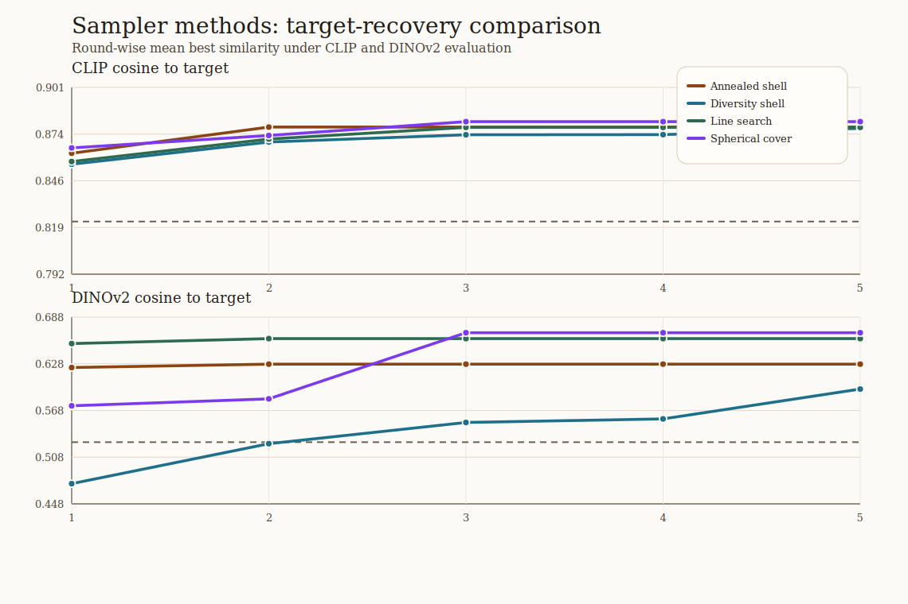
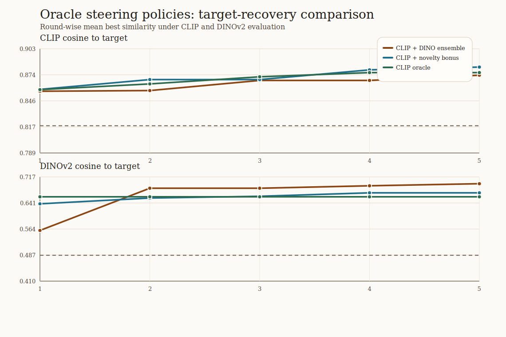

# Method Extension Comparison Analysis

## Sampler methods

| policy | clip final | clip delta | dinov2 final | dinov2 delta |
| --- | ---: | ---: | ---: | ---: |
| Annealed shell | 0.878 | 0.065 | 0.627 | 0.110 |
| Diversity shell | 0.877 | 0.065 | 0.595 | 0.127 |
| Line search | 0.878 | 0.052 | 0.660 | 0.095 |
| Spherical cover | 0.881 | 0.041 | 0.668 | 0.109 |

## Preference models

| policy | clip final | clip delta | dinov2 final | dinov2 delta |
| --- | ---: | ---: | ---: | ---: |
| Borda preference | 0.877 | 0.047 | 0.535 | -0.007 |
| Bradley-Terry preference | 0.886 | 0.088 | 0.687 | 0.150 |
| Score-weighted preference | 0.869 | 0.047 | 0.643 | 0.180 |
| Softmax preference | 0.879 | 0.033 | 0.581 | 0.026 |

## Oracle steering policies

| policy | clip final | clip delta | dinov2 final | dinov2 delta |
| --- | ---: | ---: | ---: | ---: |
| CLIP + DINO ensemble | 0.874 | 0.063 | 0.697 | 0.267 |
| CLIP + novelty bonus | 0.883 | 0.047 | 0.670 | 0.113 |
| CLIP oracle | 0.877 | 0.068 | 0.659 | 0.188 |

