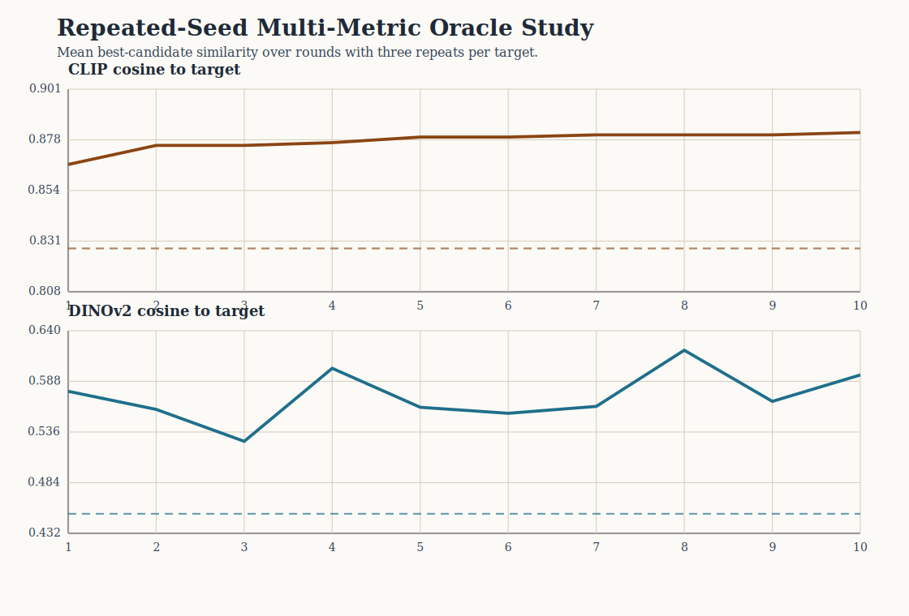

# Repeated-Seed Multi-Metric Oracle Analysis

This study repeats the oracle target-recovery protocol three times per target and evaluates the resulting trajectories under two pretrained image-embedding families.

## Scope

- targets: `3`
- repeats per target: `3`
- total runs: `9`
- total rounds: `90`

## Aggregate summary

- CLIP cosine: baseline `0.828`, final `0.881`, delta `0.053` (sd `0.035`)
- DINOv2 cosine: baseline `0.452`, final `0.595`, delta `0.142` (sd `0.179`)

## Target-level summary

| target | repeats | clip final (mean ± sd) | dinov2 final (mean ± sd) |
| --- | ---: | ---: | ---: |
| Black-and-white cat portrait | 3 | 0.883 ± 0.016 | 0.565 ± 0.047 |
| Mountain lake landscape | 3 | 0.844 ± 0.005 | 0.505 ± 0.067 |
| Red bicycle street photo | 3 | 0.916 ± 0.011 | 0.715 ± 0.035 |

## Interpretation boundary

- CLIP remains the oracle selection metric.
- DINOv2 is added as an independent evaluation metric rather than an oracle.
- Repeated seeds reduce the chance that the observed trend is a single-session artifact.
- The study is still a proxy target-recovery evaluation, not a human-preference study.

## Figure

