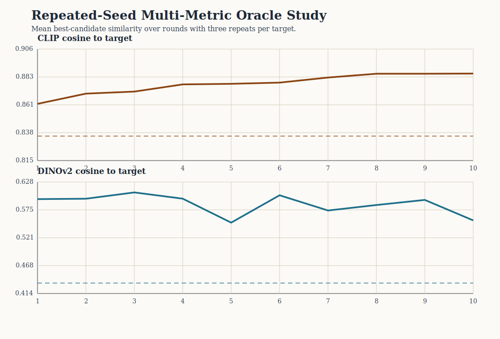

# Repeated-Seed Multi-Metric Oracle Analysis

This study repeats the oracle target-recovery protocol three times per target and evaluates the resulting trajectories under two pretrained image-embedding families.

## Scope

- targets: `3`
- repeats per target: `3`
- total runs: `9`
- total rounds: `90`

## Aggregate summary

- CLIP cosine: baseline `0.835`, final `0.886`, delta `0.051` (sd `0.028`)
- DINOv2 cosine: baseline `0.434`, final `0.554`, delta `0.120` (sd `0.150`)

## Target-level summary

| target | repeats | clip final (mean ± sd) | dinov2 final (mean ± sd) |
| --- | ---: | ---: | ---: |
| Black-and-white cat portrait | 3 | 0.891 ± 0.008 | 0.515 ± 0.199 |
| Mountain lake landscape | 3 | 0.847 ± 0.006 | 0.450 ± 0.044 |
| Red bicycle street photo | 3 | 0.920 ± 0.003 | 0.698 ± 0.036 |

## Interpretation boundary

- CLIP remains the oracle selection metric.
- DINOv2 is added as an independent evaluation metric rather than an oracle.
- Repeated seeds reduce the chance that the observed trend is a single-session artifact.
- The study is still a proxy target-recovery evaluation, not a human-preference study.

## Figure

