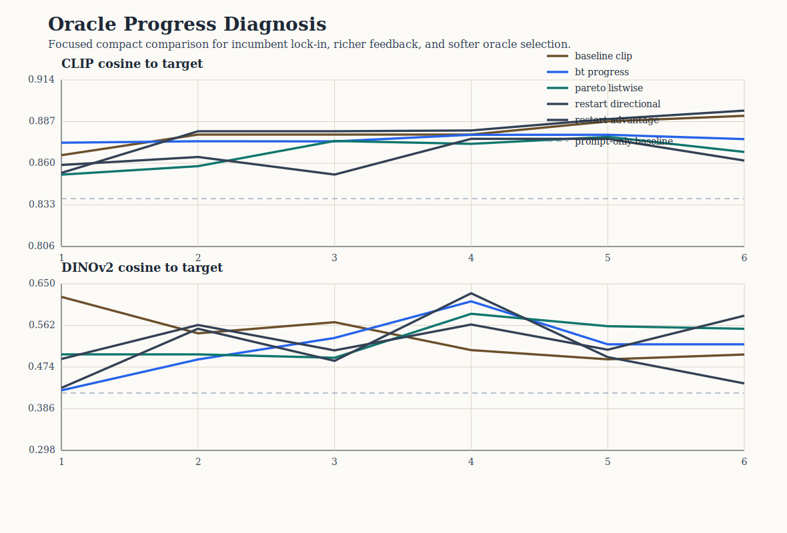

# Oracle Progress Diagnosis Analysis

This compact study tests why oracle steering often stops making visible round-by-round progress. The comparison keeps the same hidden-target recovery scaffold while changing proposal geometry, feedback modeling, and oracle selection.

## Scope

- targets: `3`
- policies: `5`
- total runs: `15`
- total rounds: `90`

## Policy summary

| policy | clip final | clip delta | dinov2 final | late improvements | incumbent selection share | plateau share |
| --- | ---: | ---: | ---: | ---: | ---: | ---: |
| Baseline CLIP oracle | 0.891 | 0.054 | 0.500 | 1.00 | 0.73 | 0.33 |
| Bradley-Terry progress-aware | 0.876 | 0.020 | 0.522 | 0.33 | 0.67 | 0.67 |
| Pareto listwise | 0.867 | 0.029 | 0.555 | 0.33 | 0.27 | 0.00 |
| Restart directional mix | 0.862 | 0.030 | 0.582 | 1.00 | 0.00 | 0.00 |
| Restart advantage mix | 0.894 | 0.069 | 0.439 | 1.00 | 0.67 | 0.33 |

## Interpretation

- The baseline still shows heavy incumbent lock-in, with incumbent selection share `0.73`.
- The strongest anti-stagnation policy by late-round movement is `Restart directional mix`.
- The strongest final CLIP target-recovery policy in this compact slice is `Restart advantage mix`.
- The key question is therefore not only which policy ends highest, but which policy preserves challenger pressure without sacrificing final target recovery too heavily.

## Figure

