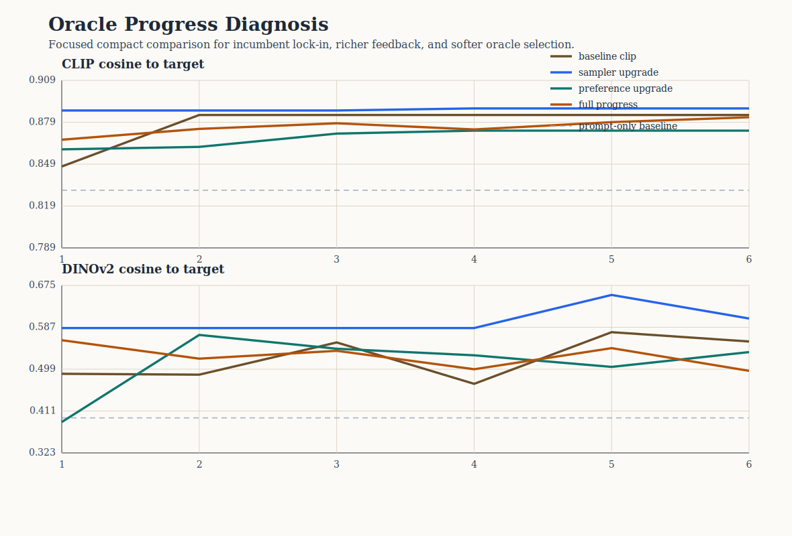

# Oracle Progress Diagnosis Analysis

This compact study tests why oracle steering often stops making visible round-by-round progress. The comparison keeps the same hidden-target recovery scaffold while changing proposal geometry, feedback modeling, and oracle selection.

## Scope

- targets: `3`
- policies: `4`
- total runs: `12`
- total rounds: `72`

## Policy summary

| policy | clip final | clip delta | dinov2 final | late improvements | incumbent selection share | plateau share |
| --- | ---: | ---: | ---: | ---: | ---: | ---: |
| Baseline CLIP oracle | 0.884 | 0.054 | 0.557 | 0.00 | 0.80 | 1.00 |
| Two-scale cover sampler | 0.889 | 0.080 | 0.606 | 0.33 | 0.93 | 1.00 |
| Challenger-mixture updater | 0.873 | 0.055 | 0.535 | 0.33 | 0.73 | 1.00 |
| Full progress-aware policy | 0.882 | 0.058 | 0.496 | 0.67 | 0.47 | 0.33 |

## Interpretation

- The baseline still shows heavy incumbent lock-in, with incumbent selection share `0.80`.
- The strongest anti-stagnation policy by late-round movement is `Full progress-aware policy`.
- The strongest final CLIP target-recovery policy in this compact slice is `Two-scale cover sampler`.
- The key question is therefore not only which policy ends highest, but which policy preserves challenger pressure without sacrificing final target recovery too heavily.

## Figure

