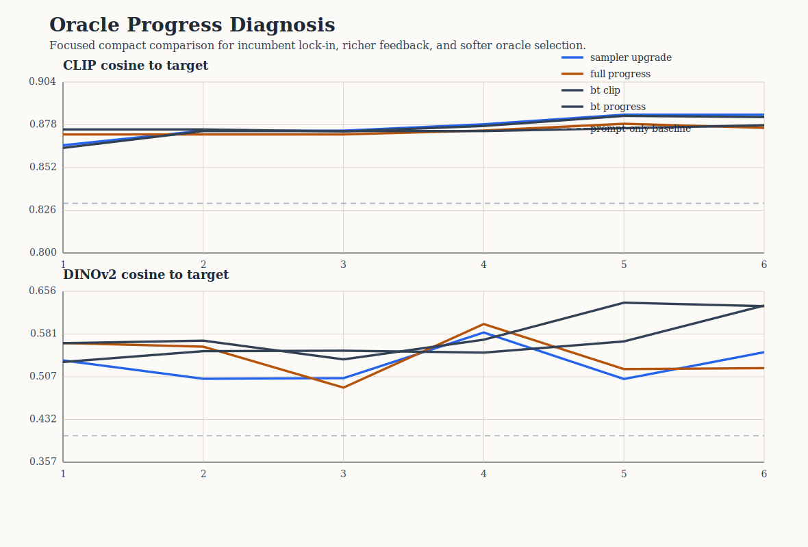

# Oracle Progress Diagnosis Analysis

This compact study tests why oracle steering often stops making visible round-by-round progress. The comparison keeps the same hidden-target recovery scaffold while changing proposal geometry, feedback modeling, and oracle selection.

## Scope

- targets: `3`
- policies: `4`
- total runs: `12`
- total rounds: `72`

## Policy summary

| policy | clip final | clip delta | dinov2 final | late improvements | incumbent selection share | plateau share |
| --- | ---: | ---: | ---: | ---: | ---: | ---: |
| Two-scale cover sampler | 0.884 | 0.054 | 0.549 | 1.00 | 0.67 | 0.67 |
| Full progress-aware policy | 0.876 | 0.045 | 0.522 | 1.00 | 0.73 | 0.33 |
| Bradley-Terry cover | 0.878 | 0.018 | 0.631 | 0.67 | 0.80 | 0.67 |
| Bradley-Terry progress-aware | 0.883 | 0.063 | 0.630 | 1.33 | 0.60 | 0.33 |

## Interpretation

- The baseline still shows heavy incumbent lock-in, with incumbent selection share `0.67`.
- The strongest anti-stagnation policy by late-round movement is `Bradley-Terry progress-aware`.
- The strongest final CLIP target-recovery policy in this compact slice is `Two-scale cover sampler`.
- The key question is therefore not only which policy ends highest, but which policy preserves challenger pressure without sacrificing final target recovery too heavily.

## Figure

