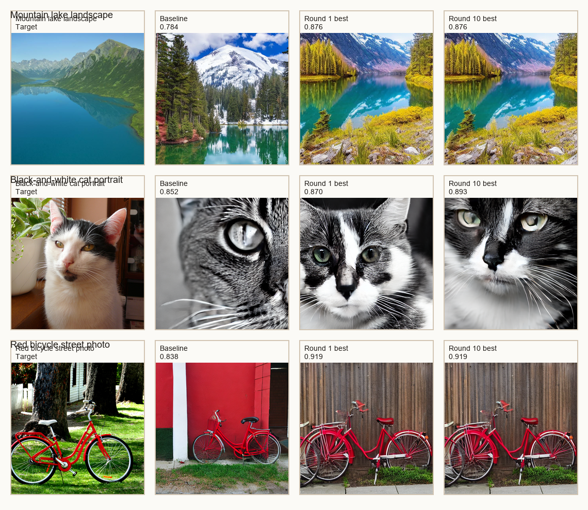

# Oracle Target-Recovery Analysis

This bundle measures how closely StableSteering can recover a held-out real target image when initialized only from a manually written caption.

## Scope

- targets: `3`
- rounds per target: `10`
- candidates per round: `4`
## Aggregate summary

- mean round-one baseline similarity: `0.825`
- mean round-ten best-candidate similarity: `0.896`
- mean improvement from baseline to round ten: `0.071`

## Target-level summary

| target | baseline | round 1 best | round 10 best | delta baseline -> round 10 |
| --- | ---: | ---: | ---: | ---: |
| Mountain lake landscape | 0.784 | 0.876 | 0.876 | 0.092 |
| Black-and-white cat portrait | 0.852 | 0.870 | 0.893 | 0.040 |
| Red bicycle street photo | 0.838 | 0.919 | 0.919 | 0.081 |

## Interpretation boundary

- The oracle selects candidates using CLIP image-embedding similarity to the hidden target.
- This is a target-recovery proxy task, not a human-quality judgment.
- Improvement should therefore be interpreted as recovery in oracle space rather than broad visual superiority.

## Figures

