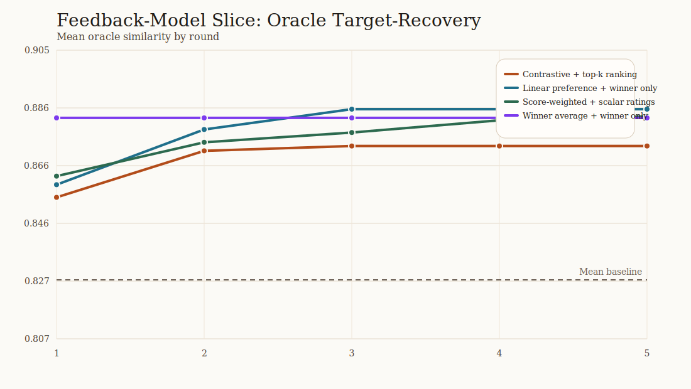

# Sampler and Feedback Comparison Analysis

## Sampler slice

| policy | final best | delta baseline -> final |
| --- | ---: | ---: |
| Diversity shell | 0.882 | 0.053 |
| Exploit orthogonal | 0.867 | 0.038 |
| Line search | 0.882 | 0.053 |
| Random local | 0.876 | 0.032 |

## Feedback-model slice

| policy | updater | feedback | final best | delta baseline -> final |
| --- | --- | --- | ---: | ---: |
| Contrastive + top-k ranking | `contrastive_preference` | `top_k` | 0.873 | 0.045 |
| Linear preference + winner only | `linear_preference` | `winner_only` | 0.885 | 0.046 |
| Score-weighted + scalar ratings | `score_weighted_preference` | `scalar_rating` | 0.883 | 0.038 |
| Winner average + winner only | `winner_average` | `winner_only` | 0.882 | 0.053 |

## Figures

