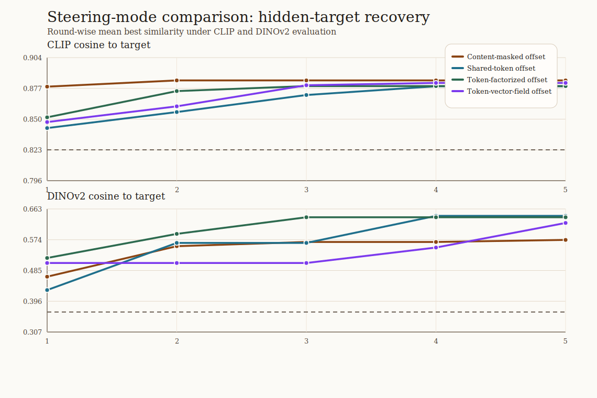
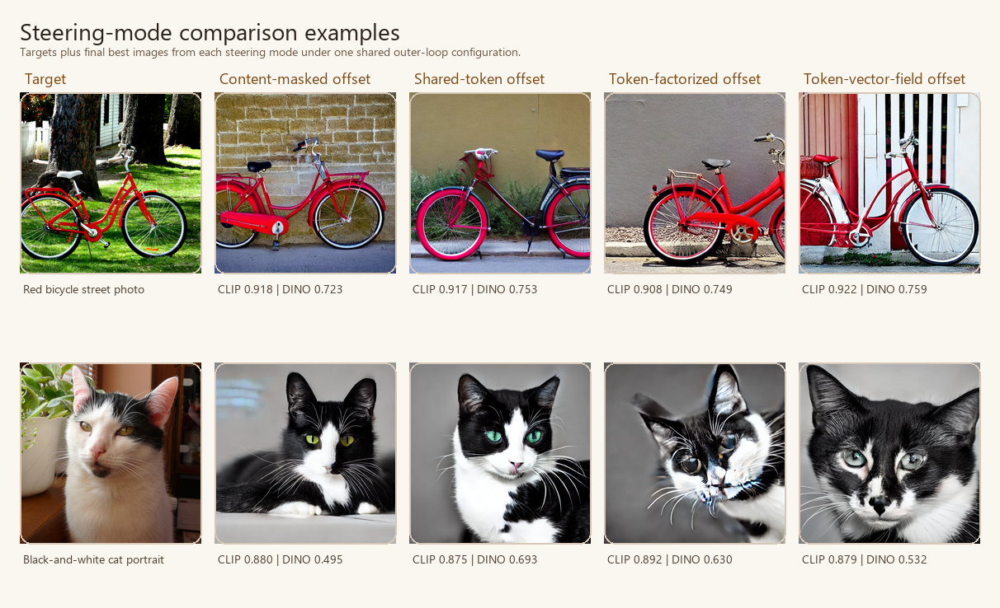

# Steering Mode Comparison Analysis

This compact bundle keeps the outer steering loop fixed and compares how the low-dimensional direction is injected into prompt embeddings.

| steering mode | clip final | clip delta | dinov2 final | dinov2 delta |
| --- | ---: | ---: | ---: | ---: |
| Content-masked offset | 0.884 | 0.062 | 0.573 | 0.217 |
| Shared-token offset | 0.879 | 0.063 | 0.643 | 0.297 |
| Token-factorized offset | 0.879 | 0.063 | 0.639 | 0.312 |
| Token-vector-field offset | 0.882 | 0.044 | 0.622 | 0.192 |

