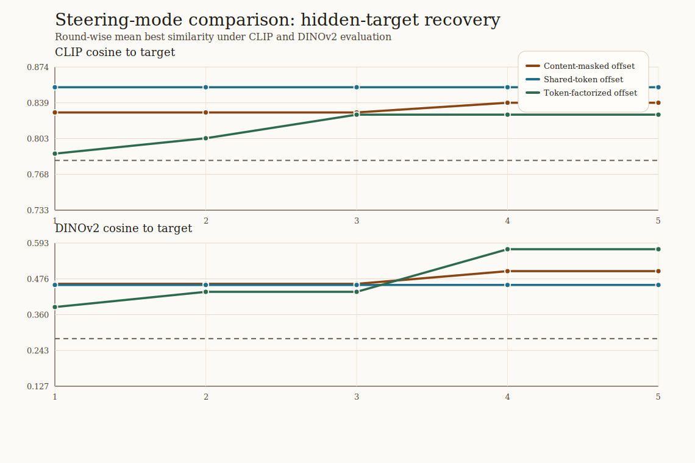
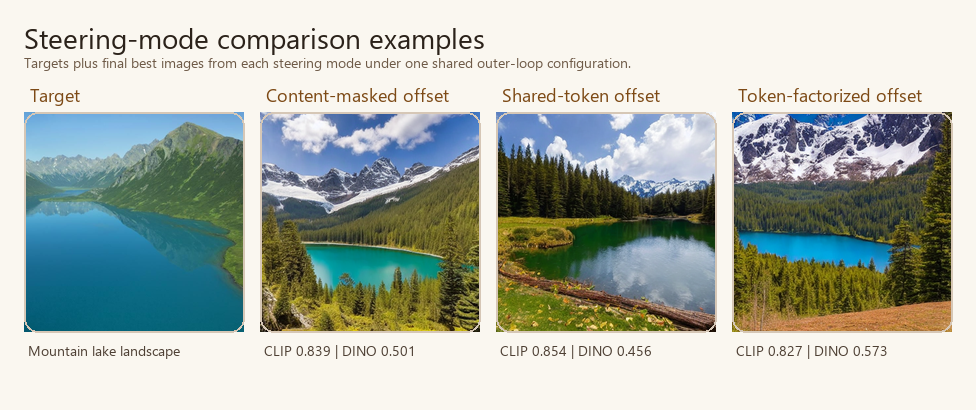

# Steering Mode Comparison Analysis

This compact bundle keeps the outer steering loop fixed and compares how the low-dimensional direction is injected into prompt embeddings.

| steering mode | clip final | clip delta | dinov2 final | dinov2 delta |
| --- | ---: | ---: | ---: | ---: |
| Content-masked offset | 0.839 | 0.035 | 0.501 | 0.187 |
| Shared-token offset | 0.854 | 0.102 | 0.456 | 0.310 |
| Token-factorized offset | 0.827 | 0.039 | 0.573 | 0.188 |

